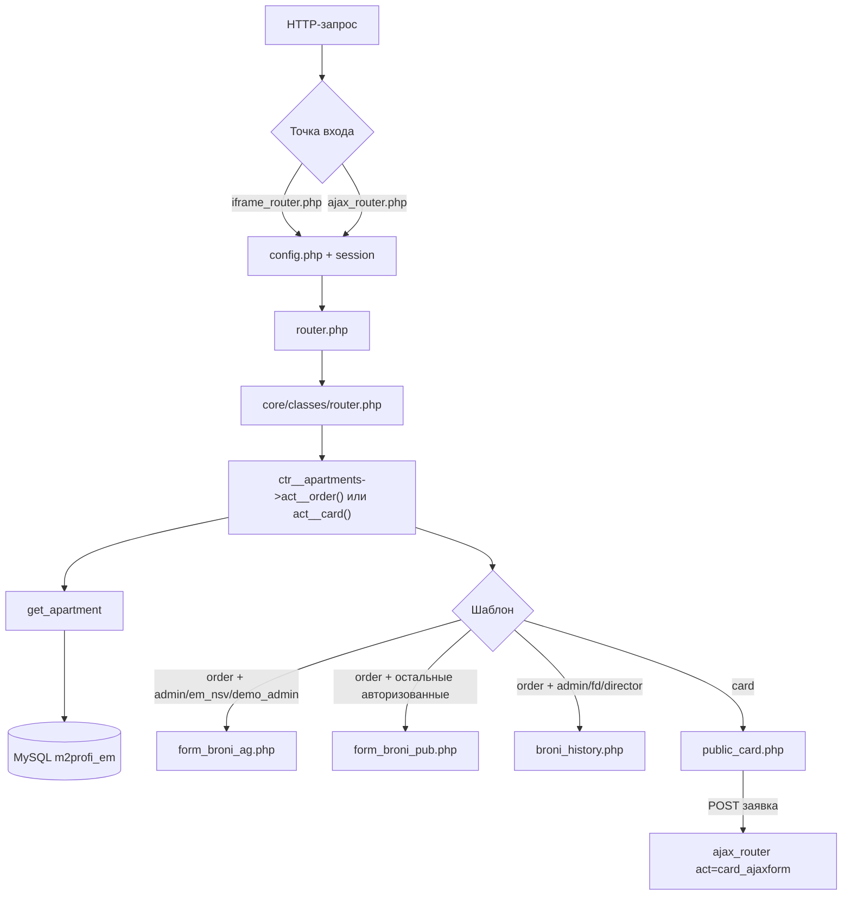
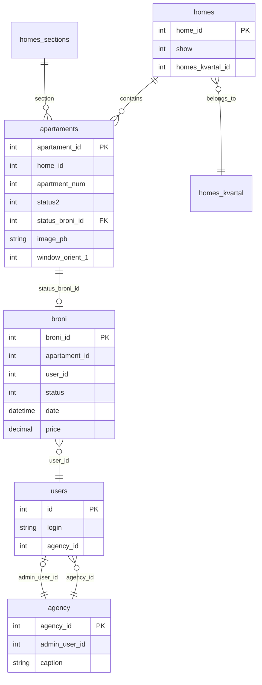

# Карточка квартиры (legacy `sites/em`)

Документ описывает формирование карточки квартиры в legacy-версии проекта EM (`sites/em/sahmatka`): маршрутизацию, уровни доступа, участвующие файлы и таблицы MySQL.

**База данных:** `m2profi_em` (подключение в `sites/em/sahmatka/config.php`).

---

## 1. Два режима карточки

| Режим | URL-пример | Экшен | Аудитория |
|-------|------------|-------|-----------|
| **Внутренняя (кабинет риэлтора)** | `iframe_router.php?ctr=apartments&act=order&home_id=53&apartment_num=52&apartments=1` | `act__order` | Авторизованные пользователи M2 Profi |
| **Публичная (с сайта em-nsk.ru)** | `iframe_router.php?ctr=apartments&act=card&home_id=47&apartment_num=97&apartments=24123` | `act__card` | Любой посетитель, без авторизации |

### GET-параметры

| Параметр | Описание |
|----------|----------|
| `home_id` | ID дома (`homes.home_id`) |
| `apartment_num` | Номер квартиры (`apartaments.apartment_num`) |
| `apartments` | Позиция ячейки на этаже в шахматке (1…N), сохраняется в `broni.apartments` |
| `subact` | `upbroni` — продление брони; `unsetbroni` — отмена (только `act=order`) |
| `dev` | Режим отладки (вывод SQL и массивов данных) |

---

## 2. Точки входа и цепочка вызовов

### 2.1. Общая схема



### 2.2. Файлы маршрутизации

| Файл | Назначение |
|------|------------|
| `sites/em/sahmatka/iframe_router.php` | Iframe-обёртка (HTML, CSS, JS). **Авторизация не требуется** (`$_SESSION['sh_login'] \|\| 1==1`). |
| `sites/em/sahmatka/ajax_router.php` | AJAX без полного шаблона; используется публичной формой заявки. |
| `sites/em/sahmatka/router.php` | Подключает `$r->action_content()`. |
| `sites/em/sahmatka/config.php` | `session_start()`, БД, `$status_arr`, ориентация окон, `$sa = new sahmatka()`. |
| `core/classes/router.php` | Загрузка `fw/controllers/ctr__{ctr}.php`, вызов `act__{act}()`. `check_user_rules()` **всегда возвращает true**. |
| `sites/em/sahmatka/fw/controllers/ctr__apartments.php` | Контроллер карточки и бронирования. |
| `core/classes/controller.php` | Базовый класс `ctr__`, метод `tpl()` → `fw/templates/{ctr}/{tpl}.php`. |
| `core/classes/classes.php` | Класс `sahmatka`: шахматка, `new_broni()`, `up_broni()`, `get_homes_arr()`. |

### 2.3. Откуда открывается карточка

| Источник | Ссылка | Экшен |
|----------|--------|-------|
| Шахматка в кабинете (`user.php?action=objects&home=…`) | `iframe_router.php?ctr=apartments&act=order&…` | `order` |
| Список броней (`user.php?action=show_broni`) | `act=order` + `subact` | `order` |
| Каталог планировок (`ctr__apartments::act__data`) | `act=card` | `card` |
| Публичная шахматка (`display_home_public*.php`, `?new=1`) | `act=card` | `card` |
| Анализ броней ОП (`ctr__op_broni_actual`) | `act=order` | `order` |

Класс `iframe_r` / `iframe` (Fancybox) открывает `iframe_router.php` во всплывающем окне.

**Legacy-файл:** `sites/em/sahmatka/iframe_apart.php` — старая реализация карточки до контроллера `ctr__apartments`; логика дублируется, основной путь — через `iframe_router.php`.

---

## 3. Авторизация и роли пользователей

### 3.1. Сессия

При входе через `user.php` / `incudes_/header.php` в сессию записываются:

| Ключ сессии | Источник | Назначение |
|-------------|----------|------------|
| `sh_login` | `users.login` | Логин |
| `sh_id` | `users.id` | ID пользователя |
| `sh_name` | `users.name` | Имя |
| `agency_id` | `users.agency_id` | Агентство сотрудника |
| `ucaption` | `agency.caption` (user_agency) | Название агентства |
| `adm_caption` | `agency.caption` (admin join) | Название агентства, **админом которого является пользователь** |
| `agency_adm_id` | `agency.agency_id` WHERE `admin_user_id = users.id` | ID агентства, которым управляет пользователь как администратор |

SQL при входе:

```sql
SELECT users.*,
       agency.agency_id AS agency_adm_id,
       agency.caption AS adm_caption,
       user_agency.caption AS ucaption
FROM users
LEFT JOIN agency ON agency.admin_user_id = users.id
LEFT JOIN agency AS user_agency ON user_agency.agency_id = users.agency_id
WHERE login = ? AND password = ?
```

**Кабинет риэлтора** (`user.php`) без `$_SESSION['sh_login']` показывает форму входа и завершает выполнение (`exit`).

**Iframe-роутер** (`iframe_router.php`) доступен без входа — это нужно для публичной карточки `act=card`.

### 3.2. Типы пользователей и их определение в коде

| Роль | Как определяется | Логины / ID (примеры из кода) |
|------|------------------|-------------------------------|
| **Системный администратор** | `check_access('admin')` → логин в `$GLOBALS['config']['admin_logins']` или `'admin'` | `admin` |
| **Демо-администратор** | `$_SESSION['sh_login'] == 'demo_admin'` | POST заблокирован (кроме `act=edit`) |
| **Сотрудник ОП (расширенный)** | `$_SESSION['sh_login'] == 'em_nsv'` | Права как у админа на карточке `order` |
| **Финансовый директор** | `$_SESSION['sh_login'] == 'fd'` | Видит историю броней; шаблон агента |
| **Директор** | `$_SESSION['sh_login'] == 'director'` | История броней; ограниченное меню |
| **Отдел продаж (ОП)** | `$_SESSION['agency_id'] == '92'` | Расширенная видимость на шахматке |
| **Администратор агентства** | `!empty($_SESSION['adm_caption'])` | `agency.admin_user_id = users.id` |
| **Агент / сотрудник агентства** | `$_SESSION['sh_id']` + `agency_id`, не попадает в списки выше | Обычный риэлтор |
| **Публичный пользователь** | Нет сессии | Только `act=card` |

Специальное агентство **«Новые технологии»**: `agency_id == 958` → срок брони **5 дней** (иначе 14).

---

## 4. Матрица доступа к карточке

### 4.1. Какой шаблон рендерится (`act__order`)

Логика в `ctr__apartments::act__order()` (строки ~912–920):

```php
if (in_array($_SESSION['sh_login'], ['admin', 'em_nsv', 'demo_admin'])) {
    $this->tpl($tpl_data, 'apartments', 'form_broni_ag');
} else {
    $this->tpl($tpl_data, 'apartments', 'form_broni_pub');
}

if ($_SESSION['sh_login'] == 'admin' || $_SESSION['sh_login'] == 'fd' || $_SESSION['sh_login'] == 'director') {
    $this->act__broni_history($home_id, $apartment_num);
}
```

| Роль | Шаблон | Цена | Форма брони | Смена статуса | Ориентация окон | История броней |
|------|--------|------|-------------|---------------|-----------------|----------------|
| `admin` | `form_broni_ag` | Да | Нет (select статуса) | Да | Да (POST) | Да |
| `em_nsv` | `form_broni_ag` | Да | Нет | Да | Да | Нет |
| `demo_admin` | `form_broni_ag` | Да | Нет | Да* | Да* | Нет |
| `fd`, `director` | `form_broni_pub` | Да | По статусу | Нет | Нет | Да |
| Админ агентства | `form_broni_pub` | Да | Если свободна | Нет | Нет | Нет |
| Агент | `form_broni_pub` | Да | Если свободна + файлы | Нет | Нет | Нет |
| ОП (`agency_id=92`) | `form_broni_pub` | Да | Если свободна | Нет | Нет | Нет |

\* `demo_admin`: POST в `config.php` блокируется для большинства действий.

### 4.2. Публичная карточка (`act__card`)

| Элемент | Поведение |
|---------|-----------|
| Шаблон | `public_card.php` |
| Цена | **Скрыта** (`$price = ''`) |
| Статус | Статусы `5`, `6` отображаются как «бронь» (`4`); пустой → «Свободно» (`2`) |
| Форма | Только для свободных (`!$status \|\| $status == "2"`): ФИО, телефон, сообщение → email |
| AJAX | `ajax_router.php?ctr=apartments&act=card_ajaxform` + `FormProtect` (капча) |

### 4.3. POST-действия (`act__order`)

| Условие | Действие |
|---------|----------|
| `subact=upbroni` | `$sa->up_broni($broni_id, 4, …)` → шаблон `form_broni_done` |
| `subact=unsetbroni` | `$sa->up_broni($broni_id, 2, …)` → освобождение |
| POST + `admin/em_nsv/demo_admin` + `status` | `up_broni` или `new_broni` + лог |
| POST + `window_orient_1` (админ) | UPDATE `apartaments.window_orient_1` |
| POST + авторизованный агент + квартира свободна | `new_broni(…, 4)` + загрузка `passport_scan`, `passport_scan2`, `anket` в `uploads/{broni_id}/` |
| Повторная бронь того же пользователя (статус 4/5) | `form_broni_done` без формы |

Проверка «свободности» для агента: `status2` (или `stat`) ∈ `''`, `'2'`, `'5'`, `'0'`.

Права на `up_broni()` (`core/classes/classes.php`):

- админ / `demo_admin` / `em_nsv`;
- владелец брони (`broni.user_id == sh_id`);
- админ агентства + та же `agency_id`, что у автора брони.

---

## 5. Получение данных: `get_apartment()`

**Метод:** `ctr__apartments::get_apartment(int $home_id, int $apartment_num)`

**SQL** (упрощённо):

```sql
SELECT
    booking.broni_id AS b_id,
    booking.status AS b_status,
    booking.date AS b_date,
    booking.price AS b_price,
    home.title,
    homes_kvartal.title AS kvartal_title,
    homes_sections.caption AS section_caption,
    user.*,
    agency.*,
    apartment.*
FROM apartaments AS apartment
LEFT JOIN homes AS home ON apartment.home_id = home.home_id
LEFT JOIN homes_sections ON homes_sections.homes_sections_id = apartment.section_id
LEFT JOIN homes_kvartal ON homes_kvartal.homes_kvartal_id = home.homes_kvartal_id
LEFT JOIN broni AS booking ON apartment.status_broni_id = booking.broni_id
LEFT JOIN users AS user ON booking.user_id = user.id
LEFT JOIN agency AS agency ON user.agency_id = agency.agency_id
WHERE apartment.home_id = {home_id}
  AND apartment.apartment_num = {apartment_num}
```

**Связь квартиры с актуальной бронью:** поле `apartaments.status_broni_id` → `broni.broni_id` (не «последняя запись по дате», а явная ссылка).

**Альтернатива:** `get_apartment_by_id(int $apartment_id)` — по `apartament_id`.

После выборки контроллер формирует:

- `$apartment` — поля квартиры;
- `$broni` — поля с префиксом `booking_` / `b_*`;
- `$stat` — `$apartment['status2']` (приоритет) или `apartment_status`.

---

## 6. Шаблоны представления

| Файл | Назначение |
|------|------------|
| `fw/templates/apartments/form_broni_ag.php` | Админская карточка: планировка, компас окон, цена, select статуса (0/2/3/4/5/6), select `window_orient_1` |
| `fw/templates/apartments/form_broni_pub.php` | Карточка агента: планировка, компас, цена; форма брони с 3 файлами если `status2` пуст или `2` |
| `fw/templates/apartments/form_broni_done.php` | Сообщение об успехе; кнопки «Продлить» / «Отменить» для владельца брони |
| `fw/templates/apartments/broni_history.php` | Таблица истории `broni` + блок текущего бронирующего (admin/fd/director) |
| `fw/templates/apartments/public_card.php` | Публичный UI: вкладки «Планировка» / «На этаже», контакты ОП, форма заявки |

**Ориентация окон:** `sites/em/sahmatka/inc/window_orient.php`, константы в `config.php`, SVG в `sites/em/sahmatka/images/compas/`.

---

## 7. Операции с бронью

### 7.1. `sahmatka::new_broni($home_id, $apartment_num, $status, $apartments = 0)`

1. SELECT из `apartaments` по `home_id` + `apartment_num`.
2. INSERT в `broni` (user_id из `$_SESSION['sh_id']`, price из квартиры).
3. UPDATE `apartaments`: `status`, `status2`, `status_broni_id`, `status_broni_date`.

### 7.2. `sahmatka::up_broni($broni_id, $status, $comment)`

1. Проверка прав (см. §4.3).
2. Копирование записи `broni` с новой датой (история не удаляется).
3. UPDATE `apartaments` по `apartament_id`.

### 7.3. Статусы квартир

Из `config.php` (`$status_arr`):

| Код | Значение | Цвет (UI) |
|-----|----------|-----------|
| 0 | Не задан (свободно) | `#8DFFA9` |
| 2 | Свободна | `#8DFFA9` |
| 3 | Продана | `#FF8A90` |
| 4 | Бронь (агентство) | `#FEFF52` |
| 5 | Бронь застройщика | `#D5E6FE` |
| 6 | Бронь подрядчика | `#991DFB` |

На **шахматке** (`core/classes/classes.php`, метод отрисовки ячеек) для разных ролей по-разному маскируются статусы 5/6 (для агентов часто показывается «Продана»), а для `agency_id=92` и админов — полная информация.

---

## 8. Видимость домов на шахматке (`homes.show`)

| `homes.show` | Кто видит дом |
|--------------|---------------|
| `1` | Все авторизованные |
| `2` | Только `admin`, `fd` (+ `get_homes_arr` OR show=2) |
| `3` | `admin`, `fd`, `agency_id=92` (отдел продаж) |

Метод: `sahmatka::get_homes_arr()` в `core/classes/classes.php`.

---

## 9. Таблицы MySQL

### 9.1. `apartaments` — основная сущность квартиры

| Столбец | Назначение |
|---------|------------|
| `apartament_id` | PK |
| `home_id` | FK → `homes.home_id` |
| `section_id` | FK → `homes_sections.homes_sections_id` |
| `apartment_num` | Номер квартиры (уникален в рамках дома) |
| `apartments` | Индекс ячейки на этаже |
| `floor` | Этаж |
| `price`, `price_m` | Цена, цена за м² |
| `area`, `area2`, `area_t` | Площади |
| `rooms` | Комнатность (строка: `1`, `2`, `3с`, …) |
| `kitchen_area`, `text`, `adress`, `plan_code` | Доп. атрибуты |
| `status` | Статус (legacy, в админ-форме) |
| `status2` | **Актуальный статус** (в форме агента и логике брони) |
| `status_broni_id` | FK → `broni.broni_id` (текущая бронь) |
| `status_broni_date` | Дата привязки брони |
| `image_pb` | URL планировки (основное изображение карточки) |
| `image_pb_plan` | План «на этаже» (публичная карточка, вкладка 2) |
| `plan_type`, `image` | Доп. медиа |
| `window_orient_1`, `window_orient_2` | Код направления окон (1–8) |
| `date` | Служебная дата |

### 9.2. `broni` — история бронирований

| Столбец | Назначение |
|---------|------------|
| `broni_id` | PK |
| `home_id`, `section_id`, `floor` | Локация |
| `apartments` | Индекс ячейки |
| `apartments_num`, `apartments_num1` | Номер квартиры |
| `apartament_id` | FK → `apartaments.apartament_id` |
| `user_id` | FK → `users.id` (кто забронировал) |
| `status` | Статус операции (2=снята, 4=бронь, 3=продана, …) |
| `date`, `date_first`, `date_fu` | Даты |
| `comment` | Комментарий |
| `price` | Цена на момент брони |
| `broni_up_counter` | Счётчик продлений |

Каждое изменение статуса через `up_broni()` создаёт **новую строку** в `broni`; квартира указывает на последнюю через `status_broni_id`.

### 9.3. `homes` — дом / объект

| Столбец | Назначение |
|---------|------------|
| `home_id` | PK |
| `title`, `long_title`, `caption` | Названия |
| `adress` | Адрес |
| `homes_kvartal_id` | FK → `homes_kvartal` |
| `kvartal` | Код квартала (1=Infinity, 2=Приозерный, …) |
| `show` | Видимость (1/2/3) |
| `complite` | 0=строится, 1=сдан |
| `order` | Сортировка в меню |

### 9.4. `homes_sections` — секции дома

| Столбец | Назначение |
|---------|------------|
| `homes_sections_id` | PK |
| `section_id` | Номер секции (отображается в карточке) |
| `caption` | Подпись секции |
| `floor`, `apartments`, `start_num` | Конфигурация шахматки |

### 9.5. `homes_kvartal` — жилой комплекс

| Столбец | Назначение |
|---------|------------|
| `homes_kvartal_id` | PK |
| `title` | Название ЖК (RED, ATOM, …) |

### 9.6. `users` — пользователи кабинета

| Столбец | Назначение |
|---------|------------|
| `id` | PK |
| `login`, `password` | Авторизация (plain text в legacy) |
| `name`, `phone`, `e_mail` | Контакты |
| `agency_id` | FK → `agency.agency_id` |
| `gl_user_id` | Связь с глобальным пользователем |

### 9.7. `agency` — агентства недвижимости

| Столбец | Назначение |
|---------|------------|
| `agency_id` | PK |
| `caption` | Название |
| `admin_user_id` | FK → `users.id` (администратор агентства) |
| `type`, `add_datetime`, `del` | Служебные |

### 9.8. Связанные таблицы

| Таблица | Связь |
|---------|-------|
| `users_stat` | Лог действий (`add_log()`) |

---

## 10. Публичная заявка (`act__card_ajaxform`)

**Файл:** `ctr__apartments::act__card_ajaxform()`

1. `FormProtect::validateForm()` — правила полей `home`, `section_caption`, `apartment_num`, `fio`, `phone`, `message`.
2. `fw_messages::build_message()` — текст письма.
3. `fw_mailer->send()` на `89236470002@mail.ru, op@em-nsk.group`.
4. JSON-ответ `{ok|fail}`.

Классы: `sites/em/captcha/FormProtect.php`, `core/fw/mod/fw_mailer/`, `core/fw/mod/fw_messages/`.

---

## 11. Шахматка → ссылка на карточку

В `core/classes/classes.php` при генерации ячеек:

```php
// Кабинет (авторизованные)
$edit_url = 'iframe_router.php?ctr=apartments&act=order&home_id='.$home
          . '&apartment_num='.$end_etza_num.'&apartments='.$k;

// Публичная шахматка (?new=1 или ?new=2)
$edit_url = get_app_url().'/sahmatka/iframe_router.php?ctr=apartments&act=card&home_id=…';
```

Класс ссылки: `iframe_r` (кабинет) или `iframe` (публичная часть / каталог).

---

## 12. Диаграмма данных



---

## 13. Сводная таблица: что видит каждый уровень доступа

| Возможность | admin | em_nsv | fd / director | Админ агентства | Агент | ОП (92) | Публичный |
|-------------|:-----:|:------:|:-------------:|:---------------:|:-----:|:-------:|:---------:|
| Открыть `act=order` | ✓ | ✓ | ✓ | ✓ | ✓ | ✓ | ✗ |
| Открыть `act=card` | ✓ | ✓ | ✓ | ✓ | ✓ | ✓ | ✓ |
| Видеть цену (order) | ✓ | ✓ | ✓ | ✓ | ✓ | ✓ | ✗ |
| Менять статус квартиры | ✓ | ✓ | ✗ | ✗ | ✗ | ✗ | ✗ |
| Редактировать ориентацию окон | ✓ | ✓ | ✗ | ✗ | ✗ | ✗ | ✗ |
| Бронировать с документами | ✗ | ✗ | ✓* | ✓* | ✓* | ✓* | ✗ |
| Заявка без документов (email) | ✗ | ✗ | ✗ | ✗ | ✗ | ✗ | ✓ |
| История броней под карточкой | ✓ | ✗ | ✓ | ✗ | ✗ | ✗ | ✗ |
| Продление / отмена своей брони | ✓ | ✓ | ✓ | ✓ | ✓ | ✓ | ✗ |
| Дома `show=2,3` на шахматке | ✓ | частично | ✓ | ✗ | ✗ | 3 only | ✗ |

\* Если квартира свободна (`status2` ∈ {пусто, 0, 2}).

---

## 14. Связанные файлы (полный список)

### Контроллеры и конфигурация
- `sites/em/sahmatka/fw/controllers/ctr__apartments.php` — `act__order`, `act__card`, `act__card_ajaxform`, `get_apartment`, `act__broni_history`
- `sites/em/sahmatka/config.php` — статусы, кварталы, БД, `$sa`
- `core/classes/router.php`
- `core/classes/controller.php`
- `core/classes/classes.php` — `sahmatka`, `new_broni`, `up_broni`, отрисовка шахматки
- `core/functions.php` — `check_access()`, `add_log()`

### Шаблоны
- `sites/em/sahmatka/fw/templates/apartments/form_broni_ag.php`
- `sites/em/sahmatka/fw/templates/apartments/form_broni_pub.php`
- `sites/em/sahmatka/fw/templates/apartments/form_broni_done.php`
- `sites/em/sahmatka/fw/templates/apartments/broni_history.php`
- `sites/em/sahmatka/fw/templates/apartments/public_card.php`

### Точки входа и UI
- `sites/em/sahmatka/iframe_router.php`
- `sites/em/sahmatka/ajax_router.php`
- `sites/em/sahmatka/user.php` — кабинет, шахматка
- `sites/em/sahmatka/incudes_/header.php` — авторизация
- `sites/em/sahmatka/fw/controllers/ctr__objects.php` — список объектов
- `sites/em/sahmatka/actions/show_broni.php` — список броней со ссылками
- `sites/em/sahmatka/inc/window_orient.php`
- `sites/em/sahmatka/template/default/css/iframe.css`, `admin.css`

### Legacy (устаревшие, но могут встречаться)
- `sites/em/sahmatka/iframe_apart.php`
- `sites/em/sahmatka/form_order.php`

---

## 15. Примеры URL

**Кабинет (после входа на em.m2profi.pro):**
```
https://em.m2profi.pro.test/sahmatka/iframe_router.php?ctr=apartments&act=order&home_id=53&apartment_num=52&apartments=1
```

**Публичная карточка (с em-nsk.ru / каталог):**
```
https://em.m2profi.pro/sahmatka/iframe_router.php?ctr=apartments&act=card&home_id=47&apartment_num=97&apartments=24123
```

**Отладка:**
```
…&dev=1
```

---

## 16. Ограничения и технический долг

1. **Права на уровне роутера не enforced** — `router::check_user_rules()` возвращает `true`; разграничение только в шаблонах и POST-обработчиках.
2. **Два поля статуса** — `status` и `status2`; формы используют разные поля (`form_broni_ag` → `status`, `form_broni_pub` → `status2`).
3. **`iframe_router.php` открыт для всех** — `act=order` технически доступен без login, но POST бронирования требует `$_SESSION['sh_id']`.
4. **Пароли пользователей** хранятся и проверяются в открытом виде (legacy).
5. **Цена в публичном каталоге** (`act__data`) принудительно скрывается (`$result['price'] = ''`).

---

*Документ составлен по состоянию кодовой базы legacy `sites/em`. Актуальные пути относительны корня `sites/em/sahmatka/`.*
