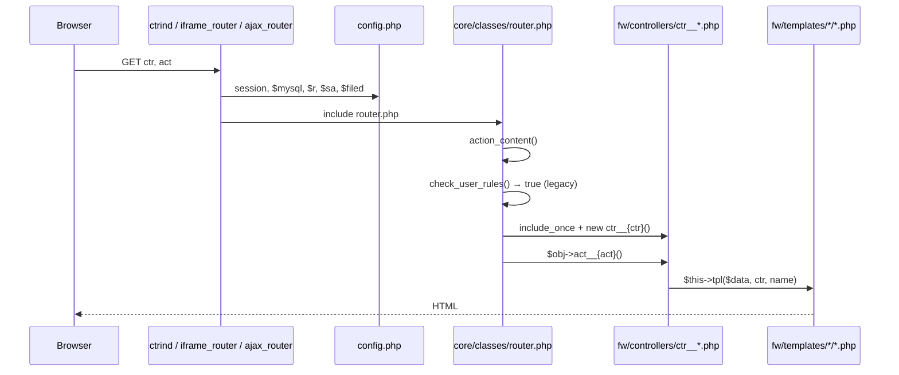

# Legacy-контроллеры и шаблоны (`sites/em/sahmatka/fw`)

Руководство по устройству мини-фреймворка контроллеров в legacy-версии EM: как маршрутизируются запросы, как устроены классы `ctr__*`, как подключать шаблоны и как добавлять новый функционал. В качестве эталонного примера используется `ctr__apartments.php`.

**Связанный документ:** [card_appartament.md](./card_appartament.md) — карточка квартиры и разграничение доступа.

---

## 1. Структура каталога `fw`

```
sites/em/sahmatka/fw/
├── controllers/          # PHP-классы контроллеров (ctr__*.php)
└── templates/            # View-шаблоны, зеркалят имя контроллера
    ├── apartments/       # Шаблоны ctr__apartments
    ├── agency/           # (часто inline в act__edit, без отдельных tpl)
    ├── core/             # Общие шаблоны CRUD-таблиц
    ├── rentobjects/
    ├── parking_spaces/
    └── …
```

| Каталог | Назначение |
|---------|------------|
| `fw/controllers/` | Бизнес-логика, экшены `act__*`, SQL, вызов `$this->tpl()` |
| `fw/templates/{ctr}/` | HTML/PHP-представление для контроллера `{ctr}` |
| `fw/templates/core/` | Переиспользуемые оболочки AJAX CRUD (`tableedit`, `ajaxeditor`, …) |

**Важно:** файлы с префиксом `!` (например `!ctr__rentobjects.php`) — **резервные/черновые копии**. Роутер загружает только `ctr__{name}.php` **без** `!`.

---

## 2. Точки входа: три способа вызвать контроллер

Все точки входа подключают `config.php`, создают `$r = new router()` и вызывают `router.php`.

| Файл | Оболочка | Авторизация | Типичное использование |
|------|----------|-------------|------------------------|
| `ctrind.php` | Шапка кабинета + `$t['h1']` + footer | Требует `$_SESSION['sh_login']` | Админ-разделы: агентства, пользователи, статистика |
| `iframe_router.php` | Минимальный HTML (iframe.css) | Не требуется (`\|\| 1==1`) | Карточки, формы брони, редактирование в popup |
| `ajax_router.php` | Без layout, только контент экшена | Не требуется | AJAX-таблицы, селекты фильтров, JSON-формы |

### URL-формат

```
/sahmatka/{точка_входа}.php?ctr={controller}&act={action}&…доп. GET…
```

| GET-параметр | Имя в роутере | По умолчанию |
|--------------|---------------|--------------|
| `ctr` | `$router->ctr_get` | `index` |
| `act` | `$router->act_get` | `index` |

**Примеры:**

```
/sahmatka/ctrind.php?ctr=agency&act=index
/sahmatka/iframe_router.php?ctr=apartments&act=order&home_id=53&apartment_num=52
/sahmatka/ajax_router.php?ctr=apartments&act=sel_home
/sahmatka/ajax_router.php?ctr=agency&act=ajax_data
```

### Цепочка выполнения



---

## 3. Базовый класс `ctr__`

**Файл:** `core/classes/controller.php`  
**Подключение:** `config.php` → `include('../../../core/classes/controller.php')`

```php
class ctr__
{
    function __construct()
    {
        $this->mysql = $GLOBALS['mysql'];
    }

    function tpl($data, $ctr, $tpl_name, $noprint = false) { … }
    function display_table(…) { … }
    function display_ajax_crud() { … }
    function display_tablex_head / display_tablex_body(…) { … }
    function getfiltr($filtr) { … }
    function getid($id) { … }
    function formpanel($backlink) { … }
    // …
}
```

Контроллер **может**, но не обязан наследовать `ctr__`:

| Класс | Наследование | Примечание |
|-------|--------------|------------|
| `ctr__apartments` | `extends ctr__` | Кастомная логика + `tpl()` |
| `ctr__agency` | `extends ctr__` | CRUD + AJAX-таблица |
| `ctr__index` | **без** extends | Минимальный пример |

---

## 4. Именование и загрузка контроллера

### Правила имен

| Сущность | Шаблон | Пример |
|----------|--------|--------|
| Файл | `fw/controllers/ctr__{name}.php` | `ctr__apartments.php` |
| Класс | `class ctr__{name}` | `class ctr__apartments extends ctr__` |
| Экшен | `function act__{action}()` | `function act__order()` |
| URL | `?ctr={name}&act={action}` | `?ctr=apartments&act=order` |

### Ленивая загрузка

Роутер подключает файл **только при вызове** соответствующего `ctr`:

```php
// core/classes/router.php
$file_class = $this->ctr_dir . 'ctr__' . $controller . '.php';  // fw/controllers/
include_once($file_class);
$obj = new $class();
$obj->{'act__' . $action}();
```

Исключение: в `config.php` жёстко подключён только `ctr__zapiskeys.php` (исторически). Остальные — по требованию.

`check_user_rules()` в legacy **всегда возвращает `true`**. Проверки прав делаются в `__construct()` контроллера или внутри экшенов (например `ctr__users`: `die('Доступ запрещен')`).

---

## 5. Метод `tpl()` — связь контроллера и шаблона

```php
$this->tpl($data, 'apartments', 'form_broni_ag');
//           ↑ данные  ↑ папка      ↑ имя файла без .php
```

**Резолвинг пути:**

```
fw/templates/{ctr}/{tpl_name}.php
```

**Поведение:**

1. Если `$data` — массив, в шаблоне доступен как `$data` (и часто распаковывается вручную в начале tpl).
2. В шаблоне доступны **глобальные** переменные: `$r`, `$tpl`, `$t`, `$filed`, `$mysql`, `$GLOBALS`, `$_SESSION`, `$_GET`.
3. Шаблон рендерится через `ob_start()` / `include` / `ob_get_clean()`.
4. По умолчанию результат **печатается** (`print $c`). Четвёртый аргумент `$noprint = true` — только вернуть строку.
5. При `?dev=1` в HTML добавляются комментарии `<!-- fw/templates/... -->`.

### Соглашение по передаче данных

```php
// В контроллере
$tpl_data = [
    'data'          => $data,       // полный массив из SQL
    'apartment'     => $apartment,  // выделенная часть
    'home_id'       => $home_id,
    'success'       => $success,
    'err_m'         => $err_m,
];
$this->tpl($tpl_data, 'apartments', 'form_broni_pub');
```

```php
// В шаблоне form_broni_pub.php
$data = $data ?? [];
$apartment = $data['apartment'];
$home_id = $data['home_id'];
```

---

## 6. Два типа контроллеров

### 6.1. AJAX CRUD (админ-таблицы)

**Примеры:** `ctr__agency`, `ctr__users`, `ctr__agfiles`, `ctr__homeseditor`

**Обязательные свойства класса:**

```php
class ctr__agency extends ctr__
{
    var $table = 'agency';
    var $key_filed = 'agency_id';   // опечатка historical: filed, не field
    var $ctr = 'agency';
    var $title = 'Агентства';
}
```

**Конструктор настраивает:**

| Свойство | Назначение |
|----------|------------|
| `$this->ajcrud_table_titles` | Заголовки столбцов `[ключ_sql => 'Подпись']` |
| `$this->ajcrud_table_order` | Поля для сортировки по клику на `<th>` |
| `$this->table_nowrap` | Столбцы без переноса |
| `$this->aj_crud_addbutton` | Кнопка «добавить» |
| `$this->aj_crud_edit_iframe` | Редактирование через `iframe_router.php` |
| `$this->display_table_exrow` | Раскрывающиеся строки (+) |

**Экшены CRUD-паттерна:**

| Экшен | Назначение |
|-------|------------|
| `act__index()` | `$this->display_ajax_crud()` — каркас страницы |
| `act__ajax_data()` | HTML `<table>` для tbody (вызывается AJAX) |
| `act__edit()` | Форма создания/редактирования |
| `act__del()` | Мягкое/жёсткое удаление |
| `act__exrow_{name}()` | Контент раскрывающейся строки |

**`display_ajax_crud()`** собирает страницу из шаблонов:

1. `core/tableedit.php` — каркас таблицы + `#fw_ajaxdata` + форма `#filtrform`
2. `core/ajaxeditor.php` — JS: `sendAjaxForm()`, сортировка, magnificPopup для iframe

**Кастомизация ячеек** — методы `display_table__{column}($row)`:

```php
function display_table__edit($row)
{
    return '<a href="…?ctr=agency&act=edit&id='.$row['agency_id'].'" class="table-edit"> </a>';
}
```

**SQL** выносится в `get_base_sql($where)`; выборка — через `getfiltr()` / `getid()`.

### 6.2. Кастомные / страничные контроллеры

**Примеры:** `ctr__apartments`, `ctr__objects`, `ctr__parking_floors`, `ctr__rentobjects`

Не используют `display_ajax_crud`. Экшены сами:

- читают GET/POST;
- выполняют SQL или вызывают `$sa->…`;
- выбирают шаблон или печатают HTML inline.

---

## 7. Разбор `ctr__apartments.php` (эталон)

**Файл:** `sites/em/sahmatka/fw/controllers/ctr__apartments.php`

### 7.1. Метаданные класса

```php
class ctr__apartments extends ctr__
{
    var $table = 'apartments';           // legacy-имя; реальная таблица — apartaments
    var $key_filed = 'apartments_id';
    var $ctr = 'apartments';
    var $title = 'Квартиры';
}
```

### 7.2. Конструктор

```php
function __construct()
{
    global $mysql;
    $this->data_arr    = $this->get_data_arr();
    $this->data_arr_ns = $this->get_data_arr(1);  // без фильтров — для селектов
    $this->sql = $mysql;
}
```

При каждом запросе к контроллеру (в т.ч. AJAX-селектам) пересчитывается каталожная выборка `get_data_arr()`.

### 7.3. Карта экшенов

| Экшен | Тип | Шаблон / вывод | Назначение |
|-------|-----|----------------|------------|
| `act__index` | stub | — (только `$t['h1']`) | Заглушка |
| `act__sel_home`, `sel_floor`, `sel_*` | AJAX fragment | inline `<option>` | Наполнение фильтров каталога |
| `act__data` | HTML list | inline `.m2catalog_item` | Список планировок |
| `act__order` | page | `form_broni_ag` / `form_broni_pub` / `form_broni_done` + опц. `broni_history` | Карточка бронирования |
| `act__card` | page | `public_card` | Публичная карточка |
| `act__card_ajaxform` | JSON | — | Заявка с публичной формы |
| `act__broni_history` | partial | `broni_history` | История (вызывается из `act__order`) |
| `act__history` | debug HTML | inline `<table>` | История по `apartament_id` |

### 7.4. Модель данных

```php
public function get_apartment(int $home_id, int $apartment_num): ?array
public function get_apartment_by_id(int $apartment_id): ?array
```

Единая точка загрузки квартиры + дом + секция + квартал + текущая бронь + пользователь + агентство. Используется в `act__order` и `act__card`.

### 7.5. Пример экшена с ветвлением шаблонов (`act__order`)

```php
function act__order()
{
    $data = $this->get_apartment($home_id, $apartment_num);
    // … POST: subact, admin status, agent booking …
    $tpl_data = [ 'data' => $data, 'apartment' => $apartment, … ];

    if ($show_done_template) {
        $this->tpl($tpl_data, 'apartments', 'form_broni_done');
        return;
    }

    if (in_array($_SESSION['sh_login'], ['admin','em_nsv','demo_admin'])) {
        $this->tpl($tpl_data, 'apartments', 'form_broni_ag');
    } else {
        $this->tpl($tpl_data, 'apartments', 'form_broni_pub');
    }

    if (in_array($_SESSION['sh_login'], ['admin','fd','director'])) {
        $this->act__broni_history($home_id, $apartment_num);
    }
}
```

**Паттерн:** один экшен — несколько шаблонов по условию; дополнительный partial через второй вызов `tpl()` / метода.

### 7.6. AJAX-экшены без шаблона (`act__sel_home`)

Печатают HTML напрямую (`print '<option>…'`), вызываются из:

```
ajax_router.php?ctr=apartments&act=sel_home
```

Клиент подставляет ответ в `<select>` (каталог на em-nsk.ru).

### 7.7. JSON-экшен (`act__card_ajaxform`)

```php
header('Content-Type: application/json; charset=utf-8');
$formProtect->ok('…');  // или ->fail()
```

Без `tpl()` — только JSON для `FormProtect` на фронте.

### 7.8. Шаблоны apartments

| Шаблон | Когда |
|--------|-------|
| `form_broni_ag.php` | Админ / em_nsv / demo_admin |
| `form_broni_pub.php` | Агент, админ агентства |
| `form_broni_done.php` | Успех / активная бронь |
| `broni_history.php` | Под карточкой для admin/fd/director |
| `public_card.php` | `act=card` |

---

## 8. Глобальные зависимости (доступны в контроллере и шаблоне)

| Переменная | Класс / объект | Назначение |
|------------|----------------|------------|
| `$mysql` | `m_mysql` | `get_arr()`, `insert()`, `update_for_key()` |
| `$connection` | mysqli | Legacy raw queries |
| `$r` | `router` | `acturl()`, `actlink()` |
| `$filed` | `filed` | Генерация полей форм |
| `$sa` | `sahmatka` | Шахматка, `new_broni()`, `up_broni()` |
| `$t` | array | `$t['h1']` — заголовок в `ctrind.php` |
| `$GLOBALS['homes']` | array | Подписи домов |
| `$GLOBALS['status_arr']` | array | Расшифровка статусов |
| `$filed_errors` | array | Ошибки валидации форм |

**Подключение ядра** — `sites/em/sahmatka/config.php`:

```php
include('../../../core/classes.php');      // $mysql, $sa, sahmatka
include('../../../core/classes/controller.php');
include('../../../core/classes/router.php');
$r = new router();
include('../../../core/classes/filed.php');
$filed = new filed();
```

---

## 9. Класс `filed` — поля форм

**Файл:** `core/classes/filed.php`

Используется в `act__edit` CRUD-контроллеров:

```php
$filed->text('caption', 'Название', $data['caption']);
$filed->checkbox('unactiv', 'Заблокирован', $data['unactiv']);
$filed->select('agency_id', 'Агентство', $data['agency_id'], $options);
```

Ошибки валидации — в `$filed_errors['field_name'][] = '…'`, вывод через `$filed->perrors('field_name')`.

---

## 10. AJAX CRUD: как это работает на клиенте

1. `act__index` → `display_ajax_crud()` → шаблон `core/tableedit.php`.
2. Форма `#filtrform` имеет атрибут:
   ```html
   data-ajaxurl="/sahmatka/ajax_router.php?ctr=agency&act=ajax_data"
   ```
3. JS `sendAjaxForm('fw_ajaxdata', 'filtrform', url)` POST-ит фильтры → `act__ajax_data` → HTML tbody.
4. Скрипт из `core/ajaxeditor.php` вешает обработчики: сортировка, поиск, iframe-редактирование (`.fw_iframeajax`).

**Функция:** `template/default/js/myfw_iframe.js` → `sendAjaxForm()`.

---

## 11. Как добавить новый контроллер (пошагово)

### Вариант A: простая страница / iframe (как apartments)

1. **Создать файл** `fw/controllers/ctr__myfeature.php`:

```php
<?php
class ctr__myfeature extends ctr__
{
    var $ctr = 'myfeature';
    var $title = 'Мой раздел';

    function act__index()
    {
        global $t;
        $t['h1'] = 'Мой раздел';
        $this->tpl(['items' => []], 'myfeature', 'index');
    }

    function act__save()
    {
        global $mysql;
        // POST-логика
        header('Location: ctrind.php?ctr=myfeature&act=index');
    }
}
```

2. **Создать шаблон** `fw/templates/myfeature/index.php`:

```php
<?php
$items = $data['items'] ?? [];
?>
<h2>Список</h2>
<?php foreach ($items as $item): ?>
    <p><?= htmlspecialchars($item['title']) ?></p>
<?php endforeach; ?>
```

3. **Открыть:**
   ```
   /sahmatka/ctrind.php?ctr=myfeature&act=index
   ```
   или для popup:
   ```
   /sahmatka/iframe_router.php?ctr=myfeature&act=index
   ```

4. **Права доступа** — в начале `__construct()` или экшена:
   ```php
   if ($_SESSION['sh_login'] != 'admin') { die('Доступ запрещен'); }
   ```

### Вариант B: AJAX CRUD-таблица (как agency)

1. `extends ctr__`, задать `$table`, `$key_filed`, `$ctr`.
2. Реализовать `get_base_sql()`, настроить `$this->ajcrud_table_titles` в `__construct`.
3. `act__index()` → `$this->display_ajax_crud()`.
4. `act__ajax_data()` → `$this->display_tablex_body($this->data, …)`.
5. `act__edit()` — форма с `$filed` и `$this->formpanel()`.
6. При необходимости переопределить `display_table__{col}()` для кастомных ячеек.

### Вариант C: новый экшен в существующем контроллере

1. Добавить метод `function act__myaction()` в `ctr__apartments`.
2. Создать `fw/templates/apartments/myaction.php`.
3. Вызвать `$this->tpl($data, 'apartments', 'myaction')`.
4. URL: `?ctr=apartments&act=myaction`.

---

## 12. Соглашения и практические правила

### Именование экшенов

| Префикс / паттерн | Смысл |
|-------------------|-------|
| `act__index` | Главная страница раздела |
| `act__edit` | Форма create/update по `?id=` |
| `act__del`, `act__block` | Действия над записью |
| `act__ajax_data` | Тело AJAX-таблицы |
| `act__sel_*` | Фрагмент `<option>` для select |
| `act__exrow_*` | Раскрывающаяся строка таблицы |
| `act__*_ajaxform` | JSON-ответ для внешних форм |

### Где проверять права

1. `__construct()` контроллера — жёсткий `die()` (ctr__users).
2. Внутри экшена — ветвление шаблонов (ctr__apartments).
3. `config.php` — блокировка POST для `demo_admin`.
4. **Не полагаться** на `router::check_user_rules()` — он отключён.

### Отладка

| Параметр | Эффект |
|----------|--------|
| `?dev=1` | Ошибки PHP, HTML-комментарии с путями шаблонов, вывод SQL в некоторых экшенах |
| `add_logx()` | Текстовый лог роутера (при включённой отладке fw) |
| `add_log()` | Запись в `users_stat` |

### `$t['h1']`

Устанавливайте в `act__index` / `act__edit` **до** вывода — заголовок подхватывает `ctrind.php`:

```php
global $t;
$t['h1'] = 'Квартиры';
```

### Iframe vs полная страница

| `$this->aj_crud_edit_iframe = 1` | Ссылки edit → `iframe_router.php`, класс `fw_iframeajax` |
| `$this->formpanel()` | Кнопка «назад»; для iframe закрывает Magnific Popup |

---

## 13. Каталог контроллеров EM (актуальные файлы)

| Контроллер | Назначение | Паттерн |
|------------|------------|---------|
| `ctr__apartments` | Каталог, карточка, бронь | Custom + tpl |
| `ctr__apartments_broni` | Список броней квартир | CRUD-подобный |
| `ctr__apartments_admin` | Админ броней | CRUD-подобный |
| `ctr__objects` | Объекты / шахматка в кабинете | Custom |
| `ctr__agency` | Агентства | AJAX CRUD |
| `ctr__users` | Пользователи | AJAX CRUD |
| `ctr__agfiles`, `ctr__agdocs` | Документы агентств | AJAX CRUD |
| `ctr__homeseditor`, `ctr__homes_kvartal` | Настройки домов/ЖК | AJAX CRUD |
| `ctr__rentobjects` | Коммерческая аренда/продажа | Custom |
| `ctr__parking_*` | Парковки | Custom + CRUD |
| `ctr__zapiskeys`, `ctr__zapisx2` | Выдача ключей | CRUD |
| `ctr__stat_*`, `ctr__metrika` | Статистика | Custom |
| `ctr__op_broni_actual` | Анализ броней ОП | Custom |
| `ctr__ajax_wiget` | AJAX-виджеты | Fragment |
| `ctr__index` | Тестовый | Minimal |

---

## 14. Шаблоны `core/` (общие)

| Файл | Назначение |
|------|------------|
| `tableedit.php` | Оболочка AJAX-таблицы: фильтр + `<tbody id="fw_ajaxdata">` |
| `ajaxeditor.php` | JS-инициализация CRUD |
| `tableedit_nulldata.php` | «Нет данных» |
| `edit_form_panel.php` | Панель кнопок формы (назад, сохранить) |
| `tableedit_uphead.php` | Доп. шапка таблицы |

---

## 15. Связь с legacy вне `fw`

Не всё переведено на контроллеры:

| Механизм | Файл | Статус |
|----------|------|--------|
| Шахматка, меню объектов | `user.php` + `actions/*.php` + `core/classes/classes.php` (`sahmatka`) | Legacy |
| Старый iframe квартиры | `iframe_apart.php` | Deprecated |
| Роутинг к fw | `ctrind.php`, `iframe_router.php`, `ajax_router.php` | Актуальный |

Новый функционал рекомендуется добавлять в `fw/controllers` + `fw/templates`, вызывая через три точки входа выше.

---

## 16. Чеклист перед коммитом

- [ ] Файл назван `ctr__{name}.php`, класс совпадает с именем
- [ ] Экшены начинаются с `act__`
- [ ] Шаблон лежит в `fw/templates/{ctr}/`
- [ ] `$t['h1']` задан для страниц `ctrind.php`
- [ ] AJAX-экшены не выводят лишний HTML до/после фрагмента
- [ ] JSON-экшены ставят `Content-Type: application/json`
- [ ] Права проверены явно (не через роутер)
- [ ] POST-формы указывают правильный `ctr` и `act` в `action=""`

---

## 17. Быстрая шпаргалка (apartments)

```
# Публичная карточка
iframe_router.php?ctr=apartments&act=card&home_id=47&apartment_num=97

# Бронирование (кабинет)
iframe_router.php?ctr=apartments&act=order&home_id=53&apartment_num=52&apartments=1

# Селект домов (AJAX)
ajax_router.php?ctr=apartments&act=sel_home

# Каталог планировок (AJAX HTML)
ajax_router.php?ctr=apartments&act=data&home=47&…

# Публичная заявка (JSON POST)
ajax_router.php?ctr=apartments&act=card_ajaxform
```

**Код:** `fw/controllers/ctr__apartments.php`  
**Шаблоны:** `fw/templates/apartments/*.php`

---

*Документ описывает legacy-слой `sites/em/sahmatka/fw`. Базовые классы общие для проекта лежат в `core/classes/`.*
