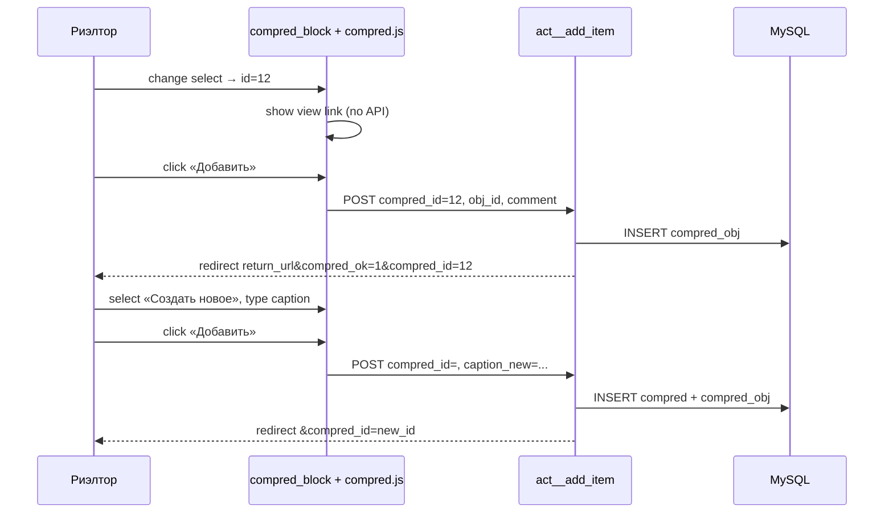
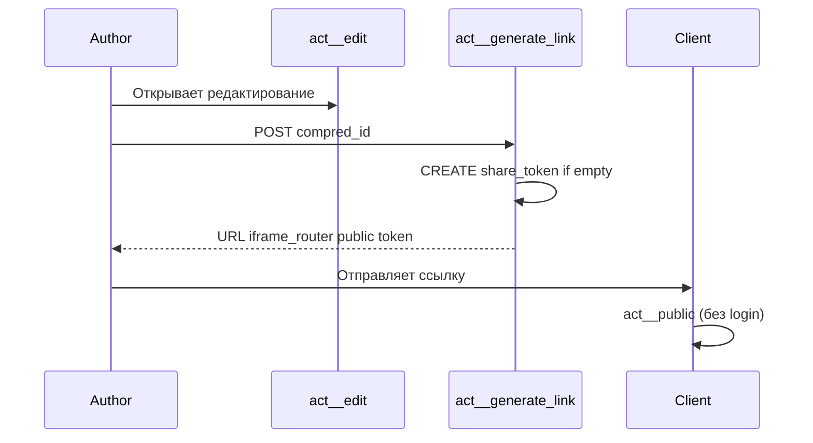
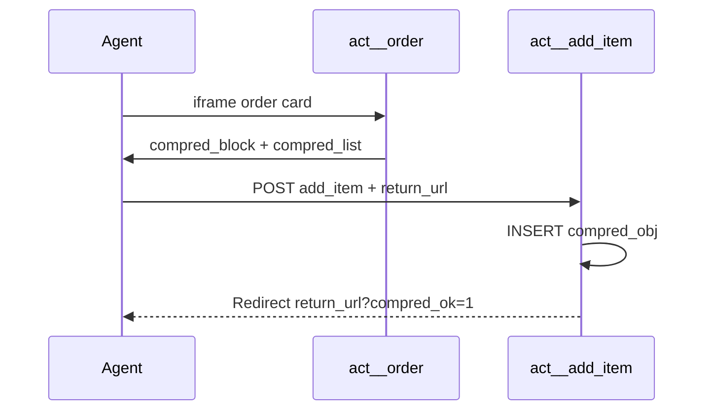

# План реализации: «Коммерческие предложения» (compred) — v2 (аудит)

**Задача:** для авторизованных пользователей — формирование подборок квартир с комментариями и публичной ссылкой для клиента.

**Область:** legacy `sites/em/sahmatka`, БД `m2profi_em`.

**MVP:** только квартиры (`obj_type = apartment`).

**UI:** двухколоночное редактирование, публичная страница без сайдбара, блок «Поделиться», карточки с badge «КВАРТИРА». Полная HTML/CSS-спецификация — **§13**, палитра accent **`#00CDAD`** (§0.3).

**Связанные документы:** [card_appartament.md](../../card_appartament.md), [ctr_legacy.md](../../ctr_legacy.md).

---

## 0. Результаты аудита кодовой базы

### 0.1. Критические исправления относительно v1 плана

| # | Проблема v1 | Как должно быть | Где проверено |
|---|-------------|-----------------|---------------|
| 1 | Публичный просмотр только для залогиненных | **Клиент по ссылке без авторизации** (нет сайдбара, только заголовок + карточки) | §13.4 |
| 2 | `act__view` через `ctrind.php` для клиента | Публичная страница через **`iframe_router.php?ctr=compred&act=public&token=…`** (минимальный layout, без `header.php` кабинета) | `iframe_router.php` строка 14: сессия не обязательна |
| 3 | Нет поля `share_token` | **Обязательно в MVP** — генерируется при «Поделиться предложением» | Скрин 2, блок permalink |
| 4 | `compred_block` с `formaction` внутри формы брони | **Отдельная `<form>`** вне формы бронирования — вложенные формы HTML невалидны | `form_broni_pub.php` строки 72–82 |
| 5 | В шаблоне `$tpl_data['compred_list']` | В `tpl()` массив доступен как **`$data`** (локальная переменная метода `ctr__::tpl`) | `core/classes/controller.php:116–140` |
| 6 | `apartament_id` из `$apartment['apartament_id']` | После `get_apartment()` поле **`$data['apartament_id']`** уже на верхнем уровне (SELECT `apartment.*`) | `ctr__apartments.php:583–637` |
| 7 | `add_item` через ajax без return URL | POST должен содержать **`return_url`** (полный URL карточки order) для redirect из iframe | Карточка открывается в Fancybox |
| 8 | Блок compred в `form_broni_done` | Не нужен (early return в `act__order`) | `ctr__apartments.php:754–755` |
| 9 | Стили «в admin.css» | Отдельный **`compred.css`** + подключение точечно (не раздувать global CSS) | `header.php` уже тянет `style.css` + `admin.css` |
| 10 | `act__view` = публичная страница | Разделить: **`act__public`** (token, без login) и **`act__view`** (login, для коллег) | — |

### 0.2. Подтверждённые точки интеграции (файлы для правки)

| Файл | Текущее поведение | Требуемое изменение |
|------|-------------------|---------------------|
| `fw/controllers/ctr__apartments.php` | `act__order` собирает `$tpl_data`, рендерит pub/ag | + загрузка `compred_list`, flash `compred_msg`, `apartament_id`, `return_url` |
| `fw/templates/apartments/form_broni_pub.php` | Форма брони внутри `.xxx` колонки | + **после** закрытия `</form>` (или вне условия статуса) include `compred_block.php` |
| `fw/templates/apartments/form_broni_ag.php` | Админская карточка без формы брони | + include `compred_block.php` в правой колонке |
| `fw/templates/apartments/public_card.php` | Публичная карточка | **Не трогать** (блок compred не показывать) |
| `ctrind.php` | Layout кабинета + `$t['h1']` | Без изменений; compred edit/index идут сюда |
| `iframe_router.php` | Iframe layout | Используется для **`act=public`** (клиент) и карточки order |
| `ajax_router.php` | AJAX без layout | `add_item`, `save_comment`, `generate_link`, `remove_item` |
| `config.php` | Глобальные массивы | + `inc/compred_config.php` (типы объектов, labels) |
| `template/default/in_head.php` | Меню сайдбара | + пункт «Мои предложения» (после «Брони», для всех кроме keys1/keys2/em_nsv/director — по аналогии со строкой 154) |
| `template/default/header.php` | CSS/JS кабинета | **Не добавлять** compred.css глобально |

### 0.3. Палитра EM (для CSS)

Из `style.css` / кабинета:

| Token | Значение | Использование |
|-------|----------|---------------|
| `--cp-accent` | `#00CDAD` | Кнопки, badge, цена (основной акцент EM) |
| `--cp-accent-hover` | `#15b99f` | hover (из `.stat-top__print:hover`) |
| `--cp-text` | `#2F4049` | Заголовки (из `admin.css .input_title`) |
| `--cp-text-muted` | `#616161` | вторичный текст |
| `--cp-success-bg` | `#ecfdf5` | блок «ссылка готова» |
| `--cp-success-border` | `#10b981` | рамка success (можно смягчить под EM) |
| `--cp-card-shadow` | `0 4px 14px rgba(47,64,73,.08)` | карточки объектов |
| Font | Montserrat / Exo2 | уже в `header.php`, `montserrat.css` |

Для compred **использовать `#00CDAD`** — совпадает с `.stat-top-btn`, `.mdefth`, кнопками кабинета EM.

### 0.4. Визуальный аудит (сверка со скринами)

**Скрин 1 — публичная страница (клиент):**

| Элемент на скрине | План | Совпадёт? |
|-------------------|------|-----------|
| Нет сайдбара, нет логотипа | `iframe_router` + `public.php` | ✓ |
| Светло-серый фон страницы | `.cp-public { background: #f5f7fa; min-height: 100vh; }` | ✓ |
| H1 по центру = caption | `.cp-public__title` | ✓ |
| Карточки белые, тень, вертикальный список | `.cp-card` + `.cp-public__list` | ✓ |
| Фото слева, текст справа | `.cp-card--public .cp-card__row` | ✓ |
| Badge зелёный «ПРОЕКТ» | Badge **«КВАРТИРА»** (MVP — квартиры) | ⚠️ текст другой, стиль тот же |
| Цена крупная, accent | `.cp-card__price` | ✓ |
| Specs: `121 м² \| 1 эт. \| 3 спальни` | `{area} м² \| {floor} эт. \| {rooms}` | ⚠️ «спальни» → число комнат без слова |
| Комментарий под карточкой | `.cp-note-box` (если comment не пуст) | ✓ (на скрине комментариев нет) |

**Скрин 2 — редактирование (автор в кабинете):**

| Элемент на скрине | План | Совпадёт? |
|-------------------|------|-----------|
| Левый сайдбар кабинета | `ctrind.php` + `in_head.php` | ✓ |
| Голубовато-бирюзовый gradient фона | `.cp-edit { background: linear-gradient(...); border-radius: 20px; }` | ✓ |
| H1 + «Всего объектов: N» | `.cp-edit-header__title` + meta | ✓ |
| [Поделиться] [Удалить предложение] | `.cp-edit-actions` | ✓ |
| Строка переименования + «Сохранить название» | `.cp-rename` | ✓ |
| Зелёный блок permalink + «Копировать» | `.cp-permalink` (показ после AJAX) | ✓ |
| Карточка: инфо \| textarea \| удалить | `.cp-card__row` + `.cp-card__edit` | ✓ |
| «Удалить из списка» — **teal-кнопка** | `.cp-btn-remove` (teal filled) | ✓ после правки §5/§13 |
| Двойной заголовок (logo + h1 ctrind + h1 edit) | `act__edit`: `$t['h1'] = ''` | ✓ после правки §4 |

**Итог визуального аудита:** структура и компоновка **совпадают** (~95% после правок §0.4). Ожидаемые отличия от скринов (не баг): badge «КВАРТИРА» вместо «ПРОЕКТ», заголовок квартиры вместо «Проект 1-284», пункты сайдбара EM вместо xdemo-каталогов.

**Прототипы в `.doc/tasks/1/inc/`, `pr.php`, `pr_edit.php` — удалять можно:** весь HTML/CSS перенесён в §13, на реализацию они не ссылаются.

---

## 1. Цели и сценарии (уточнённые)

### 1.1. Три экрана (по скриншотам)

```
┌─────────────────────────────────────────────────────────────────┐
│ A. ПУБЛИЧНАЯ (act=public, token) — для КЛИЕНТА                   │
│    iframe_router, без login, без сайдбара                        │
│    • H1 = caption                                                │
│    • Список карточек: фото, badge «КВАРТИРА», title, цена, specs │
│    • Под карточкой — comment риэлтора (если есть)                │
├─────────────────────────────────────────────────────────────────┤
│ B. РЕДАКТИРОВАНИЕ (act=edit) — только АВТОР                      │
│    ctrind.php + sidebar кабинета                                 │
│    • H1 + «Всего объектов: N»                                    │
│    • [Поделиться предложением] [Удалить предложение]             │
│    • Поле переименования + «Сохранить название»                  │
│    • Зелёный блок permalink + «Копировать»                       │
│    • Карточки 2 колонки: инфо | textarea комментария + удалить   │
├─────────────────────────────────────────────────────────────────┤
│ C. БЛОК В КАРТОЧКЕ КВАРТИРЫ (act=order, iframe)                 │
│    combobox предложений | новое название | comment | [Добавить]   │
│    + ссылка «Смотреть предложение» при выборе existing           │
└─────────────────────────────────────────────────────────────────┘
```

### 1.2. Definition of Done (MVP)

- [ ] Таблицы `compred`, `compred_obj` + поле `share_token`
- [ ] `ctr__compred` со всеми экшенами (см. §4)
- [ ] `compred.css` + `compred.js`, визуально как скрины, палитра EM
- [ ] Публичная страница **без авторизации** по token
- [ ] Edit только автор; share link + copy
- [ ] Блок в `form_broni_pub.php` + `form_broni_ag.php`
- [ ] Пункт меню «Мои предложения»
- [ ] `add_log()` на create / add / share / delete

---

## 2. Модель данных (v2)

### 2.1. Таблица `compred`

```sql
CREATE TABLE IF NOT EXISTS `compred` (
  `compred_id`   INT UNSIGNED NOT NULL AUTO_INCREMENT,
  `caption`      VARCHAR(255) NOT NULL,
  `user_id`      INT UNSIGNED NOT NULL,
  `share_token`  CHAR(32) NULL DEFAULT NULL COMMENT 'md5/random hex; NULL до первого «Поделиться»',
  `created_at`   DATETIME NOT NULL DEFAULT CURRENT_TIMESTAMP,
  `updated_at`   DATETIME NOT NULL DEFAULT CURRENT_TIMESTAMP ON UPDATE CURRENT_TIMESTAMP,
  `del`          TINYINT(1) NOT NULL DEFAULT 0,
  PRIMARY KEY (`compred_id`),
  UNIQUE KEY `uq_compred_share_token` (`share_token`),
  KEY `idx_compred_user` (`user_id`, `del`)
) ENGINE=InnoDB DEFAULT CHARSET=utf8mb4;
```

**Генерация token:** `bin2hex(random_bytes(16))` при первом вызове `act__generate_link`.

### 2.2. Таблица `compred_obj`

Без изменений от v1 + уточнение:

- `obj_type = 'apartment'`, `obj_id = apartaments.apartament_id`
- UNIQUE `(compred_id, obj_type, obj_id)`

### 2.3. Файл конфигурации

`sites/em/sahmatka/inc/compred_config.php`:

```php
$GLOBALS['compred_obj_types'] = [
    'apartment' => ['label' => 'КВАРТИРА', 'badge_class' => 'cp-badge--apartment'],
    'parking'   => ['label' => 'ПАРКОВКА',  'enabled' => false],
    'rent'      => ['label' => 'АРЕНДА',    'enabled' => false],
];
```

Подключить из `config.php` после `$status_arr`.

---

## 3. Архитектура файлов (полный список)

### 3.1. Новые файлы

```
sites/em/sahmatka/
├── migrations/001_compred.sql
├── inc/compred_config.php
├── fw/controllers/ctr__compred.php
├── fw/templates/compred/
│   ├── _layout_assets.php      # <link compred.css> + <script compred.js>
│   ├── _card_apartment.php     # partial карточки (режимы public|edit)
│   ├── public.php              # страница клиента (скрин 1)
│   ├── edit.php                  # страница автора (скрин 2)
│   ├── view.php                  # просмотр для залогиненных коллег
│   └── index.php                 # список своих предложений
├── fw/templates/apartments/
│   └── compred_block.php         # блок в карточке квартиры
├── template/default/css/compred.css
└── template/default/js/compred.js
```

### 3.2. Изменяемые файлы (diff-уровень)

#### `fw/controllers/ctr__apartments.php` — метод `act__order`

**Место вставки:** после `$data = $this->get_apartment(...)` и проверки `if (!$data)`, **до** блока `subact`.

```php
// --- compred: данные для блока «Добавить к предложению» ---
$compred_list = [];
$compred_msg = '';
$compred_err = '';
if (!empty($_SESSION['sh_id'])) {
    if (!empty($_GET['compred_ok'])) {
        $compred_msg = 'Квартира добавлена в предложение';
    }
    // для автовыбора в combobox после redirect
    $compred_selected_id = (int)($_GET['compred_id'] ?? 0);
    if (!empty($_GET['compred_err'])) {
        $compred_err = urldecode((string)$_GET['compred_err']);
    }
    $compred_list = $mysql->get_arr(
        'SELECT compred_id, caption FROM compred
         WHERE user_id = '.(int)$_SESSION['sh_id'].' AND del = 0
         ORDER BY updated_at DESC LIMIT 100'
    );
}

$apartament_id = (int)($data['apartament_id'] ?? 0);

// … существующий код …

$tpl_data = [
    // … существующие ключи …
    'compred_list'        => $compred_list,
    'compred_msg'         => $compred_msg,
    'compred_err'         => $compred_err,
    'compred_selected_id' => $compred_selected_id ?? 0,
    'apartament_id'  => $apartament_id,
    'return_url'     => 'iframe_router.php?ctr=apartments&act=order'
        . '&home_id='.$home_id.'&apartment_num='.$apartment_num
        . '&apartments='.(int)($_GET['apartments'] ?? 0),
];
```

**Важно:** добавить те же ключи в `$tpl_data` для ветки `form_broni_done` (subact) — опционально, не блокирует MVP.

#### `fw/templates/apartments/form_broni_pub.php`

**Строка ~71** — после блока цены, **структура:**

```php
<!-- существующая форма брони — НЕ ТРОГАТЬ внутренность -->
<?php if ($curr_apart_status == "2" || !$curr_apart_status) { ?>
    <form action="?ctr=apartments&act=order&…" …>
        …
    </form>
<?php } ?>

<?php
// compred — ОТДЕЛЬНАЯ форма, ВСЕГДА для авторизованных
if (!empty($_SESSION['sh_id']) && !empty($data['apartament_id'])) {
    include __DIR__ . '/compred_block.php';
}
?>
```

#### `fw/templates/apartments/form_broni_ag.php`

Аналогично — в правой колонке после формы статуса (~строка 81):

```php
<?php
if (!empty($_SESSION['sh_id']) && !empty($data['apartament_id'])) {
    include __DIR__ . '/compred_block.php';
}
?>
```

#### `template/default/in_head.php`

После пункта «Брони» (~строка 158):

```php
<?php if ($_SESSION['sh_login'] != 'keys1' && $_SESSION['sh_login'] != 'keys2'
       && $_SESSION['sh_login'] != 'em_nsv' && $_SESSION['sh_login'] != 'director') { ?>
<li><a href="/sahmatka/ctrind.php?ctr=compred&act=index">
    <i></i>Мои предложения
</a></li>
<?php } ?>
```

(Иконку при реализации подобрать или переиспользовать menu-icon-8.)

#### `config.php`

```php
include(__DIR__ . '/inc/compred_config.php');
```

---

## 4. Контроллер `ctr__compred` — спецификация экшенов

**Файл:** `fw/controllers/ctr__compred.php`  
**Класс:** `class ctr__compred extends ctr__`

### 4.1. Метод резолвинга квартиры для карточки

```sql
SELECT
    a.apartament_id,
    a.apartment_num,
    a.section_id,
    a.floor,
    a.rooms,
    a.area,
    a.price,
    a.image_pb,
    h.title AS home_title,
    h.long_title,
    hs.caption AS section_caption,
    hk.title AS kvartal_title
FROM apartaments a
LEFT JOIN homes h ON h.home_id = a.home_id
LEFT JOIN homes_sections hs ON hs.homes_sections_id = a.section_id
LEFT JOIN homes_kvartal hk ON hk.homes_kvartal_id = h.homes_kvartal_id
WHERE a.apartament_id = ?
```

**Форматирование для partial `_card_apartment.php`:**

| Поле UI | Источник |
|---------|----------|
| `$title` | `{home_title}, сек. {section_id}, №{apartment_num}` |
| `$price_fmt` | `number_format(price, 0, '.', ' ') . ' ₽'` |
| `$specs` | `{area} м² \| {floor} эт. \| {rooms}` |
| `$image` | `image_pb` (fallback: `/sahmatka/template/default/images/no-photo.jpg`) |
| `$badge` | `КВАРТИРА` |
| `$comment` | `compred_obj.comment` |

### 4.2. Экшены

| Экшен | Entry | Auth | Шаблон / ответ |
|-------|-------|------|----------------|
| `index` | ctrind | login | `index.php`, `$t['h1']='Мои предложения'` |
| `edit` | ctrind | owner | `edit.php`; **`$t['h1'] = ''`** (caption только в шаблоне, без дубля page-header) |
| `view` | ctrind | login | `view.php` (read-only карточки + comment) |
| **`public`** | **iframe_router** | **token only** | **`public.php`** |
| `add_item` | ajax_router / POST | login | redirect или JSON |
| `save_caption` | ajax_router POST | owner | JSON `{ok}` |
| `save_comment` | ajax_router POST | owner | JSON `{ok}` |
| `remove_item` | ajax_router POST | owner | JSON `{ok}` |
| `generate_link` | ajax_router POST | owner | JSON `{ok, url, token}` |
| `del` | ajax_router POST | owner | JSON / redirect index |

#### `act__public` (ключевой для клиента)

```php
function act__public()
{
    $token = preg_replace('/[^a-f0-9]/', '', strtolower($_GET['token'] ?? ''));
    if (strlen($token) !== 32) { echo 'Ссылка недействительна'; return; }

    $compred = $mysql->get_arr(
        "SELECT * FROM compred WHERE share_token = '$token' AND del = 0", 1
    );
    if (!$compred) { echo 'Предложение не найдено'; return; }

    $objects = $this->load_objects_resolved($compred['compred_id']);
    $this->tpl([
        'compred' => $compred,
        'objects' => $objects,
        'mode'    => 'public',
    ], 'compred', 'public');
}
```

**Публичный URL (для копирования):**

```
{APP_URL}/sahmatka/iframe_router.php?ctr=compred&act=public&token={share_token}
```

#### `act__edit` (страница автора — скрин 2)

```php
function act__edit()
{
    global $t;
    // Не дублировать caption в page-header ctrind (logo остаётся, h1 пустой)
    $t['h1'] = '';

    $compred = $this->load_compred_assert_owner((int)($_GET['id'] ?? 0));
    $objects = $this->load_objects_resolved($compred['compred_id']);

    $this->tpl([
        'compred' => $compred,
        'objects' => $objects,
    ], 'compred', 'edit');
}
```

#### `act__add_item`

```
POST (форма compred_block.php):
  compred_id        string  "" | "12"   — пусто = создать новое
  caption_new       string  обязательно если compred_id пуст
  obj_type          apartment
  obj_id            apartament_id
  comment           string  optional
  return_url        string  optional

Логика:
1. assert_auth()
2. compred_id = (int)POST['compred_id']
3. if compred_id > 0:
     assert_owner(compred_id)
   else:
     caption = trim(POST['caption_new'])
     if caption === '' → redirect return_url&compred_err=Укажите+название
     compred_id = create_compred(caption)
4. add_object(compred_id, 'apartment', obj_id, comment)
     ON DUPLICATE KEY UPDATE comment = VALUES(comment)
5. add_log('Добавлена квартира в предложение #N')
6. if return_url:
     Location: {return_url}&compred_ok=1&compred_id={compred_id}
   else JSON { ok: 1, compred_id, edit_url }

caption_new НЕ сохраняется при вводе — только при submit.
Выбор в combobox НЕ пишет в БД — только UI (ссылка «Смотреть»).
```

#### `act__generate_link`

```
POST: compred_id
→ assert_owner
→ if !share_token → UPDATE share_token = bin2hex(random_bytes(16))
→ return url для act__public
```

### 4.3. Права доступа (финальная матрица)

| Действие | Автор | Другой login | Клиент (token) | Не login |
|----------|:-----:|:------------:|:--------------:|:--------:|
| index, add_item | ✓ | ✓ | — | ✗ |
| edit, save_*, remove, del, generate_link | ✓ | ✗ | — | ✗ |
| view | ✓ | ✓ | — | ✗ |
| **public** | ✓ | ✓ | **✓** | **✓** |

---

## 5. UI/CSS — детальная спецификация

> **Полные HTML/CSS-фрагменты** страниц edit, public, partial карточки и итоговый `compred.css` — в **§13**.

### 5.0. Где хранить стили и как избежать конфликтов

#### 5.0.1. Один файл — одно место

| Что | Путь | Не писать в |
|-----|------|-------------|
| **Все стили compred** | `sites/em/sahmatka/template/default/css/compred.css` | `admin.css`, `style.css`, `iframe.css` |
| JS | `sites/em/sahmatka/template/default/js/compred.js` | `scripts.js`, `myfw_iframe.js` |

Отдельного `compred-block.css` **нет** — блок в карточке квартиры использует тот же `compred.css` (секция `.cp-block` в конце файла). Файл ~250–350 строк, изолирован префиксом.

#### 5.0.2. Три контекста подключения (каскад)

```
┌─────────────────────────────────────────────────────────────────────────┐
│ A. Публичная страница (act=public)                                      │
│    iframe_router.php уже грузит: style.css, admin.css, iframe.css       │
│    + compred.css через _layout_assets.php (ПОСЛЕ admin.css)             │
│    Корень разметки: <div class="cp-public">                             │
├─────────────────────────────────────────────────────────────────────────┤
│ B. Редактирование / index / view (act=edit, ctrind)                     │
│    header.php: style.css, admin.css, montserrat…                        │
│    + compred.css через _layout_assets.php                               │
│    Корень: <div class="cp-edit"> внутри .section-objects > .mobc        │
├─────────────────────────────────────────────────────────────────────────┤
│ C. Блок combobox в карточке квартиры (iframe order)                     │
│    iframe_router: style.css, admin.css, iframe.css                      │
│    + compred.css в compred_block.php (тот же файл!)                     │
│    Корень: <div class="cp-block" id="cp-block">                         │
└─────────────────────────────────────────────────────────────────────────┘
```

**Правило:** `compred.css` **никогда** не добавлять в `header.php` / `footer.php` глобально — только точечно в трёх точках выше.

#### 5.0.3. `_layout_assets.php` (единая точка для страниц)

```php
<?php
// fw/templates/compred/_layout_assets.php
// Подключать в public.php, edit.php, view.php, index.php
?>
<link rel="stylesheet" href="/sahmatka/template/default/css/compred.css?v=1">
<script src="/sahmatka/template/default/js/compred.js?v=1" defer></script>
```

`compred_block.php` дублирует `<link>` (iframe может не include layout partial) — **тот же URL и версия `?v=1`**.

#### 5.0.4. Стратегия изоляции от legacy CSS

**1. Префикс `cp-` на всех классах compred** (BEM: `.cp-card__title`, не `.title`).

**2. Запрещённые/generic-классы в разметке compred** — они уже заняты в EM:

| Нельзя использовать | Почему | Вместо |
|---------------------|--------|--------|
| `.object`, `.object__*` | каталог объектов (`style.css`) | `.cp-card`, `.cp-card__*` |
| `.card` | Bootstrap / общие карточки | `.cp-card` |
| `.proposal-*` | старые прототипы | `.cp-*` |
| `.btn` без префикса | глобальные кнопки Bootstrap | `.cp-btn` |
| голый `h1`, `h2` без обёртки | стили `.page-header__title`, `.xxx h1` | `.cp-public__title`, `.cp-edit-header__title` |
| переопределение `.section-objects`, `.page-header`, `body` | ломает кабинет | стили только внутри `.cp-edit`, `.cp-public` |

**3. CSS-переменные только с префиксом `--cp-`** — не трогать глобальные переменные темы.

**4. Селекторы с областью видимости** — предпочитать вложенность от корневого wrapper:

```css
/* ✓ правильно — не утекает наружу */
.cp-public .cp-card { … }
.cp-edit .cp-btn { … }
.cp-block .cp-block__select { … }

/* ✗ опасно — может задеть чужие элементы с тем же классом */
.card { … }
.cp-btn { … }  /* без контекста — допустимо, если класс уникален по префиксу cp- */
```

Префикс `cp-` уже даёт уникальность; дополнительная вложенность — для полей форм, где legacy задаёт `input, select { … }` в `.xxx` (карточка квартиры).

**5. Конфликт с `.xxx input, select`** (`form_broni_pub.php` inline):

Блок compred **вне** `.xxx`, но в той же колонке — явно задать в `compred.css`:

```css
.cp-block input,
.cp-block select,
.cp-block textarea {
    box-sizing: border-box;
    width: 100%;
    margin: 0 0 10px;
    border: 1px solid var(--cp-border, #ccc);
    border-radius: 6px;
    padding: 8px 10px;
    font-size: 14px;
    line-height: 1.4;
    /* перебивает наследование от .xxx, не меняя .xxx глобально */
}
```

**6. Кнопки — только `.cp-btn`**, не полагаться на `.stat-top-btn`:

В карточке квартиры раньше планировалось `class="cp-btn stat-top-btn"`. **Итог:** только `class="cp-btn"` — иначе глобальные правила `.stat-top-btn` из `style.css` (padding, width, hover) конфликтуют с `.cp-block`.

**7. Порядок каскада:** `compred.css` подключается **после** `admin.css` → правила compred побеждают при равной специфичности внутри `.cp-*`.

**8. `!important`** — не использовать, кроме единичного override для `.cp-block select` если Form Styler включат в backlog.

#### 5.0.5. Структура файла `compred.css`

```css
/* 1. Variables (--cp-*)                    */
/* 2. .cp-public — публичная страница       */
/* 3. .cp-edit — edit / view / index        */
/* 4. .cp-card* — карточки (public + edit)  */
/* 5. .cp-permalink, .cp-rename, .cp-btn*   */
/* 6. .cp-block — combobox в карточке       */
/* 7. .cp-empty                             */
/* 8. @media (max-width: 767px)             */
```

Карточки (`.cp-card`) **общие** для public и edit — один partial `_card_apartment.php`, один набор стилей.

#### 5.0.6. Чеклист «нет конфликтов» при приёмке

- [ ] В `admin.css` / `style.css` **нет** новых правил compred
- [ ] Все классы в шаблонах `compred/*` и `compred_block.php` начинаются с `cp-`
- [ ] Публичная страница: контент только внутри `.cp-public`, не ломает iframe layout
- [ ] Edit: `.cp-edit` не переопределяет `.page-header` / logo ctrind
- [ ] Карточка order: `.cp-block` не внутри `<form>` брони; стили полей self-contained
- [ ] DevTools: на элементах compred нет неожиданных правил от `.object__*`, `.btn-primary`

#### 5.0.7. Адаптивность (mobile)

**Breakpoint:** `max-width: 768px` — как в `media.css` проекта (не 767px).

**Что уже заложено в §13.6:**

| Экран / блок | Desktop | Mobile (≤768px) |
|--------------|---------|-----------------|
| Карточка edit | 2 колонки: фото+инфо \| комментарий | **Стек:** фото на всю ширину → инфо → textarea → кнопка |
| Карточка public | Фото слева, текст справа | **Стек:** фото 220px высота, текст под ним |
| `.cp-card__edit` | border-left, width 380px | border-top, width 100% |
| `.cp-rename` | строка input + кнопка | колонка, кнопка на всю ширину |
| `.cp-edit-header__row` | заголовок \| кнопки | колонка |

**Combobox (`.cp-block`) в карточке квартиры:** поля уже `width: 100%`; родитель `col-xs-12` в `form_broni_pub.php` — на телефоне блок под планировкой, без горизонтального скролла.

**Публичная страница в iframe:** `iframe_router` задаёт `viewport`; `.cp-public` с `padding: 16px` и `max-width: 100%`.

**Риски без доп. правил (добавлены в §13.6):**

- кнопки «Поделиться» / «Удалить» в одну колонку, full width;
- permalink: input и «Копировать» — стек;
- заголовок public чуть меньше (`22px`);
- все `.cp-btn` в блоке actions — `width: 100%` на mobile.

**Не входит в compred.css (уже в EM):** сворачивание сайдбара кабинета, `.mobc` padding — `media.css` + Bootstrap grid.

**Чеклист mobile QA (§9.5):**

- [ ] Public: 375px — карточки без overflow-x
- [ ] Edit: 375px — textarea и кнопки доступны, sidebar не перекрывает контент
- [ ] Карточка квартиры в Fancybox: combobox читаем, submit без zoom-iOS (font-size inputs ≥16px)
- [ ] Landscape 568px — карточки остаются в стеке

---

### 5.1. Файл `template/default/css/compred.css`

**Подключение:** см. §5.0.3 — `_layout_assets.php` и `compred_block.php`.

**Не** добавлять в `header.php` глобально.

### 5.2. CSS-структура (BEM-префикс `cp-`)

```css
/* === Страница public (скрин 1) === */
.cp-public { max-width: 900px; margin: 0 auto; padding: 32px 16px 48px; }
.cp-public__title { font-size: 28px; font-weight: 700; text-align: center; color: var(--cp-text); margin-bottom: 32px; }
.cp-public__list { display: flex; flex-direction: column; gap: 24px; }

/* === Карточка объекта === */
.cp-card {
  background: #fff;
  border-radius: 12px;
  box-shadow: var(--cp-card-shadow);
  overflow: hidden;
}
.cp-card__inner { padding: 20px; }
.cp-card__row { display: flex; gap: 20px; flex-wrap: wrap; }
.cp-card__media { position: relative; width: 280px; min-width: 240px; flex-shrink: 0; height: 180px; }
.cp-card__media img { width: 100%; height: 100%; object-fit: cover; border-radius: 8px; }
.cp-badge {
  position: absolute; top: 8px; left: 8px;
  background: var(--cp-accent); color: #fff;
  font-size: 10px; font-weight: 700; padding: 4px 8px; border-radius: 4px;
  text-transform: uppercase;
}
.cp-card__title { font-size: 18px; font-weight: 700; margin: 0 0 8px; }
.cp-card__price { font-size: 22px; font-weight: 800; color: var(--cp-accent); margin-bottom: 8px; }
.cp-card__specs { font-size: 14px; color: var(--cp-text-muted); }
.cp-card__comment {
  margin-top: 16px; padding-top: 16px; border-top: 1px solid #eee;
  font-size: 14px; line-height: 1.5;
}

/* === Edit: правая колонка (скрин 2) === */
.cp-card--edit .cp-card__row { align-items: stretch; }
.cp-card__edit {
  flex: 1; min-width: 280px;
  border-left: 1px solid #eee; padding-left: 24px;
  display: flex; flex-direction: column; justify-content: space-between;
}
.cp-card__edit label { font-size: 11px; font-weight: 700; text-transform: uppercase; color: var(--cp-text); }
.cp-card__edit textarea {
  width: 100%; min-height: 100px; margin-top: 8px;
  border: 1px solid #ccc; border-radius: 6px; padding: 10px; font-size: 14px;
}
.cp-btn-remove {
  margin-top: 12px; width: 100%;
  background: var(--cp-accent); border: none; color: #fff;
  padding: 10px; border-radius: 8px; cursor: pointer; font-size: 14px;
}
.cp-btn-remove:hover { background: var(--cp-accent-hover); }

/* === Шапка edit === */
.cp-edit-header { margin-bottom: 24px; }
.cp-edit-header__row { display: flex; justify-content: space-between; flex-wrap: wrap; gap: 16px; }
.cp-edit-header__title { font-size: 28px; font-weight: 800; margin: 0; }
.cp-edit-header__meta { color: var(--cp-text-muted); margin-top: 4px; }
.cp-edit-actions { display: flex; gap: 10px; flex-wrap: wrap; }

/* Кнопки — наследуют логику .stat-top-btn / .btn_arrow-long где возможно */
.cp-btn {
  display: inline-block; padding: 12px 24px; border-radius: 8px;
  font-weight: 600; font-size: 14px; border: none; cursor: pointer;
  text-decoration: none; color: #fff; background: var(--cp-accent);
}
.cp-btn:hover { background: var(--cp-accent-hover); color: #fff; }
.cp-btn--danger { background: #fff; color: #c00; border: 1px solid #e55; }
.cp-btn--danger:hover { background: #fef2f2; }

/* === Блок permalink (скрин 2) === */
.cp-permalink {
  display: none; margin-bottom: 24px;
  background: var(--cp-success-bg); border: 1px solid #a7f3d0;
  border-radius: 12px; padding: 20px;
}
.cp-permalink.is-visible { display: block; }
.cp-permalink__row { display: flex; gap: 12px; align-items: flex-start; }
.cp-permalink input[readonly] { flex: 1; font-family: monospace; font-size: 13px; }

/* === Rename box === */
.cp-rename { display: flex; gap: 12px; align-items: center; flex-wrap: wrap; margin-top: 20px; }
.cp-rename input { flex: 1; min-width: 200px; padding: 10px; border-radius: 6px; border: 1px solid #ccc; }

/* === Блок в карточке квартиры (iframe) === */
.cp-block { margin-top: 24px; padding-top: 20px; border-top: 2px solid var(--cp-accent); }
.cp-block__title { font-size: 16px; font-weight: 700; margin-bottom: 12px; }
.cp-block select, .cp-block input, .cp-block textarea { width: 100%; margin-bottom: 8px; }

/* см. полный @media в §13.6 */
```

### 5.3. `template/default/js/compred.js`

Спецификация combobox в карточке квартиры — **§6.4–6.7**. Кратко:

| Функция | Где | Описание |
|---------|-----|----------|
| **`cpInitBlock()`** | `compred_block.php` | Нативный `<select>` + переключение режимов NEW/EXISTING |
| `cpGenerateLink()` | `edit.php` | POST generate_link → показать `.cp-permalink` |
| `cpCopyLink()` | `edit.php` | clipboard |
| `cpSaveComment()` | `edit.php` | debounced POST save_comment |
| `cpRemoveObject()` | `edit.php` | confirm + remove_item |

**Не используется:** Select2, autosave названия, AJAX при change select.

### 5.4. HTML-скелет шаблонов

#### `compred/public.php` (скрин 1)

```html
<?php include __DIR__ . '/_layout_assets.php'; ?>
<div class="cp-public">
  <h1 class="cp-public__title"><?= htmlspecialchars($data['compred']['caption']) ?></h1>
  <div class="cp-public__list">
    <?php foreach ($data['objects'] as $obj): ?>
      <?php include __DIR__ . '/_card_apartment.php'; // mode=public ?>
    <?php endforeach; ?>
  </div>
</div>
```

Фон страницы: body в `iframe_router` уже белый; опционально `.cp-public { background: linear-gradient(180deg, #f0faf8 0%, #fff 120px); }` — лёгкий teal gradient как на скрине 2.

#### `compred/edit.php` (скрин 2)

```html
<?php include __DIR__ . '/_layout_assets.php'; ?>
<div class="cp-edit container mobc">
  <div class="cp-edit-header">… кнопки … rename …</div>
  <div class="cp-permalink" id="cp-permalink">…</div>
  <div class="cp-public__list">
    <?php foreach ($data['objects'] as $obj): ?>
      <?php $mode = 'edit'; include __DIR__ . '/_card_apartment.php'; ?>
    <?php endforeach; ?>
  </div>
</div>
```

`ctrind.php` уже оборачивает в `.section-objects` — **не дублировать** лишние container если ломает layout; использовать `.cp-edit` внутри существующего `<div>` ctrind.

#### `compred/_card_apartment.php`

Параметры: `$obj` (compred_obj + resolved apartment), `$mode` (`public`|`edit`|`view`).

---

## 6. Блок `compred_block.php` — combobox в карточке квартиры

Экран **C** (§1.1): форма добавления квартиры в предложение внутри `act=order` (iframe Fancybox). Показывается только авторизованным (`$_SESSION['sh_id']`).

### 6.1. Какой UI-компонент используется

| Вариант | Решение для MVP |
|---------|-----------------|
| Select2 / Chosen / autocomplete | **Нет** — лишняя зависимость |
| jQuery Form Styler | Библиотека **подключена** в `iframe_router.php`, но на карточке квартиры **не инициализируется** (`scripts.js`: `$('select').styler` закомментирован) |
| **Нативный `<select>`** | **Да** — как статус/ориентация окон в `form_broni_ag.php` |
| Стилизация | CSS `.cp-block select` в `compred.css` + наследование inline-стилей колонки `.xxx` (`border`, `padding`, `width: 100%`) |

**Вывод:** combobox = обычный HTML `<select>` + ~40 строк jQuery/vanilla в `compred.js`. Form Styler **не вызывать** — на iframe-карточке остальные select тоже нативные; единообразие важнее «красивого» dropdown.

Опционально (backlog): `$('#cp-select-proposal').styler({ selectSmartPositioning: false })` — только если QA подтвердит отсутствие багов в Fancybox.

### 6.2. Два режима (state machine)

```
                    ┌─────────────────────────────────────┐
                    │  Загрузка страницы                   │
                    │  compred_selected_id из GET?         │
                    └──────────────┬──────────────────────┘
                                   │
              compred_id в select  │  option value="" (по умолчанию)
              ─────────────────────┼──────────────────────────────
                                   ▼
        ┌──────────────── MODE: EXISTING ────────────┐   ┌──── MODE: NEW ─────────────┐
        │ select.value = "12" (id предложения)      │   │ select.value = ""         │
        │ #cp-new-caption-wrap → hidden               │   │ #cp-new-caption-wrap → visible │
        │ #cp-caption-new → disabled (не уходит POST) │   │ #cp-caption-new → required     │
        │ #cp-view-link → visible                     │   │ #cp-view-link → hidden         │
        │ href → ctrind edit&id=12                    │   │                                │
        └─────────────────────────────────────────────┘   └────────────────────────────────┘
                                   │
                          [Добавить к предложению]  ← единственное действие, пишущее в БД
                                   │
                                   ▼
                          redirect → return_url&compred_ok=1&compred_id=N
```

| Действие пользователя | Пишет в БД? | Что происходит в UI |
|----------------------|:-----------:|---------------------|
| Меняет `<select>` на существующее предложение | **Нет** | Появляется ссылка «Смотреть предложение», поле названия скрыто |
| Меняет `<select>` на «— Создать новое —» | **Нет** | Ссылка скрыта, показано поле «Название нового предложения» |
| Печатает в `caption_new` | **Нет** | Только локальный текст в input до submit |
| Печатает в `comment` | **Нет** | То же |
| Жмёт «Добавить к предложению» | **Да** | POST `add_item` → redirect или JSON |

### 6.3. HTML формы

```php
<?php
$compred_list = $data['compred_list'] ?? [];
$apartament_id = (int)($data['apartament_id'] ?? 0);
$return_url = $data['return_url'] ?? '';
$compred_msg = $data['compred_msg'] ?? '';
$compred_err = $data['compred_err'] ?? '';
$compred_selected_id = (int)($data['compred_selected_id'] ?? 0);
?>
<link rel="stylesheet" href="/sahmatka/template/default/css/compred.css?v=1">
<div class="cp-block" id="cp-block">
  <?php if ($compred_msg): ?><div class="alert alert-success"><?= htmlspecialchars($compred_msg) ?></div><?php endif; ?>
  <?php if ($compred_err): ?><div class="alert alert-danger"><?= htmlspecialchars($compred_err) ?></div><?php endif; ?>

  <div class="cp-block__title">Добавить к предложению</div>

  <form method="post" action="/sahmatka/ajax_router.php?ctr=compred&act=add_item" id="cp-add-form">
    <input type="hidden" name="obj_type" value="apartment">
    <input type="hidden" name="obj_id" value="<?= $apartament_id ?>">
    <input type="hidden" name="return_url" value="<?= htmlspecialchars($return_url) ?>">

    <label for="cp-select-proposal">Предложение</label>
    <select name="compred_id" id="cp-select-proposal" class="cp-block__select">
      <option value="">— Создать новое —</option>
      <?php foreach ($compred_list as $c):
          $cid = (int)$c['compred_id'];
          $sel = ($compred_selected_id === $cid) ? ' selected' : '';
      ?>
      <option value="<?= $cid ?>"<?= $sel ?>><?= htmlspecialchars($c['caption']) ?></option>
      <?php endforeach; ?>
    </select>

    <div id="cp-new-caption-wrap" class="cp-block__new-caption">
      <label for="cp-caption-new">Название нового предложения</label>
      <input type="text" name="caption_new" id="cp-caption-new" maxlength="255"
             placeholder="Например: Подборка для Ивановых" autocomplete="off">
    </div>

    <label for="cp-comment">Комментарий (необязательно)</label>
    <textarea name="comment" id="cp-comment" rows="2"
              placeholder="Комментарий для клиента"></textarea>

    <button type="submit" class="cp-btn" id="cp-submit-btn">
      Добавить к предложению
    </button>

    <a href="/sahmatka/ctrind.php?ctr=compred&act=edit&id="
       target="_blank" rel="noopener" id="cp-view-link" class="cp-btn cp-block__view-link">
      Смотреть предложение
    </a>
  </form>
</div>
<script src="/sahmatka/template/default/js/compred.js?v=1"></script>
<script>cpInitBlock();</script>
```

**Размещение в шаблонах:** после `</form>` бронирования в `form_broni_pub.php` и в правой колонке `form_broni_ag.php` (§3.2).

### 6.4. Логика `compred.js` — функция `cpInitBlock()`

jQuery **уже есть** в iframe (`iframe_router.php` строка 44). Реализация на jQuery для согласованности с проектом.

```javascript
/**
 * Блок в карточке квартиры — combobox + переключение режимов.
 * Вызывается: cpInitBlock() в compred_block.php
 */
function cpInitBlock() {
    var $select = $('#cp-select-proposal');
    var $captionWrap = $('#cp-new-caption-wrap');
    var $caption = $('#cp-caption-new');
    var $viewLink = $('#cp-view-link');
    var editBase = '/sahmatka/ctrind.php?ctr=compred&act=edit&id=';

    function cpApplyBlockMode() {
        var id = $select.val(); // "" или "12"

        if (id) {
            // MODE: EXISTING — добавить в выбранное предложение
            $captionWrap.hide();
            $caption.prop('disabled', true).removeAttr('required');
            $viewLink
                .attr('href', editBase + id)
                .show();
        } else {
            // MODE: NEW — создать предложение с caption_new
            $captionWrap.show();
            $caption.prop('disabled', false).attr('required', 'required');
            $viewLink.hide();
        }
    }

    $select.on('change', cpApplyBlockMode);

    $('#cp-add-form').on('submit', function (e) {
        if (!$select.val() && !$.trim($caption.val())) {
            e.preventDefault();
            alert('Укажите название нового предложения или выберите существующее.');
            $caption.focus();
            return false;
        }
        // disabled caption_new не уходит в POST — OK для режима EXISTING
    });

    cpApplyBlockMode(); // начальное состояние (+ selected после redirect)
}
```

| Функция | Назначение |
|---------|------------|
| `cpInitBlock()` | Инициализация combobox в карточке квартиры |
| `cpApplyBlockMode()` | Переключение EXISTING ↔ NEW (внутренняя) |
| `cpGenerateLink()` | edit.php — «Поделиться» |
| `cpCopyLink()` | edit.php — «Копировать» |
| `cpSaveComment()` | edit.php — debounced save |
| `cpRemoveObject()` | edit.php — удалить объект |

### 6.5. Сценарии по шагам

**A. Добавить в существующее предложение**

1. Открыть карточку квартиры (iframe).
2. В combobox выбрать «Подборка для Ивановых» → появляется «Смотреть предложение» (можно открыть edit в новой вкладке, **без сохранения**).
3. Опционально ввести комментарий.
4. «Добавить к предложению» → POST → redirect на ту же карточку с зелёным alert и **автовыбором** этого предложения в combobox (`compred_selected_id`).

**B. Создать новое предложение**

1. Combobox = «— Создать новое —» (по умолчанию или после сброса).
2. Ввести название в `caption_new` (пока **только в браузере**).
3. «Добавить к предложению» → сервер: `INSERT compred` + `INSERT compred_obj` → redirect с `compred_id` нового предложения → combobox переключается в MODE EXISTING.

**C. Квартира уже в предложении**

`add_object` → duplicate key → обновить comment → redirect с `compred_ok=1` (сообщение «добавлена» или уточнить текст «Комментарий обновлён» — опционально).

### 6.6. Диаграмма потока (карточка → БД)



### 6.7. Валидация

| Проверка | Client (`compred.js`) | Server (`act__add_item`) |
|----------|----------------------|--------------------------|
| Авторизация | блок не рендерится без session | `assert_auth()` |
| Выбрано предложение или название | submit handler | `compred_id` или `caption_new` |
| `caption_new` ≤ 255 | `maxlength` | `trim` + truncate/ reject |
| Владелец предложения | — | `assert_owner` |
| Дубликат квартиры | — | UNIQUE → update comment |

### 6.8. CSS блока (дополнение к §5.2)

```css
.cp-block__select,
.cp-block input,
.cp-block textarea {
    width: 100%;
    box-sizing: border-box;
    margin-bottom: 10px;
}
.cp-block__view-link {
    display: none;          /* показывает JS */
    margin-top: 10px;
    text-align: center;
}
.cp-block__new-caption.is-hidden { display: none; }
```

---

## 7. Диаграммы потоков (v2)

### 7.1. Share flow



### 7.2. Add from apartment card



---

## 8. Этапы реализации (пересмотренные)

| Этап | Содержание | Оценка |
|------|------------|--------|
| **1. DB + config** | migration, compred_config.php, config include | 0.5 д |
| **2. Controller** | ctr__compred все экшены + resolvers | 1.5 д |
| **3. CSS/JS** | compred.css, compred.js, _layout_assets | 1 д |
| **4. Templates** | public, edit, view, index, _card_apartment | 1 д |
| **5. Card integration** | apartments.php + 2 form templates + compred_block | 0.5 д |
| **6. Menu + QA** | in_head, ручной тест public link | 0.5 д |
| **Итого** | | **~5 д** |

### Порядок разработки (рекомендуемый)

1. SQL + пустой `ctr__compred` с `act__public` и mock data → сверить вёрстку public.
2. `act__edit` + generate_link + save_comment/remove.
3. `act__add_item` + compred_block в карточке.
4. index + menu.

---

## 9. Тест-план (расширенный)

### 9.1. Публичная страница

- [ ] Token 32 hex открывается без login
- [ ] Неверный token → сообщение об ошибке
- [ ] `del=1` → недоступно
- [ ] Комментарии риэлтора видны под карточкой
- [ ] Цена и планировка отображаются
- [ ] Mobile: карточки stack вертикально

### 9.2. Edit

- [ ] Только автор открывает edit
- [ ] «Поделиться» генерирует URL, повторный клик — тот же URL
- [ ] «Копировать» работает
- [ ] Сохранение caption
- [ ] Autosave comment (или save по blur)
- [ ] «Удалить из списка» убирает объект
- [ ] «Удалить предложение» → soft delete, index не показывает

### 9.3. Карточка квартиры (combobox)

- [ ] Блок не в public_card
- [ ] Блок в pub + ag шаблонах
- [ ] Форма брони и форма compred **не вложены**
- [ ] Combobox — нативный `<select>`, без Form Styler
- [ ] Выбор существующего → ссылка «Смотреть», поле названия скрыто, **без запроса к серверу**
- [ ] «Создать новое» → поле названия видно, ссылка скрыта
- [ ] Ввод названия **не сохраняет** до submit
- [ ] Submit → redirect с `compred_ok=1&compred_id=N` → автовыбор в combobox
- [ ] Пустое название при «Создать новое» → alert client + ошибка server
- [ ] Redirect после add в iframe с `compred_ok`
- [ ] Дубликат квартиры → comment обновляется

### 9.4. Регрессия

- [ ] POST бронирования с файлами
- [ ] Админ смена статуса / window_orient

### 9.5. Mobile (≤768px)

- [ ] Public 375px: нет horizontal scroll, карточки в стеке
- [ ] Edit 375px: кнопки шапки full width, permalink стек
- [ ] Textarea комментария не обрезана, «Удалить из списка» видна
- [ ] iframe карточка: combobox + submit full width, font-size полей ≥16px
- [ ] Public + edit: фото 100% ширины, высота ~220px

---

## 10. Чеклист файлов PR (v2)

```
A  sites/em/sahmatka/migrations/001_compred.sql
A  sites/em/sahmatka/inc/compred_config.php
A  sites/em/sahmatka/fw/controllers/ctr__compred.php
A  sites/em/sahmatka/fw/templates/compred/_layout_assets.php
A  sites/em/sahmatka/fw/templates/compred/_card_apartment.php
A  sites/em/sahmatka/fw/templates/compred/public.php
A  sites/em/sahmatka/fw/templates/compred/edit.php
A  sites/em/sahmatka/fw/templates/compred/view.php
A  sites/em/sahmatka/fw/templates/compred/index.php
A  sites/em/sahmatka/fw/templates/apartments/compred_block.php
A  sites/em/sahmatka/template/default/css/compred.css
A  sites/em/sahmatka/template/default/js/compred.js
M  sites/em/sahmatka/config.php
M  sites/em/sahmatka/fw/controllers/ctr__apartments.php
M  sites/em/sahmatka/fw/templates/apartments/form_broni_pub.php
M  sites/em/sahmatka/fw/templates/apartments/form_broni_ag.php
M  sites/em/sahmatka/template/default/in_head.php
```

---

## 11. URL (итоговые)

```
# Список (кабинет)
/sahmatka/ctrind.php?ctr=compred&act=index

# Редактирование (автор, кабинет)
/sahmatka/ctrind.php?ctr=compred&act=edit&id=12

# Просмотр коллегой (login)
/sahmatka/ctrind.php?ctr=compred&act=view&id=12

# Публичная ссылка для КЛИЕНТА (без login)
/sahmatka/iframe_router.php?ctr=compred&act=public&token=a1b2c3...

# Добавить из карточки
POST /sahmatka/ajax_router.php?ctr=compred&act=add_item

# Поделиться
POST /sahmatka/ajax_router.php?ctr=compred&act=generate_link
```

---

## 12. Backlog (после MVP)

- `obj_type` parking / rent + резолверы
- compred_block в карточках парковки и аренды
- Drag-sort `sort_order`
- PDF / печать предложения
- Админ видит все предложения агентства
- Кнопка «+» на карточках шахматки для быстрого добавления — §13.7

---

## 13. Вёрстка и стили (HTML/CSS)

Спецификация интерфейса compred: три поверхности (публичная страница, редактирование, блок в карточке квартиры), единый префикс классов **`cp-`**, accent **`#00CDAD`**.

### 13.1. Поверхности UI → шаблоны

| Поверхность | Кто видит | Entry | Шаблон |
|-------------|-----------|-------|--------|
| Список предложений | Автор (login) | `ctrind.php?ctr=compred&act=index` | `fw/templates/compred/index.php` |
| Редактирование | Автор (owner) | `ctrind.php?ctr=compred&act=edit&id=N` | `fw/templates/compred/edit.php` |
| Просмотр коллегой | Любой login | `ctrind.php?ctr=compred&act=view&id=N` | `fw/templates/compred/view.php` |
| **Публичная ссылка** | **Клиент без login** | `iframe_router.php?ctr=compred&act=public&token=…` | `fw/templates/compred/public.php` |
| Добавление из карточки | Автор в iframe | POST `ajax_router.php?ctr=compred&act=add_item` | `fw/templates/apartments/compred_block.php` |
| Карточка объекта (partial) | Все режимы | include | `fw/templates/compred/_card_apartment.php` |
| Стили + JS | Точечно | `_layout_assets.php`, `compred_block.php` | **`css/compred.css`** (один файл), `js/compred.js` |

### 13.2. Система классов `cp-*`

| Класс | Назначение |
|-------|------------|
| `.cp-public`, `.cp-public__title`, `.cp-public__list` | Публичная страница: центрированный заголовок + вертикальный список карточек |
| `.cp-edit`, `.cp-edit-header`, `.cp-edit-header__row` | Обёртка и шапка страницы редактирования |
| `.cp-edit-actions` | Блок кнопок «Поделиться» / «Удалить» |
| `.cp-rename` | Строка переименования предложения |
| `.cp-permalink`, `.cp-permalink.is-visible` | Блок «Персональная ссылка готова» (скрыт по умолчанию) |
| `.cp-card`, `.cp-card--edit`, `.cp-card--public` | Карточка квартиры в списке |
| `.cp-card__row`, `.cp-card__col-db` | Горизонтальный ряд: фото + инфо (edit) |
| `.cp-card__media`, `.cp-badge` | Фото 280×180, badge «КВАРТИРА» |
| `.cp-card__title`, `.cp-card__price`, `.cp-card__specs` | Заголовок, цена (accent), характеристики |
| `.cp-card__edit` | Правая колонка edit: textarea + «Удалить из списка» |
| `.cp-card__comment`, `.cp-note-box` | Блок комментария на публичной карточке |
| `.cp-block` | Блок «Добавить к предложению» в карточке квартиры |
| `.cp-btn`, `.cp-btn--danger`, `.cp-btn-remove` | Кнопки действий |
| `.cp-empty` | Пустое состояние (нет объектов) |

### 13.3. Страница `edit.php` — HTML

```html
<?php include __DIR__ . '/_layout_assets.php'; ?>

<div class="cp-edit container mobc">
    <div class="cp-edit-header">
        <div class="cp-edit-header__row">
            <div>
                <h1 class="cp-edit-header__title" id="cp-main-title">
                    <?= htmlspecialchars($data['compred']['caption']) ?>
                </h1>
                <p class="cp-edit-header__meta">
                    Всего объектов:
                    <span id="cp-objects-count" style="font-weight:700;color:var(--cp-accent);">
                        <?= count($data['objects']) ?>
                    </span>
                </p>
            </div>
            <div class="cp-edit-actions">
                <button type="button" class="cp-btn" id="cp-generate-link"
                        data-compred-id="<?= (int)$data['compred']['compred_id'] ?>">
                    Поделиться предложением
                </button>
                <button type="button" class="cp-btn cp-btn--danger" id="cp-delete-proposal"
                        data-compred-id="<?= (int)$data['compred']['compred_id'] ?>">
                    Удалить предложение
                </button>
            </div>
        </div>

        <div class="cp-rename">
            <span style="font-weight:600;min-width:170px;">Название предложения:</span>
            <input type="text" class="form-control" id="cp-edit-caption"
                   value="<?= htmlspecialchars($data['compred']['caption']) ?>"
                   placeholder="Например: Подборка для семьи Ивановых">
            <button type="button" class="cp-btn" id="cp-save-caption"
                    data-compred-id="<?= (int)$data['compred']['compred_id'] ?>">
                Сохранить название
            </button>
        </div>
    </div>

    <div class="cp-permalink" id="cp-permalink">
        <div class="cp-permalink__row">
            <div style="background:var(--cp-accent);color:#fff;width:40px;height:40px;
                        border-radius:50%;display:flex;align-items:center;justify-content:center;
                        font-size:20px;flex-shrink:0;">✓</div>
            <div style="flex-grow:1;">
                <p style="margin:0 0 10px;font-weight:700;color:#065f46;font-size:18px;">
                    Персональная ссылка готова!
                </p>
                <p style="margin:0 0 15px;color:#065f46;font-size:14px;">
                    Отправьте эту ссылку клиенту. Он увидит все квартиры с вашими комментариями.
                </p>
                <div style="display:flex;gap:10px;flex-wrap:wrap;">
                    <input type="text" id="cp-permalink-result" class="form-control" readonly
                           style="flex:1;min-width:200px;background:#fff;font-family:monospace;">
                    <button type="button" class="cp-btn" id="cp-copy-link">Копировать</button>
                </div>
            </div>
        </div>
    </div>

    <div class="cp-public__list">
        <?php foreach ($data['objects'] as $obj): ?>
            <?php $mode = 'edit'; include __DIR__ . '/_card_apartment.php'; ?>
        <?php endforeach; ?>
    </div>
</div>
```

**Пустое состояние** (если объектов 0 — в `edit.php` / `index.php`):

```html
<div class="cp-empty" style="padding:80px 20px;text-align:center;background:#fff;
     margin-top:20px;border-radius:12px;box-shadow:var(--cp-card-shadow);">
    <h2 style="font-weight:700;margin-bottom:20px;">Ваше предложение пока пусто</h2>
    <p style="color:var(--cp-text-muted);font-size:18px;margin-bottom:30px;">
        Добавьте квартиры из карточки объекта на шахматке, чтобы сформировать список для клиента.
    </p>
    <a href="/sahmatka/ctrind.php?ctr=objects&act=index" class="cp-btn">
        Перейти к объектам
    </a>
</div>
```

### 13.4. Страница `public.php` — HTML

Минимальный layout: без `header.php` и сайдбара, только `iframe_router.php` + `_layout_assets.php`.

```html
<?php include __DIR__ . '/_layout_assets.php'; ?>

<div class="cp-public">
    <h1 class="cp-public__title"><?= htmlspecialchars($data['compred']['caption']) ?></h1>

    <?php if (empty($data['objects'])): ?>
        <div class="cp-empty">В этом предложении пока нет объектов.</div>
    <?php else: ?>
        <div class="cp-public__list">
            <?php foreach ($data['objects'] as $obj): ?>
                <?php $mode = 'public'; include __DIR__ . '/_card_apartment.php'; ?>
            <?php endforeach; ?>
        </div>
    <?php endif; ?>
</div>
```

### 13.5. Partial `_card_apartment.php`

Параметры: `$obj` (строка `compred_obj` + resolved apartment), `$mode` ∈ `public` | `edit` | `view`.

**Режим edit** — две колонки: слева фото + инфо из БД, справа комментарий и удаление:

```html
<?php
$a = $obj['apartment']; // resolved
$title = $a['home_title'] . ', сек. ' . $a['section_id'] . ', №' . $a['apartment_num'];
$price = number_format((float)$a['price'], 0, '.', ' ') . ' ₽';
$specs = $a['area'] . ' м² | ' . $a['floor'] . ' эт. | ' . $a['rooms'];
$img = $a['image_pb'] ?: '/sahmatka/template/default/images/no-photo.jpg';
$co_id = (int)$obj['compred_obj_id'];
?>
<div class="cp-card cp-card--edit" data-compred-obj-id="<?= $co_id ?>">
    <div class="cp-card__inner">
        <div class="cp-card__row">
            <div class="cp-card__col-db" style="display:flex;gap:20px;flex:1;">
                <div class="cp-card__media">
                    " alt="<?= htmlspecialchars($title) ?>">
                    <div class="cp-badge">Квартира</div>
                </div>
                <div class="cp-card__body">
                    <h3 class="cp-card__title"><?= htmlspecialchars($title) ?></h3>
                    <div class="cp-card__price"><?= $price ?></div>
                    <div class="cp-card__specs"><?= htmlspecialchars($specs) ?></div>
                    <?php if (!empty($a['kvartal_title'])): ?>
                        <div class="cp-card__specs"><?= htmlspecialchars($a['kvartal_title']) ?></div>
                    <?php endif; ?>
                </div>
            </div>

            <div class="cp-card__edit">
                <div>
                    <label>Ваш комментарий:</label>
                    <textarea class="cp-note-input" data-compred-obj-id="<?= $co_id ?>"
                              placeholder="Напишите здесь детали для клиента..."><?=
                        htmlspecialchars($obj['comment'] ?? '')
                    ?></textarea>
                    <div class="cp-note-status" style="display:none;font-size:10px;
                         color:var(--cp-accent);text-align:right;margin-top:5px;">Сохранено</div>
                </div>
                <button type="button" class="cp-btn-remove cp-remove-object"
                        data-compred-obj-id="<?= $co_id ?>">
                    Удалить из списка
                </button>
            </div>
        </div>
    </div>
</div>
```

**Режим public** — одна строка (фото + инфо), комментарий снизу в `.cp-note-box`:

```html
<div class="cp-card cp-card--public">
    <div class="cp-card__inner">
        <div class="cp-card__row">
            <div class="cp-card__media">
                
                <div class="cp-badge">Квартира</div>
            </div>
            <div class="cp-card__body">
                <h3 class="cp-card__title">…</h3>
                <div class="cp-card__price">…</div>
                <div class="cp-card__specs">…</div>
            </div>
        </div>
        <?php if (!empty($obj['comment'])): ?>
        <div class="cp-card__comment">
            <div class="cp-note-box">
                <strong>Комментарий:</strong><br>
                <?= nl2br(htmlspecialchars($obj['comment'])) ?>
            </div>
        </div>
        <?php endif; ?>
    </div>
</div>
```

**Режим view** (коллега): как `public`, без редактирования; опционально ссылка «Открыть карточку» на шахматку.

### 13.6. Полный CSS (`template/default/css/compred.css`)

Единственный файл стилей (§5.0). Переменные — §0.3. **Все селекторы с префиксом `cp-`**, группы — §5.0.5.

```css
/* compred.css — изолированные стили, не править admin.css / style.css */
:root {
    --cp-accent: #00CDAD;
    --cp-accent-hover: #00b89a;
    --cp-danger: #ef4444;
    --cp-bg: #f8fafc;
    --cp-card-bg: #ffffff;
    --cp-text: #1e293b;
    --cp-text-muted: #64748b;
    --cp-border: #e2e8f0;
    --cp-radius: 12px;
    --cp-card-shadow: 0 4px 6px -1px rgb(0 0 0 / 0.1), 0 2px 4px -2px rgb(0 0 0 / 0.1);
    --cp-success-bg: #ecfdf5;
    --cp-note-bg: #f0faf8;
    --cp-note-border: #ccfbf1;
}

/* === Public page === */
.cp-public {
    max-width: 900px;
    margin: 0 auto;
    padding: 32px 16px 48px;
    min-height: 100vh;
    background: #f5f7fa;
    font-family: inherit;
    color: var(--cp-text);
}

.cp-public__title {
    font-size: 28px;
    font-weight: 800;
    text-align: center;
    margin: 0 0 32px;
}

.cp-public__list {
    display: flex;
    flex-direction: column;
    gap: 24px;
}

/* === Edit wrapper === */
.cp-edit {
    max-width: 1200px;
    margin: 20px auto 40px;
    padding: 24px 16px;
    border-radius: 20px;
    background: linear-gradient(255deg, #C1FDF4 1%, rgba(193, 253, 244, 0.58) 34%, #fff 80%);
}

.cp-edit-header { margin-bottom: 24px; }
.cp-edit-header__row {
    display: flex;
    justify-content: space-between;
    align-items: flex-start;
    flex-wrap: wrap;
    gap: 16px;
    margin-bottom: 20px;
}
.cp-edit-header__title { font-size: 32px; font-weight: 800; margin: 0; }
.cp-edit-header__meta { color: var(--cp-text-muted); margin: 5px 0 0; }
.cp-edit-actions { display: flex; gap: 10px; flex-wrap: wrap; }

.cp-rename {
    display: flex;
    gap: 12px;
    align-items: center;
    flex-wrap: wrap;
    padding: 16px;
    background: var(--cp-bg);
    border-radius: var(--cp-radius);
    border: 1px solid var(--cp-border);
}
.cp-rename input { flex: 1; min-width: 200px; }

/* === Card === */
.cp-card {
    background: var(--cp-card-bg);
    border-radius: var(--cp-radius);
    border: 1px solid var(--cp-border);
    box-shadow: var(--cp-card-shadow);
    overflow: hidden;
}

.cp-card__inner { padding: 24px; }

.cp-card__row {
    display: flex;
    gap: 24px;
    align-items: flex-start;
}

.cp-card__media {
    position: relative;
    width: 280px;
    min-width: 240px;
    height: 180px;
    border-radius: 10px;
    overflow: hidden;
    flex-shrink: 0;
}

.cp-card__media img {
    width: 100%;
    height: 100%;
    object-fit: cover;
}

.cp-badge {
    position: absolute;
    top: 10px;
    left: 10px;
    background: rgba(0, 205, 173, 0.92);
    color: #fff;
    padding: 4px 10px;
    border-radius: 6px;
    font-size: 11px;
    font-weight: 700;
    text-transform: uppercase;
}

.cp-card__title {
    font-size: 20px;
    font-weight: 700;
    margin: 0 0 10px;
}

.cp-card__price {
    font-size: 24px;
    color: var(--cp-accent);
    font-weight: 800;
    margin-bottom: 12px;
}

.cp-card__specs {
    font-size: 14px;
    color: var(--cp-text-muted);
    line-height: 1.5;
}

/* Edit: правая колонка */
.cp-card__edit {
    width: 380px;
    min-width: 300px;
    flex-shrink: 0;
    display: flex;
    flex-direction: column;
    justify-content: space-between;
    padding-left: 24px;
    border-left: 1px solid var(--cp-border);
}

.cp-card__edit label {
    display: block;
    font-size: 13px;
    font-weight: 700;
    color: var(--cp-text-muted);
    margin-bottom: 8px;
    text-transform: uppercase;
}

.cp-note-input,
.cp-card__edit textarea {
    width: 100%;
    height: 140px;
    border-radius: 8px;
    border: 1px solid var(--cp-border);
    padding: 12px;
    font-size: 14px;
    font-family: inherit;
    resize: vertical;
    background: #fbfbfb;
}

.cp-note-input:focus,
.cp-card__edit textarea:focus {
    border-color: var(--cp-accent);
    outline: none;
    background: #fff;
}

.cp-btn-remove {
    margin-top: 16px;
    width: 100%;
    background: var(--cp-accent);
    border: none;
    color: #fff;
    padding: 10px;
    border-radius: 8px;
    cursor: pointer;
    font-size: 14px;
}
.cp-btn-remove:hover { background: var(--cp-accent-hover); }

/* Public comment box */
.cp-card__comment {
    margin-top: 20px;
    padding-top: 20px;
    border-top: 1px solid var(--cp-border);
}

.cp-note-box {
    background: var(--cp-note-bg);
    border: 1px solid var(--cp-note-border);
    padding: 15px;
    border-radius: 8px;
    font-size: 15px;
    line-height: 1.6;
}

/* Permalink */
.cp-permalink {
    display: none;
    margin-bottom: 24px;
    background: var(--cp-success-bg);
    border: 1px solid #a7f3d0;
    border-radius: var(--cp-radius);
    padding: 20px;
}
.cp-permalink.is-visible { display: block; }

/* Buttons */
.cp-btn {
    display: inline-block;
    padding: 10px 20px;
    border-radius: 8px;
    font-weight: 600;
    font-size: 14px;
    border: none;
    cursor: pointer;
    text-decoration: none;
    color: #fff;
    background: var(--cp-accent);
}
.cp-btn:hover { background: var(--cp-accent-hover); color: #fff; }
.cp-btn--danger {
    background: #fff;
    color: var(--cp-danger);
    border: 1px solid var(--cp-danger);
}

/* Block in apartment card (iframe) */
.cp-block {
    margin-top: 24px;
    padding-top: 20px;
    border-top: 2px solid var(--cp-accent);
}
.cp-block__title { font-size: 16px; font-weight: 700; margin-bottom: 12px; }
.cp-block select,
.cp-block input,
.cp-block textarea {
    width: 100%;
    margin-bottom: 8px;
    padding: 8px;
    border: 1px solid var(--cp-border);
    border-radius: 6px;
}

/* Responsive — max-width: 768px (как media.css EM) */
@media (max-width: 768px) {
    .cp-public {
        padding: 20px 12px 32px;
    }
    .cp-public__title {
        font-size: 22px;
        margin-bottom: 24px;
    }
    .cp-edit {
        padding: 16px 12px;
        margin: 12px auto 24px;
        border-radius: 12px;
    }
    .cp-edit-header__row,
    .cp-edit-actions {
        flex-direction: column;
        align-items: stretch;
    }
    .cp-edit-actions .cp-btn,
    .cp-edit-header__row .cp-btn {
        width: 100%;
        text-align: center;
        box-sizing: border-box;
    }
    .cp-edit-header__title {
        font-size: 24px;
    }
    .cp-card__row,
    .cp-card__col-db,
    .cp-card--public .cp-card__row {
        flex-direction: column;
    }
    .cp-card__media {
        width: 100%;
        min-width: unset;
        height: 220px;
    }
    .cp-card__edit {
        width: 100%;
        min-width: unset;
        padding-left: 0;
        border-left: none;
        padding-top: 20px;
        border-top: 1px solid var(--cp-border);
    }
    .cp-card__inner {
        padding: 16px;
    }
    .cp-card__price {
        font-size: 20px;
    }
    .cp-rename {
        flex-direction: column;
        align-items: stretch;
    }
    .cp-rename .cp-btn {
        width: 100%;
    }
    .cp-permalink {
        padding: 16px;
    }
    .cp-permalink__row {
        flex-direction: column;
    }
    .cp-permalink input[readonly],
    .cp-permalink .cp-btn {
        width: 100%;
        box-sizing: border-box;
    }
    .cp-block input,
    .cp-block select,
    .cp-block textarea {
        font-size: 16px; /* iOS: не зумит при focus */
    }
    .cp-block .cp-btn,
    .cp-block__view-link {
        width: 100%;
        display: block;
        text-align: center;
        box-sizing: border-box;
    }
    .cp-btn-remove {
        width: 100%;
    }
}
```

### 13.7. Backlog: кнопка «+» на шахматке (не MVP)

В MVP добавление только через `compred_block.php` в карточке квартиры (§6). В будущем можно добавить быструю кнопку на ячейках шахматки:

```html
<button type="button" class="cp-quick-add" data-apartament-id="123" title="Добавить в предложение">
    +
</button>
```

Поведение: AJAX `add_item` с выбором последнего использованного `compred_id` или модалка выбора предложения. Счётчик «Сформировать предложение» из сессии **не используется** — список предложений всегда из БД.

### 13.8. Ключевые UI-решения

| Решение | Реализация |
|---------|------------|
| Badge на карточке | Текст **«КВАРТИРА»** (uppercase в CSS) |
| Accent | `#00CDAD` через `--cp-accent`, все кнопки единого цвета |
| Edit layout | Desktop: 2 колонки; mobile: стек (§5.0.7) |
| Public layout | Desktop: фото+инфо в ряд; mobile: стек |
| Permalink | Скрытый `.cp-permalink`, показывается JS после `generate_link` |
| Комментарий | Debounced AJAX `save_comment`, индикатор «Сохранено» |
| Пустой список | `.cp-empty` с CTA «Перейти к объектам» |

---

*План v2: аудит от 2025-06-21. Сверен с `ctr__apartments.php`, `form_broni_pub.php`, `ctrind.php`, `iframe_router.php`, `controller.php::tpl()`.*
