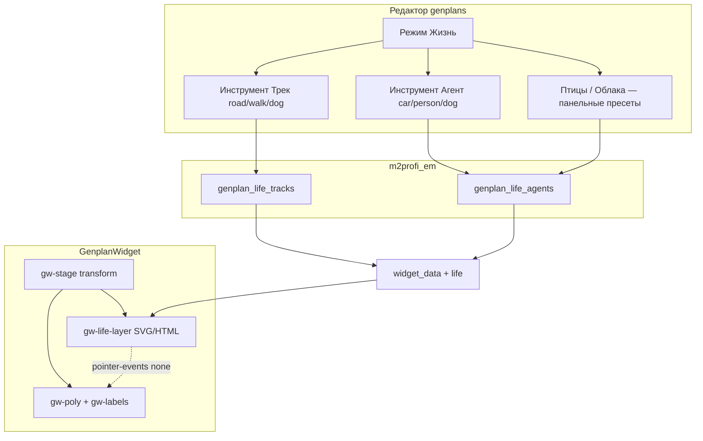

# План: «Жизнь» на генплане (треки + агенты) — задача 12

**Задача:** слой анимации поверх GenplanWidget + инструменты разметки в редакторе.  
**Дата:** 11.08.2026 · **решения:** [decisions.md](./decisions.md)  
**Статус:** 📋 план готов к коду  
**Ветка:** `feature/12-genplan-life`  
**Зависимость:** [#10 Genplan](../10/doc.md) (редактор + виджет)  
**Единственный источник истины для кода:** этот файл  

### ⚠️ Область — строго `sites/em/**`

| | |
|---|---|
| **Меняем** | `sites/em/sahmatka/**`, `sites/em/.doc/tasks/12/**` |
| **Не трогаем** | Sigma, core, другие тенанты, логику полигонов домов (кроме UI-режима рядом) |
| **Reuse** | Leaflet.Draw polyline из редактора #10; Shadow DOM / transform stage из `genplan_widget.js` |

---

## 0. Канон продукта

| Тема | Канон |
|------|--------|
| Цель | Максимум «живости» при мин. трудозатратах админа и без ущерба навигации |
| Графика | Встроенные SVG-спрайты (`car_a/b/c`, `person_a/b`, `dog_a/b`, `bird_a`, `cloud_a/b`) |
| Треки | Polyline в CRS плана (как points полигонов: y=0 у низа) |
| Агенты на треке | car / person / dog → обязательный `track_id`, speed, period, sprite |
| Птицы | Random, без трека |
| Облака | Медленный drift, без трека (1–2 экземпляра на квартал) |
| Клики | Life: `pointer-events: none` всегда |
| Motion | `prefers-reduced-motion: reduce` → life off |
| Explore | Life играет в компакте и explore; позиция в системе координат stage (масштабируется с pan/zoom) |

---

## 1. Архитектура



**Z-order в stage (снизу вверх):** фон img → life layer → SVG polys → labels overlay.

---

## 2. Модель данных

### 2.1. Миграция `007_genplan_life.sql`

```sql
-- EM task 12: треки и агенты «жизни» на генплане
-- БД: m2profi_em

CREATE TABLE IF NOT EXISTS `genplan_life_tracks` (
  `track_id`     INT UNSIGNED NOT NULL AUTO_INCREMENT,
  `kvartal_id`   INT UNSIGNED NOT NULL COMMENT 'homes_kvartal.homes_kvartal_id',
  `role`         ENUM('road','walk','dog') NOT NULL DEFAULT 'road'
                   COMMENT 'road=машины, walk=люди, dog=собаки',
  `title`        VARCHAR(128) NULL DEFAULT NULL COMMENT 'подпись в админке',
  `points`       TEXT NOT NULL COMMENT 'JSON [[x,y],…] CRS.Simple y=0 у низа; >=2 точек',
  `closed`       TINYINT(1) NOT NULL DEFAULT 0 COMMENT '1=петля (замкнуть путь)',
  `sort_order`   INT NOT NULL DEFAULT 0,
  `created_at`   DATETIME NOT NULL DEFAULT CURRENT_TIMESTAMP,
  `updated_at`   DATETIME NOT NULL DEFAULT CURRENT_TIMESTAMP ON UPDATE CURRENT_TIMESTAMP,
  `del`          TINYINT(1) NOT NULL DEFAULT 0,
  PRIMARY KEY (`track_id`),
  KEY `idx_glt_kvartal` (`kvartal_id`, `del`)
) ENGINE=InnoDB DEFAULT CHARSET=utf8mb4;

CREATE TABLE IF NOT EXISTS `genplan_life_agents` (
  `agent_id`     INT UNSIGNED NOT NULL AUTO_INCREMENT,
  `kvartal_id`   INT UNSIGNED NOT NULL,
  `track_id`     INT UNSIGNED NULL DEFAULT NULL
                   COMMENT 'обязателен для car/person/dog; NULL для bird/cloud',
  `species`      ENUM('car','person','dog','bird','cloud') NOT NULL,
  `sprite_key`   VARCHAR(32) NOT NULL DEFAULT 'default'
                   COMMENT 'car_a|car_b|car_c|person_a|… встроенные SVG',
  `speed`        DECIMAL(8,2) NOT NULL DEFAULT 40
                   COMMENT 'px/s вдоль трека (или характерная скорость ambient)',
  `period_ms`    INT UNSIGNED NOT NULL DEFAULT 8000
                   COMMENT 'интервал появления / полный цикл; для cloud — период дрейфа',
  `enabled`      TINYINT(1) NOT NULL DEFAULT 1,
  `params_json`  TEXT NULL COMMENT 'JSON доп.: direction, phase, altitude, opacity…',
  `sort_order`   INT NOT NULL DEFAULT 0,
  `created_at`   DATETIME NOT NULL DEFAULT CURRENT_TIMESTAMP,
  `updated_at`   DATETIME NOT NULL DEFAULT CURRENT_TIMESTAMP ON UPDATE CURRENT_TIMESTAMP,
  `del`          TINYINT(1) NOT NULL DEFAULT 0,
  PRIMARY KEY (`agent_id`),
  KEY `idx_gla_kvartal` (`kvartal_id`, `del`),
  KEY `idx_gla_track` (`track_id`, `del`)
) ENGINE=InnoDB DEFAULT CHARSET=utf8mb4;
```

### 2.2. Инварианты

| Species | `track_id` | `role` трека | Дефолт speed | Дефолт period_ms |
|---------|------------|--------------|--------------|------------------|
| `car` | обязателен | `road` | 55 | 10000 |
| `person` | обязателен | `walk` | 18 | 12000 |
| `dog` | обязателен | `dog` (или `walk`) | 28 | 14000 |
| `bird` | NULL | — | 70 | 15000 (редко) |
| `cloud` | NULL | — | 4 | 60000 |

- На одном треке — **N агентов** (разные sprite / phase через `params_json.phase` 0…1).  
- Soft-delete как у полигонов (`del=1`).  
- Валидация: car нельзя повесить на `walk`; person/dog — не на `road` (dog допускается на `walk` **или** `dog`).

### 2.3. `params_json` (контракт)

```json
{
  "phase": 0.35,
  "direction": 1,
  "scale": 1,
  "opacity": 0.85,
  "yJitter": 0,
  "bird": { "altitudeMin": 40, "altitudeMax": 160, "lifespanMs": 9000 },
  "cloud": { "bandY": 0.12, "width": 180 }
}
```

| Поле | Назначение |
|------|------------|
| `phase` | Сдвиг старта по длине трека / по времени (0…1) |
| `direction` | `1` вперёд по points, `-1` назад |
| `scale` | Множитель размера спрайта |
| `bird.*` | Полоса высоты и время жизни одного пролёта |
| `cloud.*` | Относительная высота полосы и ширина |

---

## 3. API (расширение `ctr__genplans`)

Все admin-acts: `require_admin` / `check_access('admin')` как в #10.  
Публичный `widget_data` — без сессии (как сейчас).

### 3.1. Admin CRUD

| Act | Метод | Назначение |
|-----|-------|------------|
| `life_list` | GET `kvartal_id` | tracks[] + agents[] |
| `life_save_track` | POST | create/update track |
| `life_delete_track` | POST `track_id` | soft-delete (+ опц. soft-delete агентов трека) |
| `life_save_agent` | POST | create/update agent |
| `life_delete_agent` | POST `agent_id` | soft-delete |

**`life_save_track` поля:** `track_id?`, `kvartal_id`, `role`, `title?`, `points` (JSON), `closed?`, `sort_order?`  
Ошибки: `<2` точек → 400; чужой kvartal → 403/404.

**`life_save_agent` поля:** `agent_id?`, `kvartal_id`, `species`, `track_id?`, `sprite_key`, `speed`, `period_ms`, `enabled`, `params_json?`  
Ошибки: car без track / неверный role; bird/cloud с track_id → либо игнор track, либо 400 (канон: **игнор track_id**, пишем NULL).

### 3.2. Публичный `widget_data` — добавить блок `life`

```json
{
  "life": {
    "enabled": true,
    "tracks": [
      { "id": 1, "role": "road", "closed": false, "points": [[x,y], ...] }
    ],
    "agents": [
      {
        "id": 10,
        "species": "car",
        "trackId": 1,
        "spriteKey": "car_a",
        "speed": 55,
        "periodMs": 10000,
        "params": { "phase": 0.2, "direction": 1, "scale": 1 }
      }
    ],
    "sprites": {
      "car_a": { "viewBox": "0 0 40 20", "svg": "<path…/>" }
    }
  }
}
```

**Вариант спрайтов:**  
- **A (предпочтительно):** SVG inline в `genplan_widget.js` / `genplan_life_sprites.js` — `widget_data` отдаёт только `spriteKey`.  
- **B:** сервер кладёт `sprites` map (дублирование).  

Канон плана: **A** — спрайты только в JS бандле виджета; ключи стабильны.

Если tracks/agents пусто → `life.enabled=false` или пустые массивы (виджет no-op).

### 3.3. Лимиты (сервер + клиент)

| Лимит | Значение |
|-------|----------|
| Треков на kvartal | ≤ 40 |
| Агентов на kvartal | ≤ 60 |
| Точек polyline | ≤ 200 |
| Одновременно видимых на сцене (runtime) | cars≤8, people≤10, dogs≤4, birds≤3, clouds≤2 |

Клиент **троттлит** спавн, если agents больше лимита видимости.

---

## 4. Редактор (`genplan_editor.js` + CSS)

### 4.1. Третий режим тулбара

```
[ Полигоны ] [ Подписи ] [ Жизнь ]
```

При уходе из «Жизнь» — сброс недорисованного polyline (как у полигонов).

### 4.2. Подрежим «Жизнь»

| Кнопка | Действие |
|--------|----------|
| Трек · дорога | Leaflet.Draw polyline → `role=road` |
| Трек · тропа | polyline → `walk` |
| Трек · собаки | polyline → `dog` |
| Машина | выбрать трек `road` (клик по линии) → форма speed/period/sprite → save agent |
| Человек | то же для `walk` |
| Собака | для `dog` или `walk` |
| Птицы | панель: добавить 1 bird-agent (без трека), period/speed/sprite |
| Облака | панель: 1–2 cloud-agent |
| Редактировать | Path.Drag / edit vertices трека; select агента в списке |

### 4.3. Панель свойств агента

- Species (readonly после create)  
- Sprite select (превью SVG)  
- Speed (number, px/s)  
- Period (ms или сек в UI → ms в API)  
- Phase (slider 0–100%)  
- Direction (туда / обратно / туда-обратно — `direction` + optional `pingpong` в params Stage 2)  
- Enabled checkbox  
- Delete  

### 4.4. Визуал треков в редакторе

| role | Цвет линии (только editor) |
|------|----------------------------|
| road | синий `#2f80ed` |
| walk | зелёный `#28a745` |
| dog | оранжевый `#fb8c00` |

Агенты на карте — маленькие иконки-маркеры у midpoint трека или список слева.

### 4.5. Dirty / Save

Расширить dirty-модель #10: изменения life → `isDirty`; Save шлёт batch или поэлементно (как polygons).  
**Канон Stage 1:** поэлементный save сразу по «Применить» в панели life + общий dirty только для polys — **либо** единый Save.  

Предпочтение (проще UX): **автоsave life** при закрытии формы агента/трека (отдельные ajax), polys — как сейчас через общий Save. Явно разделить в UI: «Жизнь сохраняется сразу».

---

## 5. Виджет (`genplan_widget.js`)

### 5.1. Модуль жизни

Новый файл (предпочтительно):  
`sites/em/sahmatka/template/default/js/genplan_life.js`  
подключается до/внутри виджета, экспортирует `GenplanLife.mount(layerEl, lifeData, getTransform)`.

Или IIFE-секция внутри `genplan_widget.js` (если не раздувать >файл).  
Канон: **отдельный `genplan_life.js`** + sprites в `genplan_life_sprites.js`.

### 5.2. Рендер

1. После `_buildMapStage` — `div.gw-life-layer` **внутри stage** (наследует transform pan/zoom).  
2. Для каждого агента — SVG symbol instance / `<g>` / `` data-URI.  
3. `requestAnimationFrame` loop:
   - car/person/dog: `distance = (t * speed + phase * length) % length` → точка на polyline + угол касательной  
   - closed track: loop; else: ping-pong **Stage 1 default** для open tracks  
   - bird: каждые `periodMs` спавн с random x, дуга Безье, remove через lifespan  
   - cloud: медленный x drift в bandY, wrap  
4. Pause loop если: destroyed, reduced-motion, tab hidden (`document.hidden`), `life.agents.length===0`.

### 5.3. CSS (Shadow)

```
.gw-life-layer { position:absolute; inset:0; pointer-events:none; z-index:2; overflow:visible; }
.gw-life-agent { position:absolute; will-change:transform; transform-origin:center center; }
.gw-root.is-coarse:not(.is-explore) .gw-life-layer { opacity: 0.85; } /* чуть тише в компакте */
@media (prefers-reduced-motion: reduce) {
  .gw-life-layer { display: none !important; }
}
```

Labels z-index 5+; polys выше life.

### 5.4. Опция mount (опционально)

```js
GenplanWidget.mount({
  // …
  life: true,              // default true; false — не запрашивать/не играть
  lifeDensity: 'auto'      // 'low'|'auto'|'high' — множитель лимитов видимости
});
```

---

## 6. Спрайты (без графики заказчика)

Рисовать **минималистичные силуэты сверху/¾**, цвет приглушённый, читаемость на рендере:

| key | Описание |
|-----|----------|
| `car_a` `car_b` `car_c` | 3 цвета кузова, ~36×18 px viewBox |
| `person_a` `person_b` | 2 позы/одежды, ~14×24 |
| `dog_a` `dog_b` | 2 силуэта, ~22×14 |
| `bird_a` | V-крыло / точка с крыльями, ~16×10 |
| `cloud_a` `cloud_b` | мягкие blob, opacity 0.35–0.5, ~120×40 |

Хранить как строки SVG в JS. Превью в редакторе — те же ключи.

---

## 7. Стейджи поставки

### Stage 1 — MVP (максимум эффекта)

1. Миграция `007`.  
2. CRUD tracks + agents (car only на road).  
3. Режим «Жизнь» в редакторе: draw road track, add car agents.  
4. `widget_data.life` + playback cars + 1–2 clouds.  
5. pointer-events none, reduced-motion, лимиты.  

**Критерий приёмки Stage 1:** на демо kvartal_id машины едут по размеченной дороге, облака ползут, клики по домам работают.

### Stage 2 — люди и собаки

1. Tracks `walk` / `dog`.  
2. Agents person/dog + спрайты.  
3. Ping-pong / direction UI.  

### Stage 3 — птицы + полировка

1. Bird random ambient.  
2. `lifeDensity`, меньше агентов в compact mobile.  
3. Список агентов в панели, duplicate agent.  
4. Docs delivery + QA.

### Вне scope

- Загрузка своих PNG спрайтов  
- Физика столкновений / светофоры  
- Звук  
- Анимация деревьев на JPG фона  
- WebGL / video background  
- Правки Sigma  

---

## 8. Файловый манифест

| Путь | Действие |
|------|----------|
| `migrations/007_genplan_life.sql` | create |
| `fw/controllers/ctr__genplans.php` | acts life_* + блок в widget_data |
| `fw/templates/genplans/editor.php` | кнопки режима Жизнь / панель |
| `template/default/js/genplan_editor.js` | UI life |
| `template/default/css/genplan_editor.css` | стили треков/панели |
| `template/default/js/genplan_life_sprites.js` | create SVG map |
| `template/default/js/genplan_life.js` | runtime playback |
| `template/default/js/genplan_widget.js` | integrate layer + option `life` |
| `fw/templates/genplans/widget_demo.php` | cache-bust version |
| `.doc/tasks/12/*` | эта документация |

Версия виджета: bump минорно при поставке (например `2.5.0` при Stage 1).

---

## 9. Алгоритм движения по треку (виджет)

```
function pointAlong(points, dist):
  // накопить длины сегментов; найти сегмент; lerp; вернуть {x,y,angle}

each frame:
  len = pathLength(track.points, closed)
  if open && pingpong:
    cycle = periodMs based OR (len/speed)*2
    u = triangleWave(t, cycle)  // 0→1→0
  else:
    u = fract(t * speed / len + phase)
  p = pointAlong(points, u * len)
  el.style.transform = `translate(px) rotate(angle)`
  // учесть flipY как у полигонов при переводе CRS → SVG/CSS layer
```

**Координаты:** хранение как у #10 (`label_y` / points, y=0 снизу). В life-layer внутри stage с размером `imageWidth×imageHeight` — те же преобразования, что SVG viewBox.

---

## 10. QA checklist (черновик)

### Stage 1
- [ ] Миграция 007 на стенде  
- [ ] Draw road → save track → reload editor  
- [ ] Add 2 cars different sprites/phase → видны в demo  
- [ ] Pan/zoom/explore: машины остаются на дороге  
- [ ] Hover/tap дома: тултипы работают, life не перехватывает  
- [ ] reduced-motion: life скрыт  
- [ ] Пустой life: виджет без ошибок  

### Stage 2–3
- [ ] walk/dog треки + agents  
- [ ] birds появляются редко и исчезают  
- [ ] clouds не перекрывают читаемость chips  

---

## 11. Оценка порядка работ

| Этап | Оценка |
|------|--------|
| Stage 1 | 2–3 дня |
| Stage 2 | 1 день |
| Stage 3 | 0.5–1 день |

---

## 12. Связь с задачей 10

В [../10/doc.md](../10/doc.md) добавить строку:  
«Следующая задача: [#12 Жизнь на плане](../12/doc.md)».

Не ломать API `objects[]` виджета — только additive поле `life`.
