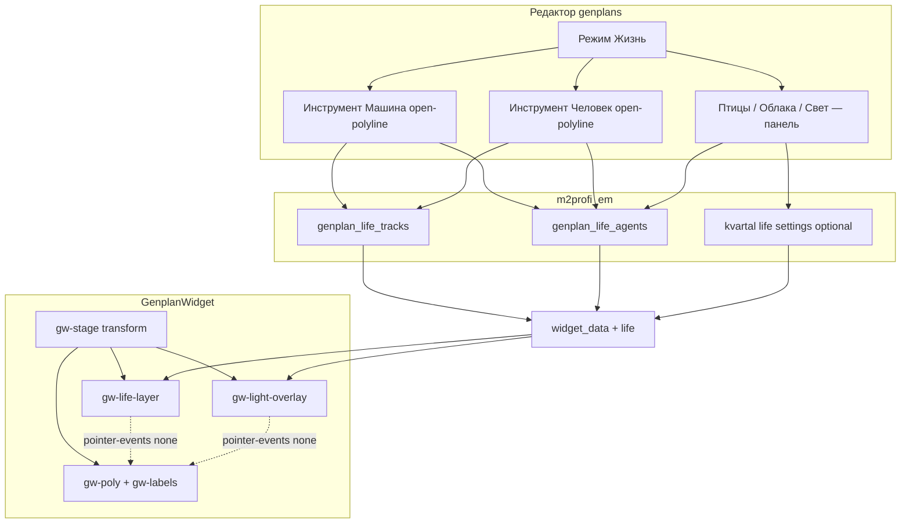

# План: «Жизнь» на генплане (треки + агенты) — задача 12

**Задача:** слой анимации поверх GenplanWidget + инструменты разметки в редакторе.  
**Дата:** 11.08.2026 · **решения:** [decisions.md](./decisions.md)  
**Статус:** 📋 план готов к коду  
**Ветка:** `feature/12-genplan-life`  
**Зависимость:** [#10 Genplan](../10/doc.md) (редактор + виджет)  
**Единственный источник истины для кода:** этот файл  

### ⚠️ Область — строго `sites/em/**`

| | |
|---|---|
| **Меняем** | `sites/em/sahmatka/**`, `sites/em/.doc/tasks/12/**` |
| **Не трогаем** | Sigma, core, другие тенанты, логику полигонов домов (кроме UI-режима рядом) |
| **Reuse** | Leaflet.Draw polyline из редактора #10; Shadow DOM / transform stage из `genplan_widget.js` |

---

## 0. Канон продукта

| Тема | Канон |
|------|--------|
| Цель | Максимум «живости» при мин. трудозатратах админа и без ущерба навигации |
| Графика | Встроенные SVG-спрайты (`car_a/b/c`, `person_a/b`, `dog_a/b`, `bird_a`, `cloud_a/b`) |
| Рисование путей | **Как полигон** (последовательные клики по вершинам), но **без требования замыкания** — open polyline ≥2 точек |
| Спец-инструменты | **«Машина»** → путь `road`; **«Человек»** → путь `walk` (не общий «полигон домов») |
| Агенты на треке | car / person: обязательны **`speed`** + **`period_ms`** (+ sprite, `track_id`) |
| Птицы | Random **диагональные** пролёты; **отключаемые** (mount + админ) |
| Облака | Медленный drift; отключаемые |
| Свет | Лёгкий overlay (§6); отключаемый из mount |
| Клики | Life + light: `pointer-events: none` всегда |
| Motion | `prefers-reduced-motion: reduce` → life + light pulse off |
| Explore | Life/light в системе координат stage (с pan/zoom) |
| Mount | Раздельные флаги: `life`, `lifeCars`, `lifePeople`, `lifeBirds`, `lifeClouds`, `lifeLight` |

---

## 1. Архитектура



**Z-order в stage (снизу вверх):** фон img → **light overlay** → life layer → SVG polys → labels overlay.

---

## 2. Модель данных

### 2.1. Миграция `007_genplan_life.sql`

```sql
-- EM task 12: треки и агенты «жизни» на генплане
-- БД: m2profi_em

CREATE TABLE IF NOT EXISTS `genplan_life_tracks` (
  `track_id`     INT UNSIGNED NOT NULL AUTO_INCREMENT,
  `kvartal_id`   INT UNSIGNED NOT NULL COMMENT 'homes_kvartal.homes_kvartal_id',
  `role`         ENUM('road','walk','dog') NOT NULL DEFAULT 'road'
                   COMMENT 'road=машины, walk=люди, dog=собаки',
  `title`        VARCHAR(128) NULL DEFAULT NULL COMMENT 'подпись в админке',
  `points`       TEXT NOT NULL COMMENT 'JSON [[x,y],…] CRS.Simple y=0 у низа; >=2 точек; OPEN polyline',
  `closed`       TINYINT(1) NOT NULL DEFAULT 0 COMMENT 'Stage1 всегда 0 для car/person; петля — backlog',
  `sort_order`   INT NOT NULL DEFAULT 0,
  `created_at`   DATETIME NOT NULL DEFAULT CURRENT_TIMESTAMP,
  `updated_at`   DATETIME NOT NULL DEFAULT CURRENT_TIMESTAMP ON UPDATE CURRENT_TIMESTAMP,
  `del`          TINYINT(1) NOT NULL DEFAULT 0,
  PRIMARY KEY (`track_id`),
  KEY `idx_glt_kvartal` (`kvartal_id`, `del`)
) ENGINE=InnoDB DEFAULT CHARSET=utf8mb4;

CREATE TABLE IF NOT EXISTS `genplan_life_agents` (
  `agent_id`     INT UNSIGNED NOT NULL AUTO_INCREMENT,
  `kvartal_id`   INT UNSIGNED NOT NULL,
  `track_id`     INT UNSIGNED NULL DEFAULT NULL
                   COMMENT 'обязателен для car/person/dog; NULL для bird/cloud',
  `species`      ENUM('car','person','dog','bird','cloud') NOT NULL,
  `sprite_key`   VARCHAR(32) NOT NULL DEFAULT 'default'
                   COMMENT 'car_a|car_b|car_c|person_a|… встроенные SVG',
  `speed`        DECIMAL(8,2) NOT NULL DEFAULT 40
                   COMMENT 'px/s вдоль трека (или характерная скорость ambient)',
  `period_ms`    INT UNSIGNED NOT NULL DEFAULT 8000
                   COMMENT 'интервал появления / полный цикл; для cloud — период дрейфа',
  `enabled`      TINYINT(1) NOT NULL DEFAULT 1,
  `params_json`  TEXT NULL COMMENT 'JSON доп.: direction, phase, altitude, opacity…',
  `sort_order`   INT NOT NULL DEFAULT 0,
  `created_at`   DATETIME NOT NULL DEFAULT CURRENT_TIMESTAMP,
  `updated_at`   DATETIME NOT NULL DEFAULT CURRENT_TIMESTAMP ON UPDATE CURRENT_TIMESTAMP,
  `del`          TINYINT(1) NOT NULL DEFAULT 0,
  PRIMARY KEY (`agent_id`),
  KEY `idx_gla_kvartal` (`kvartal_id`, `del`),
  KEY `idx_gla_track` (`track_id`, `del`)
) ENGINE=InnoDB DEFAULT CHARSET=utf8mb4;
```

### 2.2. Инварианты

| Species | `track_id` | `role` трека | Дефолт speed | Дефолт period_ms |
|---------|------------|--------------|--------------|------------------|
| `car` | обязателен | `road` | 55 | 10000 |
| `person` | обязателен | `walk` | 18 | 12000 |
| `dog` | обязателен | `dog` или `walk` | 28 | 14000 |
| `bird` | NULL | — | 70 | 15000 (редко) |
| `cloud` | NULL | — | 4 | 60000 |

- Инструмент **Машина** рисует open polyline → track `road` + сразу 1 car-agent (редактируемые speed/period/sprite).  
- Инструмент **Человек** → track `walk` + 1 person-agent.  
- На одном треке можно добавить ещё агентов того же вида (Stage 1.1).  
- **Замыкание запрещено** в UI Stage 1 (`closed=0` всегда).  
- car нельзя на `walk`; person не на `road`.  

### 2.3. Настройки ambient на квартал (опционально)

Либо отдельные agents bird/cloud в БД, либо компактная строка в `widget_data.life.settings`:

```json
"settings": {
  "birds": true,
  "clouds": true,
  "light": "day"
}
```

Админ-переключатели в панели «Жизнь»; **виджет-mount может переопределить** (см. §5.4).

### 2.4. `params_json` (контракт)

```json
{
  "phase": 0.35,
  "direction": 1,
  "scale": 1,
  "opacity": 0.85,
  "yJitter": 0,
  "bird": { "altitudeMin": 40, "altitudeMax": 160, "lifespanMs": 9000 },
  "cloud": { "bandY": 0.12, "width": 180 }
}
```

| Поле | Назначение |
|------|------------|
| `phase` | Сдвиг старта по длине трека / по времени (0…1) |
| `direction` | `1` вперёд по points, `-1` назад |
| `scale` | Множитель размера спрайта |
| `bird.*` | Диагональ: `diagonal: "↘"|"↙"|"↗"|"↖"|"random"`, lifespan, altitude |
| `cloud.*` | Относительная высота полосы и ширина |

---

## 3. API (расширение `ctr__genplans`)

Все admin-acts: `require_admin` / `check_access('admin')` как в #10.  
Публичный `widget_data` — без сессии (как сейчас).

### 3.1. Admin CRUD

| Act | Метод | Назначение |
|-----|-------|------------|
| `life_list` | GET `kvartal_id` | tracks[] + agents[] |
| `life_save_track` | POST | create/update track |
| `life_delete_track` | POST `track_id` | soft-delete (+ опц. soft-delete агентов трека) |
| `life_save_agent` | POST | create/update agent |
| `life_delete_agent` | POST `agent_id` | soft-delete |

**`life_save_track` поля:** `track_id?`, `kvartal_id`, `role`, `title?`, `points` (JSON), `closed?`, `sort_order?`  
Ошибки: `<2` точек → 400; чужой kvartal → 403/404.

**`life_save_agent` поля:** `agent_id?`, `kvartal_id`, `species`, `track_id?`, `sprite_key`, `speed`, `period_ms`, `enabled`, `params_json?`  
Ошибки: car без track / неверный role; bird/cloud с track_id → либо игнор track, либо 400 (канон: **игнор track_id**, пишем NULL).

### 3.2. Публичный `widget_data` — добавить блок `life`

```json
{
  "life": {
    "enabled": true,
    "settings": {
      "cars": true,
      "people": true,
      "birds": true,
      "clouds": true,
      "light": "day"
    },
    "tracks": [
      { "id": 1, "role": "road", "closed": false, "points": [[x,y], ...] }
    ],
    "agents": [
      {
        "id": 10,
        "species": "car",
        "trackId": 1,
        "spriteKey": "car_a",
        "speed": 55,
        "periodMs": 10000,
        "params": { "phase": 0.2, "direction": 1, "scale": 1 }
      }
    ]
  }
}
```

**Вариант спрайтов:**  
- **A (предпочтительно):** SVG inline в `genplan_life_sprites.js` — `widget_data` отдаёт только `spriteKey`.  
- **B:** сервер кладёт `sprites` map (дублирование).  

Канон плана: **A** — спрайты только в JS бандле виджета; ключи стабильны.

Если tracks/agents пусто и ambient выкл → виджет no-op.

### 3.3. Лимиты (сервер + клиент)

| Лимит | Значение |
|-------|----------|
| Треков на kvartal | ≤ 40 |
| Агентов на kvartal | ≤ 60 |
| Точек polyline | ≤ 200 |
| Одновременно видимых на сцене (runtime) | cars≤8, people≤10, dogs≤4, birds≤3, clouds≤2 |

Клиент **троттлит** спавн, если agents больше лимита видимости.

---

## 4. Редактор (`genplan_editor.js` + CSS)

### 4.1. Третий режим тулбара

```
[ Полигоны ] [ Подписи ] [ Жизнь ]
```

При уходе из «Жизнь» — сброс недорисованного polyline (как у полигонов).

### 4.2. Подрежим «Жизнь» — спец-инструменты

Рисование пути = **тот же UX, что полигон домов** (клик → вершина → клик…), но:

- используется Leaflet.Draw **polyline** (не polygon);
- **замыкания нет** (нет требования вернуть в первую точку);
- finish: double-click / Enter / кнопка «Готово» при ≥2 точках.

| Кнопка | Действие |
|--------|----------|
| **Машина** | Open-polyline → save track `role=road` + дефолтный car-agent → панель speed/period/sprite |
| **Человек** | Open-polyline → track `role=walk` + person-agent → панель |
| Собака (Stage 2) | То же → `role=dog` |
| Птицы | Toggle + period/density (без линии); пролёты **по диагонали** |
| Облака | Toggle + 1–2 экземпляра |
| Свет | Select: off / day / evening / soft-pulse |
| Редактировать | Edit vertices open-line; список агентов на выбранном пути |
| Удалить | Soft-delete track (+ его агенты) |

**Не делать** отдельный «нарисуй трек, потом привяжи машину» как обязательный двухшаговый поток Stage 1 — инструмент сразу создаёт путь+агент.

### 4.3. Панель свойств агента (машина / человек)

Обязательные поля после рисования линии (и при редактировании):

| Поле UI | API | Смысл | Дефолт |
|---------|-----|--------|--------|
| **Скорость** | `speed` | px/s вдоль линии | car 55 · person 18 |
| **Периодичность** | `period_ms` | интервал цикла / появления (в UI — секунды → ms) | car 10с · person 12с |
| Спрайт | `sprite_key` | какой из 2–3 силуэтов | `car_a` / `person_a` |

Дополнительно (не блокируют save):

- Phase (сдвиг старта 0–100%)  
- Direction / ping-pong (Stage 2)  
- Enabled  
- Delete  

Без скорости и периодичности агент **не сохраняется** (валидация UI + сервер: `speed > 0`, `period_ms ≥ 1000`).

### 4.4. Визуал треков в редакторе

| role | Цвет линии (только editor) |
|------|----------------------------|
| road | синий `#2f80ed` |
| walk | зелёный `#28a745` |
| dog | оранжевый `#fb8c00` |

Агенты на карте — маленькие иконки-маркеры у midpoint трека или список слева.

### 4.5. Dirty / Save

Расширить dirty-модель #10: изменения life → `isDirty`; Save шлёт batch или поэлементно (как polygons).  
**Канон Stage 1:** поэлементный save сразу по «Применить» в панели life + общий dirty только для polys — **либо** единый Save.  

Предпочтение (проще UX): **автоsave life** при закрытии формы агента/трека (отдельные ajax), polys — как сейчас через общий Save. Явно разделить в UI: «Жизнь сохраняется сразу».

---

## 5. Виджет (`genplan_widget.js`)

### 5.1. Модуль жизни

Новый файл (предпочтительно):  
`sites/em/sahmatka/template/default/js/genplan_life.js`  
подключается до/внутри виджета, экспортирует `GenplanLife.mount(layerEl, lifeData, getTransform)`.

Или IIFE-секция внутри `genplan_widget.js` (если не раздувать >файл).  
Канон: **отдельный `genplan_life.js`** + sprites в `genplan_life_sprites.js`.

### 5.2. Рендер

1. После `_buildMapStage` — `div.gw-light-overlay` + `div.gw-life-layer` **внутри stage**.  
2. Агенты — SVG instances.  
3. `requestAnimationFrame` loop:
   - car/person: open polyline → **ping-pong** по умолчанию  
   - bird: каждые `periodMs` спавн; траектория **диагональ** (↘↙↗↖), lifespan → remove  
   - cloud: медленный drift + лёгкий wobble  
4. Pause: destroyed / reduced-motion / `document.hidden` / все категории выкл флагами mount.

Фильтр: `lifeCars` / `lifePeople` / `lifeBirds` / `lifeClouds` / `lifeDogs`.

### 5.3. CSS (Shadow)

```
.gw-light-overlay { position:absolute; inset:0; pointer-events:none; z-index:1; mix-blend-mode: multiply; }
.gw-life-layer { position:absolute; inset:0; pointer-events:none; z-index:2; overflow:visible; }
.gw-life-agent { position:absolute; will-change:transform; transform-origin:center center; }
.gw-root.is-coarse:not(.is-explore) .gw-life-layer { opacity: 0.85; }
@media (prefers-reduced-motion: reduce) {
  .gw-life-layer { display: none !important; }
  .gw-light-overlay.is-pulse { animation: none !important; }
}
```

### 5.4. Опции `GenplanWidget.mount` (канон)

Mount **перекрывает** `life.settings` с сервера. Defaults = `true`.

```js
GenplanWidget.mount({
  // …
  life: true,           // master; false = нет слоя
  lifeCars: true,
  lifePeople: true,
  lifeDogs: true,       // Stage 2
  lifeBirds: true,      // диагональ; false = выкл
  lifeClouds: true,
  lifeLight: true,
  lifeLightMode: 'day', // 'off'|'day'|'evening'|'pulse'
  lifeDensity: 'auto'
});
```

---

## 6. Свет (ambient)

Тонкий overlay (не day/night-движок):

| Режим | Визуал |
|-------|--------|
| `day` | vignette opacity ≤0.08 |
| `evening` | тёплый градиент сверху |
| `pulse` | медленный fade 8–12s |
| `off` | нет |

`pointer-events: none`; не портить читаемость chips; reduced-motion отключает только pulse.  
Админ: `settings.light`. Точечные «окна» — backlog, не MVP.

---

## 7. Спрайты

`car_a/b/c`, `person_a/b`, `dog_a/b`, `bird_a`, `cloud_a/b` — SVG в JS, без файлов заказчика.

---

## 8. Стейджи

### Stage 1 — MVP
Инструменты **Машина** / **Человек** (open-polyline **без замыкания**); cars+people+clouds; mount-флаги; light day/evening.

### Stage 2
Собаки; birds **по диагонали** + отключение; direction UI.

### Stage 3
Light pulse; density; QA/docs.

### Вне scope
PNG заказчика; звук; **обязательное замыкание** путей; анимация JPG-деревьев; WebGL; Sigma.

---

## 9. Файловый манифест

`007_genplan_life.sql`, life_* acts, editor (Машина/Человек), `genplan_life.js` + sprites, widget mount flags, demo.  
Версия Stage 1: **2.5.0**.

---

## 10. Алгоритмы

**Open track:** ping-pong `triangleWave` вдоль polyline + rotate по касательной.  
**Birds:** periodMs → диагональ {SE,SW,NE,NW} off-canvas→off-canvas + wobble.  
Координаты как #10 (y=0 снизу).

---

## 11. QA

- [ ] Машина/Человек: ≥2 точки, **без** замыкания  
- [ ] Движение в demo  
- [ ] `lifeCars/People/Birds/Clouds/Light: false`  
- [ ] Тултипы домов ок; birds диагональ; reduced-motion  

---

## 12. Оценка

Stage1 2–3д · Stage2 1д · Stage3 0.5–1д

---

## 13. Связь с #10

Только additive `life` + light. `objects[]` не ломать.
