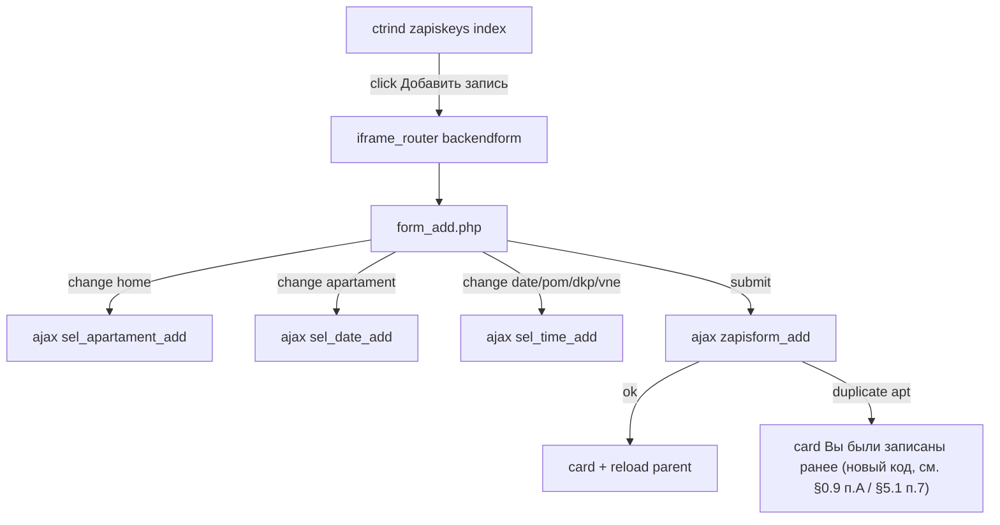

# План: форма «Добавить запись» в модалке (ctr=zapiskeys)

**Задача:** на странице [Запись на выдачу](https://em.m2profi.pro/sahmatka/ctrind.php?ctr=zapiskeys) добавить кнопку **«Добавить запись»**, открывающую форму в iframe-модалке (как `act=edit` и другие формы контроллера).  
**Дата аудита:** 06.07.2026 (3 раунда: первичный аудит → §0.7 доп. проверка → §0.9 строгий аудит логики/регрессии)  
**Статус:** план (код не менялся)  
**Область:** `sites/em/` только (sigma **не трогаем**)  
**Связанные документы:** [ctr_legacy.md](../../ctr_legacy.md)  
**Страница:** `ctrind.php?ctr=zapiskeys` → `ctr__zapiskeys::act__index()`  
**Документ задачи:** [doc.md](./doc.md)

---

## 0. Результат аудита

### 0.1. Текущее состояние UI

| Элемент | Файл | Состояние |
|---------|------|-----------|
| Кнопка «Запись» / `backendform` | `ctr__zapiskeys.php` ~849 | `display:none` — **не показывается** |
| Ссылка `form_zapis_editor.php` | тот же блок | `display:none`, файла **нет в репозитории** |
| Редактирование строки | `index_ajaxrow.php` | `iframe_rajax` → `act=edit` — **работает** |
| Карточка записи | `index_ajaxrow.php` | `iframe_rajax` → `act=card` — **работает** |
| На скриншоте EM (production) | — | видна ссылка **«Добавить запись»** справа над таблицей — вероятно ручная правка на сервере или локальная ветка, в git **скрыта** |

**Вывод:** функционал добавления записи **задуман**, но **не доведён**: нет `act__backendform`, кнопка скрыта, обработчик сохранения указывает на несуществующий экшен в `zapiskeys`.

### 0.2. Существующий прототип формы (`bedit`)

В `ctr__zapisx.php` есть готовый прототип админ-формы:

| Метод | Назначение |
|-------|------------|
| `act__bedit()` | HTML-форма с каскадными селектами + JS `fwloadx` |
| `act__zapisformx()` | POST-обработчик: валидация слота, `INSERT` в `zapis`, email, карточка |
| `act__sel_home_zapis()` | options домов (жирный / disabled по свободным местам) |
| `act__sel_section_zapis()` | секции |
| `act__sel_apartament_zapis()` | квартиры (жирный = без записи, серый = уже записаны) |
| `act__sel_date_zapisx()` | даты из графика `keys_graficx` |
| `act__sel_time_zapisx()` | время из графика с учётом ПО/ДКП |

**Проблемы прототипа:**

1. Форма в `bedit` постит на `ctr=zapiskeys&act=zapisformx`, но **`zapisformx` живёт только в `ctr__zapisx`** → сохранение **сломано**.
2. Чекбокс `admin_mode` («ЛЮБЫЕ ДОМА И ВРЕМЯ») **только перезагружает** селект домов; в `sel_*` методах **нет ветки** `admin_mode` / `vne_grafika`.
3. Нет селекта **тип договора ДКП/ДДУ** (поле `zapis.dkp`: `0` = ДДУ, `1` = ДКП).
4. Hardcoded URL `https://em.m2profi.pro/...` в `bedit` (форма и JS) — заменить на относительные `/sahmatka/...`.
5. Нет проверки `check_access('admin')` на форме и сохранении.
6. `act__edit` в `zapiskeys` при `id` без записи пишет «Добавление записей не возможно» — **добавление через edit закрыто намеренно**.

### 0.3. Две системы графика (важно не перепутать)

| Система | Таблицы | Где используется | Актуальность |
|---------|---------|------------------|--------------|
| **Старая** | `keys_grafic` | `ctr__zapiskeys::get_grafic()`, редактор `stat_zapis_editor_keys.php` | Legacy, **не** для публичной записи |
| **Новая** | `keys_graficx_date`, `keys_graficx_objects`, `keys_graficx_time`, `keys_graficx_filters` | `ctr__zapisx::get_graficx()`, публичная запись, редактор `ctr=zapisx` | **Источник истины** для слотов |

**Решение для новой формы:** использовать **`get_graficx()` из `ctr__zapisx2`** (сигнатура идентична `ctr__zapisx`, но `zapisx2` — выбранная база, см. §0.7 п.3; либо вынести в общий helper позже). Методы `sel_*_zapis` в `ctr__zapiskeys` (строки 605–647, keys_grafic) — **не использовать** для новой формы.

### 0.4. Сетка времени (константа проекта)

Из `ctr__zapisx::__construct()` (идентично в `ctr__zapisx2::__construct()`) / `edit_daygroup`:

```
09:00, 10:00, 11:00, 13:30, 14:30, 15:30 [, 16:30 в редакторе графика]
```

Для режима «вне графика» брать **`$this->time_arr`** контроллера `zapisx2` (выбранная база, см. §0.7 п.3; список идентичен `zapisx`).

### 0.5. Матрица файлов (планируемые изменения)

| # | Путь (от `sites/em/sahmatka/`) | Действие |
|---|-----------------------------------|----------|
| 1 | `fw/controllers/ctr__zapiskeys.php` | **PATCH** — `act__backendform`, прокси/сохранение, ajax-селекты |
| 2 | `fw/controllers/ctr__zapisx2.php` | **PATCH (только добавление новых методов)** — новые публичные `render_sel_date_add`/`render_sel_time_add` (без промо-хардкода §0.7 п.4) и новый `admin_insert_zapis($data, $vne_grafika)` (§0.7 п.7/§5.1). **`atomic_insert_zapis()` НЕ редактируется** — вызывается как есть для режима «по графику». **Не `ctr__zapisx.php`** — базой выбран `zapisx2`, см. §0.7 п.3 |
| 3 | `fw/templates/zapiskeys/form_add.php` | **NEW** — разметка формы (рекомендуется) |
| 4 | `fw/templates/zapiskeys/form_add_js.php` | **NEW** — JS `fwloadx` + обработчики (опционально, можно inline) |
| 5 | `template/default/css/zapiskeys_add.css` | **NEW** — стили option (жирный/серый/«вне графика»), опционально |
| 6 | `fw/controllers/ctr__zapiskeys.php` `act__index` | **PATCH** — видимая кнопка «Добавить запись» |
| 7 | `ajax_router.php` | **VERIFY** — маршрутизация новых `act` (обычно без правок) |
| 8 | `iframe_router.php` | **VERIFY** — открытие формы в модалке |

**Не трогаем:** `sites/sigma/**`, `core/etalon_site/**`, миграции БД (поля уже есть).

### 0.6. Схема данных `zapis` (релевантные поля)

По `act__zapisformx()` и `index_ajaxrow.php`:

| Поле | Тип (логика) | Форма |
|------|--------------|-------|
| `home_id` | int | селект дома |
| `section` | int | из `apartaments.section_id` при выборе квартиры |
| `apartment_num` | int | селект квартиры |
| `date` | DATE | селект даты → `Y-m-d` при insert |
| `time` | TIME | селект `HH:MM` → `HH:MM:00` |
| `fio` | string | input |
| `phone` | string | input |
| `email` | string | input |
| `pom` | 0/1 | checkbox «С помогающей» |
| `dkp` | 0/1 | select: **ДДУ** (0) / **ДКП** (1) |
| `del` | 0 | по умолчанию |
| `at` | unix time | `time()` при создании |

Отдельного поля «вне графика» **нет** — такие записи определяются постфактум (`zapis_i_dtnr` в `get_graficx`).

### 0.7. Повторный аудит (доп. проверка 06.07.2026) — критические уточнения

Проверка кода `sites/em` выявила расхождения с первой версией плана. **Все пункты ниже обязательны к учёту**, иначе реализация не будет работать так, как задумано.

**1. `check_access()` — подтверждено, существует.**
`core/functions.php:44` — функция реализована (`in_array($login, $GLOBALS['config']['admin_logins'] ?? ['admin'])`). Предположения плана (§3.1, §8) о `check_access('admin')` — **верны**, править не нужно.

**2. ❗ `ajax_router.php` НЕ требует сессию — исправить §8.**
`sites/em/sahmatka/ajax_router.php:19`: `if( $_SESSION['sh_login'] || 1==1 )` — условие **всегда истинно** из-за `|| 1==1`. Аналогично в `iframe_router.php:20`. Утверждение из §8 «`ajax_router` уже требует сессию» — **неверно, это баг документации плана**. Вывод: **каждый новый `act__sel_*_add` и `act__zapisform_add` обязан сам вызывать `check_access('admin') || op15`**, полагаться на роутер нельзя. Не переиспользовать `act__edit`/`act__card` как образец безопасности — они тоже без проверки доступа (существующая, не наша, уязвимость).

**3. ❗ `ctr__zapisx2.php` уже содержит частично готовую, более надёжную реализацию — использовать её как базу вместо `zapisx`, закрывает открытый вопрос §11.4.**

В `zapisx2` уже есть:
- `act__testfree($home, $date, $time, $pom=0, $dkp=0)` (line ~1720) — **с параметрами ПО/ДКП** (в отличие от `zapisx::act__testfree($home,$date,$time)` — 3 параметра, **без** учёта ПО/ДКП при валидации!).
- `atomic_insert_zapis($data)` (line ~1750) — **транзакция + `FOR UPDATE`**, защита от race condition при одновременной записи на последний слот. Старый `zapisx::act__zapisformx()` такой защиты не имеет (testfree → insert без блокировки строки).
- `act__zapisformx()` (line ~1921) — с валидацией обязательных полей, формата даты/времени, проверкой существования квартиры — заметно надёжнее версии в `zapisx`.
- `act__sel_date_zapisx2()` / `act__sel_time_zapisx2()` (line ~460/517) — **уже принимают `pom`/`dkp`** так же, как требуется для новой формы (§4.5–4.6).
- `isApartmentAllowed()`, `graficx_i_filters` — smart-фильтры секций/квартир.

**НО:** `zapisx2::act__bedit()` (line 2064) — **это копипаста `zapisx::act__bedit()` без доработки**: форма постит на `ctr=zapiskeys&act=zapisformx` (тот же баг маршрута), а JS-каскад ссылается на `ctr=zapisx&act=sel_home_zapis` / `sel_section_zapis` / `sel_apartament_zapis` / `sel_date_zapisx` / `sel_time_zapisx` — **то есть даже собственная форма `zapisx2` не использует свои же продвинутые `sel_date_zapisx2` / `sel_time_zapisx2` / `atomic_insert_zapis`**. Поля `dkp` нет ни там, ни там.

**Решение (заменяет §11 вопрос №4):** новую форму делегировать на **`zapisx2`**, а не `zapisx`:
- `sel_date_add` → `zapisx2::act__sel_date_zapisx2()` (не `zapisx::act__sel_date_zapisx()`)
- `sel_time_add` → `zapisx2::act__sel_time_zapisx2()`
- `act__zapisform_add` (сохранение) → адаптировать `zapisx2::atomic_insert_zapis()` / `act__zapisformx()`, а не `zapisx::act__zapisformx()`
- Раздел 5.1 п.5 ниже скорректирован соответственно.

**4. ⚠ Хардкод бизнес-правил по датам/квартирам внутри `sel_date_zapisx2` / `sel_time_zapisx2` — решить явно, наследовать ли их в админ-форме.**

В `act__sel_date_zapisx2()` и `act__sel_time_zapisx2()` зашиты **временные ограничения по конкретным домам/квартирам**, вперемешку с базовой логикой в одном теле метода:
- `home_id == 49` — блокировка дат до/после `02.02.2026` в зависимости от секции (в `zapisx::act__sel_date_zapisx`, копия логики может быть и в x2);
- `home_id == 37` — спецправило на `23.01.2024` (есть **и в `zapisx`, и в `zapisx2`**, line ~492 в `zapisx2`);
- `home_id == 48` — жёсткие списки разрешённых дат по секциям (Feb–Mar 2026);
- `home_id == 46`, квартира `56` (`act__sel_time_zapisx2`, line ~553) — «большие квартиры» не могут записаться до `29.10.2024`.
- Все перечисленные даты (2024, начало 2026) уже **в прошлом** относительно текущей даты сервера, т.е. правила фактически не влияют на выбор дат в будущем, но код всё ещё выполняется при каждом вызове — при копировании в `render_sel_date_add`/`render_sel_time_add` **не переносить** ни один из этих блоков (не только явно перечисленные — при копировании метода целиком **свериться построчно**, вдруг есть ещё необнаруженные `if($_REQUEST['home_id']==...)` блоки).

**Дополнительно — `isApartmentAllowed()` (smart-фильтр секций/квартир, `keys_graficx_filters`) встроен в ту же логику**, что и хардкод дат: обе функции (`sel_date_zapisx2`, `sel_time_zapisx2`) вызывают `isApartmentAllowed($home_id, $section_id, $apartament_num, $filters)` и делают `continue`, если квартира не разрешена в активной группе графика. Это **не хардкод**, а управляемая через БД (`keys_graficx_filters`) настройка — в отличие от `$iskl`, её удалять не обязательно. **Решение по умолчанию:** в MVP `render_sel_date_add`/`render_sel_time_add` **тоже не** вызывать `isApartmentAllowed()` (админ должен видеть все технически свободные даты/время независимо от настроенных для публичного виджета фильтров секций) — это соответствует backlog-пункту §12 «подключить `isApartmentAllowed()` в admin-селекты» как **опциональное** улучшение, а не MVP-требование. Если бизнес решит иначе — включить фильтр отдельным тикетом.

**Важно:** и `sel_date_zapisx2`, и `sel_time_zapisx2` читают `$_REQUEST['section_id']` и `$_REQUEST['apartament_num']` (для `isApartmentAllowed`) — то есть в форме к моменту AJAX-запроса дат/времени эти поля уже должны быть в сериализованных данных формы (hidden `section_id` + выбранная `apartament_num`). Цепочка §6.3 (дом → квартира → дата → время) это обеспечивает, но важно не менять порядок полей в форме.

**5. ❗ Шаблон `form_add.php` — исправить обращение к переданным данным (иначе `$form_action` будет undefined).**

`controller::tpl($data, $ctr, $tpl_name)` (`core/classes/controller.php:116`) **не делает `extract($data)`** — внутри инклюда доступна ровно переменная `$data` (тот же массив, что передан первым аргументом), никаких отдельных `$form_action`/`$ajax_base` не создаётся. Конвенция проекта (см. `zapis_card.php:19` `$v = $data;`, `form!_broni_ag.php` `$data['apartment']` и т.д.) — читать **`$data['form_action']`**, а не голую переменную. Скелет в §3.3 ниже исправлен.

**6. ⚠ SQL-примеры в §4.4 — привести к стилю проекта.**

`$mysql` (`core/classes/mysql.php`) — обёртка над `mysqli_query`, **без поддержки `?`-плейсхолдеров/PDO**. Все запросы в кодовой базе (в т.ч. новые в `zapisx2::atomic_insert_zapis`) строятся конкатенацией строк с ручным `(int)`-приведением/`mysqli_real_escape_string`. Пример в §4.4 с `WHERE a.home_id = ?` — **не будет работать**, исправлен ниже.

**7. ❗❗ КРИТИЧНО: `atomic_insert_zapis()` физически не даст сохранить запись «вне графика» — нельзя переиспользовать как есть.**

Полный разбор метода (`ctr__zapisx2.php:1750-1847`):

```php
function atomic_insert_zapis($data)
{
    // 1. Проверка дубликата квартиры (FOR UPDATE) — ok, нужно и для «вне графика»
    ...
    // 2. Получаем группу для дома и даты
    $group = $this->graficx_i_grra[$data['home_id']][$date_formatted];
    if (!$group) {
        $mysql->sql('ROLLBACK');
        return ['success' => false, 'message' => 'Нет доступного графика для выбранного дома и даты', 'id' => null];
        //     ^^^^^^^^^^^^^^^^^^^^^^^^^^^^^^^^^^^^^^^^^^^^^^^^^^^^^^^^^^^^^^^^^^^^^^^^^^^^^^^^^^^^^^^^^
        //     ЖЁСТКИЙ БЛОК: если для дома+даты нет группы графика вообще — insert НЕ произойдёт.
        //     Именно это и есть смысл «вне графика» — дата/время БЕЗ группы. Метод в текущем виде
        //     всегда отклонит такую запись, ещё ДО проверки capacity.
    }
    // 3. Проверка capacity — тоже блокирует overbooking
    if ($current_count >= $capacity) { ROLLBACK; return 'Все места заняты'; }
    // 4. INSERT
}
```

**Вывод:** формулировка в §5.1 (ранее: «адаптировать `atomic_insert_zapis()`, пропустив проверку capacity») была **неточной и недостаточной** — пропустить нужно не только проверку capacity (шаг 3), но и сам поиск группы (шаг 2), при этом единственный вызывающий код — `zapisx2::act__zapisformx()` (публичная запись, проверено `grep` — других мест вызова нет). 

**Решение (обновляет §5.1): НЕ модифицировать `atomic_insert_zapis()` вообще.** Вместо веток `if($vne_grafika)` внутри общего метода — завести **отдельный, полностью независимый метод** `admin_insert_zapis($data, $vne_grafika)` **в `ctr__zapisx2.php`** (рядом с `atomic_insert_zapis()`, но не изменяя его), который:
- для `vne_grafika=0` — **вызывает существующий `zapisx2->atomic_insert_zapis($data)` без единой правки** (используется «как чёрный ящик», это ровно то поведение, которое нужно для режима «по графику» — проверка группы и capacity обязательна);
- для `vne_grafika=1` — использует **свою собственную транзакцию** с тем же дубль-чеком квартиры (`FOR UPDATE`), но **без обращения к `graficx_i_grra`/`graficx_i_gr_c2` вообще** — сразу `INSERT`.

Такой подход даёт **нулевой риск** для публичной записи (её код вообще не трогается ни строчкой) и одновременно снимает блокировку для «вне графика». Псевдокод — в обновлённом §5.1.

---

### 0.8. Анализ влияния на существующий функционал (ответ на прямые вопросы)

**Вопрос 1: добавляется только новая форма, весь остальной функционал неизменный?**

Не совсем «только новая форма» — есть 2 точечных PATCH существующих файлов, оба **аддитивные** (добавляют код, не переписывают существующую логику):

| Файл | Что именно меняется | Затрагивает существующий функционал? |
|------|---------------------|---------------------------------------|
| `ctr__zapiskeys.php` → `act__index()` | Замена скрытой (`display:none`) ссылки на видимую с проверкой доступа (§3.2) | Нет — блок изолирован, не трогает `get_data_arr()`/таблицу/фильтр |
| `ctr__zapiskeys.php` | Добавление **новых** методов `act__backendform`, `act__sel_home_add`, `act__sel_apartament_add`, `act__sel_date_add`, `act__sel_time_add`, `act__zapisform_add` | Нет — новые имена методов, старые (`act__edit`, `act__card`, `act__index`, `get_grafic()`) не меняются |
| `ctr__zapisx2.php` | Добавление **новых** методов `render_sel_date_add`, `render_sel_time_add`, `admin_insert_zapis` (§0.7 п.7) | **Нет, если строго не редактировать существующие `act__sel_date_zapisx2`, `act__sel_time_zapisx2`, `atomic_insert_zapis`, `act__zapisformx`, `act__testfree`** — план теперь явно требует их только **читать/копировать логику**, не изменять ни строки в них (см. §0.7 п.3, п.7) |

`ctr__zapisx.php` не трогается вообще (кроме необязательного микро-фикса §5.2). Миграции БД не нужны — все поля (`pom`, `dkp`, `section`, и т.д.) уже существуют в таблице `zapis`.

**Вопрос 2: как будет работать «запись вне графика» — не заблокируют ли её существующие методы валидации?**

Заблокировали бы, если бы план (как в первой версии) просто «адаптировал» `atomic_insert_zapis()` — у него есть жёсткая проверка `if(!$group){ return 'Нет доступного графика...' }` (§0.7 п.7), которая **всегда** сработает для дат/времени без группы графика — то есть именно для того случая, ради которого и существует режим «вне графика». Это было реальной дырой в плане, **исправлено**: теперь для `vne_grafika=1` используется отдельный метод `admin_insert_zapis()` (§5.1), который вообще не обращается к таблицам графика (`graficx_i_grra`/`graficx_i_gr_c2`) — только проверяет дубликат квартиры (через `FOR UPDATE`) и делает `INSERT`. Также на этапе **выбора** даты/времени (§4.5–4.6, §1.4) для `vne_grafika=1` селекты используют полный `$time_arr`/календарь, а не отфильтрованный по графику список — то есть и UI, и сохранение теперь согласованно допускают бронирование без графика.

**Вопрос 3: форма и её функционал доступны строго админу?**

Строго — **admin или op15** (тот же уровень доступа, что и у существующей кнопки редактирования на этой же странице, `index_ajaxrow.php`). Это не «любой залогиненный», а именно два конкретных уровня, как и остальной backend-функционал `ctr=zapiskeys`. Важно: раз `ajax_router.php`/`iframe_router.php` сами сессию не проверяют (§0.7 п.2), проверка `check_access('admin') || $_SESSION['sh_login']=='op15'` обязана быть **первой строкой в каждом** из шести новых методов (`act__backendform`, 4× `act__sel_*_add`, `act__zapisform_add`) — это уже отражено в коде-скелетах §3.1/§4.1 и в таблице §8, но подчеркну: пропуск проверки хотя бы в одном из `sel_*_add` откроет доступ к чтению состояния графика (не критично, но нежелательно) неавторизованным пользователям, а пропуск в `zapisform_add` — откроет создание записей кем угодно.

**Вопрос 4: не повредит ли форма функционалу проекта (обычная запись по графику, редактор графика и т.д.)?**

Разобрал по каждому смежному функционалу:

| Функционал | Риск | Почему безопасно |
|---|---|---|
| Публичная запись (виджет, `ctr=zapisx2&act=zapisformx`) | Был высокий (модификация `atomic_insert_zapis`) | **Устранён** — метод не трогается, новый `admin_insert_zapis()` для режима «по графику» вызывает его как чёрный ящик, для «вне графика» — вообще отдельный код |
| Редактор графика (`ctr=zapisx`, `ctr=zapisx2` — `act__edit_daygroup` и т.п.) | Низкий | Эти методы не читаются и не пишутся новым кодом вообще |
| `act=edit` / `act=card` в `zapiskeys` | Низкий | Не изменяются; только `act__index()` получает косметический патч (видимая кнопка) |
| Фильтр таблицы на index (`get_data_arr()`) | Нулевой | Код не трогается, вызывается как раньше |
| `sel_*_zapis`/`sel_*_zapisx2` (используются существующими формами `bedit`) | Нулевой | Новые `act__sel_*_add` **вызывают** эти методы через `get_object()` (свежий инстанс) или копируют логику в новые `render_*`/`sel_*_add`, но не редактируют существующие тела функций |
| `keys_grafic` (старая система, legacy-редактор `stat_zapis_editor_keys.php`) | Нулевой | Не участвует в новой форме вообще (§0.3) |

Итог: при условии, что реализация строго следует §0.7 п.3/п.7 (не редактировать `atomic_insert_zapis`, `act__sel_date_zapisx2`, `act__sel_time_zapisx2`, `act__zapisformx`, `act__testfree` — только читать/копировать/вызывать), риск регресса для остального функционала — **минимальный**. Добавил в QA-чеклист (§9.5) явный пункт «выполнить полный публичный цикл записи виджетом после деплоя» как обязательный smoke-test.

---

### 0.9. Третий раунд аудита (строгая проверка кода 06.07.2026, часть 2) — 6 новых находок

Проверка велась построчным сопоставлением плана с реальным кодом (`ctr__zapiskeys.php`, `ctr__zapisx.php`, `ctr__zapisx2.php`, `ajax_router.php`, `iframe_router.php`, `core/classes/mysql.php`, `core/classes/controller.php`, `core/classes/router.php`, `core/functions.php`, `scripts.js`, шаблоны `zapiskeys/*`). Предыдущие 2 раунда (§0.7) — подтверждены точными, но не выявили следующее:

**A. ❗❗ КРИТИЧНО: «Вы были записаны ранее» — это НЕ поведение `zapisx2::act__zapisformx()`, а поведение старого `zapisx::act__zapisformx()` (line 1105). В выбранной базе `zapisx2` этой карточки нет вообще.**

Реальный код `zapisx2::act__zapisformx()` (line 1985-2015, эта же версия — база нового функционала) при `$result['success']===false` **для любой причины отказа** (в т.ч. «Квартира уже записана») делает:

```php
print '<center><br/><br/><br/>Произошла ошибка - ' . $result['message'] .
      '<br/>попробуйте записаться на другое время</center>';
```

— то есть просто печатает текст, **без карточки**. Карточка `card('', $row, 'Вы были записаны ранее')` существует только в **старом** `ctr__zapisx.php:1105`:

```1069:1106:sites/em/sahmatka/fw/controllers/ctr__zapisx.php
	function act__zapisformx()
	{
		...
		 $q = 'SELECT zapis.* ,homes.title, homes.keys_adress FROM zapis LEFT JOIN homes ON homes.home_id = zapis.home_id WHERE 1=1 AND zapis.del="0" 
		AND `zapis`.`home_id` = "'.$data['home_id'].'" AND `zapis`.`apartment_num` = "'.$data['apartment_num'].'" ';
			 
		$row = $mysql->get_arr($q,1);
		
		if($row) // Есть запись
		{
			// print '<b>Есть запись</b>';
			$this->card('',$row,'Вы были записаны ранее'); //  card($id='',$data='', $title='')
		}
```

Формулировки «как в `zapisformx`» / «копировать 1:1» в §1.3, §1.5 (диаграмма), §5.1 п.7, §9.2, §9.4 — **неточны**: буквальное следование «выбранной базе `zapisx2`» (§0.7 п.3) даст просто текст ошибки, без карточки. Поведение придётся **написать заново** (благо `card()` с идентичной сигнатурой `card($id='', $data='', $h1='')` уже есть и на `ctr__zapiskeys`, где живёт `act__zapisform_add`) — паттерн see §5.1 (обновлено ниже).

**B. ❗❗ КРИТИЧНО: `$mysql->insert()`/`$mysql->sql()` не поддерживают откат при ошибке SQL — при неверном имени колонки происходит `die()` с дампом SQL на экран, а не `Exception`.**

`core/classes/mysql.php:326-368` — `sql()` при ошибке запроса делает:

```php
else{
     print '--'.$sql.'--';
     print mysqli_error($this->c);
     if(!$ign_error) { die(); }
}
```

`insert()` (line 162-177) строит `INSERT INTO zapis (`.implode(', ', array_keys($data)).`) VALUES (...)` **из всех ключей переданного массива без какой-либо фильтрации/whitelisting столбцов**. Следствия для §5.1 (`admin_insert_zapis`):

- Если `$data`, переданный в `admin_insert_zapis($data, ...)` → `$mysql->insert('zapis', $data)`, содержит **хоть один лишний ключ** (например, случайно оставленный `vne_grafika`, `section_id` вместо `section`, скрытое поле формы, CSRF-токен и т.п.) — MySQL вернёт `Unknown column`, и `sql()` тут же вызовет `die()`.
- Блок `try { ... } catch (Exception $e) { ROLLBACK; ... }` в псевдокоде §5.1 **не перехватит эту ошибку** — `die()` не бросает `Exception`, это фатальное завершение скрипта. Пользователь в iframe увидит **сырой дамп SQL-запроса и текст ошибки MySQL** вместо карточки (некрасиво и потенциально раскрывает структуру БД).
- Открытая `START TRANSACTION` не будет явно закрыта (`ROLLBACK` из `catch` не выполнится) — не катастрофично (MySQL сам освобождает блокировки при закрытии соединения по `die()`), но грязно.
- Тот же риск уже существует в проверенном `atomic_insert_zapis()` (использует тот же `$mysql->insert()`), но там `$data` собирается 1:1 по образцу `zapisformx()` и на практике не содержит лишних ключей — поэтому в проде не проявляется.

**Обязательное дополнение к §5.1:** перед вызовом `admin_insert_zapis($data, ...)` собирать `$data` **строго тем же фиксированным набором ключей**, что и существующий рабочий код (`zapisx2::act__zapisformx()` line 1967-1979): `home_id, date, section, apartment_num, time, phone, new_passport, fio, pom, dkp, email, at` — **и никаких других** (ни `vne_grafika`, ни `section_id`, ни что-либо ещё из `$_POST`). Не делать `$data = $_POST` или merge лишних полей.

**C. ✅ Уточнение к §0.7 п.4: хардкод `home_id==49` и `home_id==48` в `zapisx2` отсутствует физически — переносить/вырезать нечего.**

Прямой grep по `ctr__zapisx2.php` подтверждает: там есть **только** блок `home_id==37` (line 492, дата `23.01.2024`) и блок `home_id==46`/квартира `56` (lines 552-560). Блоки `home_id==49` (line 388) и `home_id==48` (line 319, 409) существуют **только в старом `ctr__zapisx.php`**, который в проект не входит как база (§0.7 п.3). Ранее сформулированная в плане оговорка «копия логики может быть и в x2» — снимается: **копии нет**. Это упрощает §0.7 п.4/§1.3: при переносе `act__sel_date_zapisx2()`/`act__sel_time_zapisx2()` в `render_sel_date_add`/`render_sel_time_add` достаточно вырезать ровно 2 блока (37 и 46/56), «свериться построчно» — по-прежнему полезная страховка, но круг подозреваемых сужен.

**D. ⚠ Класс `.iframe_r` полностью блокирует клик (не просто «неудобно читать») при ширине окна < 1000px — это существующее общесайтовое поведение, а не баг новой формы.**

`scripts.js:783-834`:

```javascript
if( window.innerWidth >= 1000 ){
    // .iframe_r инициализируется как magnificPopup (работает)
} else {
    // игнорировать клики на квартирах в мобильной
    $('.iframe_r').click(function(e) { e.preventDefault(); });
}
```

Кнопка «Добавить запись» (§1.1, класс `iframe_r`) на экранах уже <1000px **вообще не откроет модалку** (не просто будет «нечитаемой») — идентично существующим кнопкам `act=edit`/`act=card`. Это не регресс и чинить не нужно, но формулировку в §9.1 «форма читаема на desktop ≥1000px» стоит заменить на явную: «кнопка функциональна только при ширине окна ≥1000px (общесайтовое ограничение `.iframe_r`, не специфично для новой формы)» — чтобы при QA это не приняли за баг.

**E. ℹ Производительность: каждый вызов `ctr=zapiskeys` (в т.ч. каждый новый `sel_*_add`) выполняет полный `get_data_arr()` + `get_grafic()` в конструкторе — это уже так для `act=edit`/`act=card`, но новая форма увеличит частоту таких вызовов.**

`ctr__zapiskeys::__construct()` (line 10-38) **безусловно** вызывает `get_data_arr()` (JOIN `zapis`+`apartaments`+`homes`) и `get_grafic()` (line 329-509) — последний, помимо тяжёлых вложенных циклов, на **каждый запрос** выполняет `update_for_key()` (UPDATE) для **каждой строки** таблицы `keys_grafic` (line 338-351, помечено в коде как «костыль»). Это уже стоимость каждого текущего действия (`edit`, `card`, `archive`), поэтому не новый риск сам по себе — но каскад новой формы (`sel_home_add → sel_apartament_add → sel_date_add → sel_time_add`, повторяется при каждом изменении `pom`/`dkp`/`vne_grafika`) даёт **до 4+ таких вызовов подряд на одно взаимодействие пользователя**, и каждый `act__sel_*_add` ещё и создаёт свежий `ctr__zapisx2` через `$r->get_object('zapisx2')` (доп. запрос к `homes` + `get_graficx()` — join 3 таблиц + запрос по `zapis` + запрос по `keys_graficx_filters`). Функционально не ломает ничего, но рекомендуется добавить в QA (§9) ручную проверку отзывчивости каскада в iframe (не должно быть заметных зависаний/задержек >1-2 сек на слабом хостинге).

**F. ✅ Подтверждено: `$GLOBALS['config']['admin_logins']` не задан нигде в `sites/em`** (grep по всему сайту — 0 совпадений, кроме документации другой задачи). Значит `check_access('admin')` на `em` эквивалентен `$_SESSION['sh_login'] === 'admin'` (fallback-список `['admin']` в `core/functions.php:52`). Это **подтверждает необходимость** явного `|| $_SESSION['sh_login']=='op15'` во всех точках плана (иначе оператора `op15` не пустит) — план уже делает это последовательно везде (§3.1, §4.1, §8), исправлений не требуется, пункт зафиксирован как проверенный.

---

## 1. Целевое поведение (ТЗ)

### 1.1. Кнопка на списке

- Текст: **«Добавить запись»** (как на скриншоте EM).
- Расположение: справа над таблицей, в блоке `act__index()` (рядом с «Скачать архив» или под заголовком фильтра).
- Класс: `iframe_r` (как в `scripts.js` — magnificPopup iframe).
- URL: `<?=$r->acturl('zapiskeys','backendform','iframe_router.php')?>`
- Видимость: `check_access('admin') || $_SESSION['sh_login']=='op15'` — **как у кнопки редактирования** в `index_ajaxrow.php`.

После закрытия модалки `scripts.js` делает `parent.location.reload()` — таблица обновится целиком. Альтернатива (легче для UX): класс `iframe_rajax` + callback `sendAjaxForm('fw_data_tbody', ...)` как в `act__index` — **backlog**, для MVP достаточно reload.

### 1.2. Поля формы

| # | Элемент | name | Обязательный |
|---|---------|------|:------------:|
| 1 | Checkbox **«Запись вне графика»** | `vne_grafika` | нет |
| 2 | Select **Дом** | `home_id` | да |
| 3 | Select **Квартира** | `apartament_num` | да |
| 4 | Hidden **Секция** | `section_id` | да (auto) |
| 5 | Select **Дата** | `date` | да |
| 6 | Select **Время** | `time` | да |
| 7 | Input **ФИО** | `fio` | да |
| 8 | Input **Телефон** | `phone` | да |
| 9 | Input **E-mail** | `email` | да |
| 10 | Checkbox **С помогающей (ПО)** | `pom` | нет |
| 11 | Select **Тип договора** | `dkp` | да (default ДДУ) |

**Секция:** в UI не показывать отдельным селектом (ТЗ: дом + квартира). При выборе квартиры в `value` или `data-section` хранить `section_id`; при submit писать в `zapis.section`.

**Тип договора:**

```html
<select name="dkp" id="dkp">
  <option value="0">ДДУ</option>
  <option value="1">ДКП</option>
</select>
```

Смена `pom` / `dkp` **перезагружает** цепочку дата → время (как в публичной форме — фильтрация слотов в `keys_graficx_time`).

### 1.3. Режим A — «по графику» (`vne_grafika` = 0, default)

**Даты:**

- Только даты, где для выбранного `home_id` есть группа в `keys_graficx` **и** есть хотя бы один слот с `free > 0` (с учётом ПО/ДКП).
- Базовые ограничения из `act__sel_date_zapisx2()`, которые **переносим**:
  - не показывать **сегодня**;
  - после 16:00 — блок завтра / ближайший понедельник в выходные.
- Клиентские промо-ограничения `$iskl` (хардкод по `home_id` 49/37/48/46 и конкретным датам, см. §0.7 п.4) — **НЕ переносим** в админ-форму (решение §11 п.6): оператор должен видеть все технически свободные даты, а не только те, что открыты для публичных продаж на конкретном этапе.
- Smart-фильтры `keys_graficx_filters`/`isApartmentAllowed()` из `ctr__zapisx2` — **тоже НЕ переносим** в MVP (решение §0.7 п.4): это отдельная, управляемая через БД настройка для публичного виджета, а не хардкод, но по умолчанию админ должен видеть все даты/время без учёта этих фильтров. Подключение — backlog §12, отдельным тикетом.
- Подпись option: `дд.мм.гггг (свободно/всего)` — сумма `free` и `capacity` по всем слотам дня для дома.

**Время:**

- Только слоты из графика на выбранную дату с `free > 0` (логика `graficx_i_za_gr_free2`).
- Подпись: `13:30 (1/3)` — **1 свободно из 3 мест**.
- Стили option:
  - `free > 0` → `font-weight:bold; color:#000;` — **можно выбрать**
  - `free == 0` → `color:#999;` + `disabled` — **нельзя выбрать**

**Дома / квартиры:**

- Дома без свободных слотов в графике — `disabled` (как `sel_home_zapis`).
- **Квартиры — селект предусмотрен и обновляется по AJAX при выборе дома** (см. диаграмму §1.5 и цепочку §6.3: `home_id` change → `sel_apartament_add`). Квартиры с существующей активной записью (`zapis_id` в `zapis`) подсвечиваются, но **НЕ `disabled`** — как в текущем прецеденте `zapisx::act__sel_apartament_zapis()` / `zapisx2::act__sel_apartament_zapis()` (обе версии красят `color:#333`/тёмным, не блокируют выбор). Решение принято для консистентности с существующим кодом: **жирный чёрный (`font-weight:bold;color:#000`) = свободна, обычный тёмно-серый (`color:#333`) = уже есть запись**, обе **selectable**. Финальная защита от дублей — на **сохранении** (`act__zapisform_add`): если для квартиры уже есть активная запись, вместо `INSERT` показывается карточка «Вы были записаны ранее» — **это поведение нужно написать заново** по образцу СТАРОГО `zapisx::act__zapisformx()` (line 1105), в выбранной базе `zapisx2` этой ветки нет (см. §0.9 п.A, код — в §5.1 п.7).
  - Опционально для UX — добавить в текст `<option>` суффикс `— есть запись`, чтобы не полагаться только на цвет (доступность/читаемость на iframe в модалке): `№78 (сек. 3) — есть запись`.

### 1.4. Режим B — «вне графика» (`vne_grafika` = 1)

**Даты:**

- Все календарные дни от **завтра** (или от **сегодня** — уточнить с заказчиком; рекомендация: **с завтра**, как в публичной форме) до **+1 месяц** от сегодня.
- Даты **с графиком**: обычный цвет, подпись `(свободно/всего)` если группа есть.
- Даты **без графика**: `color:#c45c00` (или класс `.opt-vne-date`), подпись без блокировки, **все selectable**.

**Время:**

- Полная сетка `$time_arr` (09:00 … 15:30).
- Для слотов **в графике**: подпись `(занято/всего)` из `graficx_i_gr_c`.
- Для слотов **вне графика**: подпись `(?/—)` или `(записей без лимита)` — capacity не применяется.
- **Все слоты selectable** (не `disabled` при `free=0`).
- Стили:
  - в графике, есть места → чёрный жирный
  - в графике, нет мест → `color:#c45c00` (предупреждающий, но активный)
  - вне графика → `color:#0066cc` (отличительный цвет режима)

**Дома:**

- Все дома с `show_keys=1`, **без disabled** (аналог старого `admin_mode`).

**Валидация при сохранении:**

- **Не вызывать** `act__testfree()` и **не вызывать** `atomic_insert_zapis()` — обе проверяют/требуют наличие группы графика (см. критичную находку §0.7 п.7) и отклонят именно те записи, ради которых существует режим «вне графика».
- Сохранение идёт через новый `admin_insert_zapis($data, true)` (§5.1) — проверяет только уникальность квартиры (`FOR UPDATE`) и делает `INSERT`, без обращения к таблицам графика.
- Проверять на уровне формы (до отправки): заполненность обязательных полей, корректность формата даты/времени.

### 1.5. Диаграмма потока



---

## 2. Этапы реализации (рекомендуемый порядок)

| Этап | Содержание | Зависимости |
|------|------------|-------------|
| **1** | `act__backendform` + шаблон + кнопка на index | — |
| **2** | Ajax-экшены селектов (`sel_*_add`) с двумя режимами | этап 1 |
| **3** | `act__zapisform_add` (сохранение) + исправление маршрута | этап 2 |
| **4** | JS: `fwloadx`, относительные URL, смена `vne_grafika` | этап 2 |
| **5** | CSS option, progressbar, подписи «Квартира» | этап 4 |
| **6** | QA по чеклисту §9 | всё выше |

**Оценка:** 1.5–2.5 дня (с учётом тонкостей графика и регрессии публичной записи).

---

## 3. Этап 1 — `act__backendform` и кнопка

### 3.1. Метод `act__backendform()` в `ctr__zapiskeys.php`

```php
function act__backendform()
{
    if (!check_access('admin') && $_SESSION['sh_login'] != 'op15') {
        die('Ошибка доступа');
    }
    global $r, $filed;
    // Данные для шаблона
    $tpl = [
        'form_action' => $r->acturl('zapiskeys', 'zapisform_add', 'ajax_router.php'),
        'ajax_base'   => '/sahmatka/ajax_router.php?ctr=zapiskeys',
    ];
    $this->tpl($tpl, 'zapiskeys', 'form_add');
}
```

**Не** копировать весь `bedit` inline — вынести в шаблон по аналогии с `compred`, `index_table`.

### 3.2. Патч `act__index()` — показать кнопку

Заменить блок ~848–851:

```php
<div style="text-align:right; width:100%; padding:20px 0;">
    <?php if (check_access('admin') || $_SESSION['sh_login'] == 'op15'): ?>
    <a href="<?= $r->acturl('zapiskeys', 'backendform', 'iframe_router.php') ?>"
       class="btn_2 iframe_r">Добавить запись</a>
    <?php endif; ?>
</div>
```

Удалить или оставить скрытыми устаревшие ссылки на `form_zapis_editor.php`.

### 3.3. Шаблон `fw/templates/zapiskeys/form_add.php`

Структура (скелет):

**Важно:** `tpl()` не делает `extract()` — читать значения через `$data['...']` (см. §0.7 п.5), а не отдельными переменными.

```php
<?php
// $data — массив, переданный из act__backendform(): ['form_action' => ..., 'ajax_base' => ...]
$form_action = $data['form_action'];
$ajax_base   = $data['ajax_base'];
?>
<form method="post" action="<?= htmlspecialchars($form_action) ?>" id="zapisform_add" class="zapis-add-form">
  <div id="form_progressbar" class="zapis-add-form__progress">Загрузка…</div>

  <?= $filed->checkbox('vne_grafika', 'Запись вне графика', 0, ' data-bl="-1" ', 'vne_grafika') ?>

  <select name="home_id" id="home_id" data-bl="1" required disabled>...</select>
  <select name="apartament_num" id="apartament_num" data-bl="2" required disabled>...</select>
  <input type="hidden" name="section_id" id="section_id" value="">

  <select name="date" id="date" data-bl="3" required disabled>...</select>
  <select name="time" id="time" data-bl="4" required disabled>...</select>

  <input name="fio" required placeholder="ФИО">
  <input name="phone" required type="tel" class="phone_mask" placeholder="Телефон">
  <input name="email" required type="email" placeholder="E-Mail">

  <?= $filed->checkbox('pom', 'С помогающей', 0, ' data-bl="0" ', 'pom') ?>

  <select name="dkp" id="dkp" data-bl="0">
    <option value="0">ДДУ</option>
    <option value="1">ДКП</option>
  </select>

  <?= $filed->submit('Сохранить') ?>
</form>
```

Подключить JS-фрагмент в конце шаблона или `form_add_js.php`.

---

## 4. Этап 2 — Ajax-селекты

### 4.1. Именование экшенов (в `ctr__zapiskeys`)

| act | Аналог | Назначение |
|-----|--------|------------|
| `sel_home_add` | `zapisx2::act__sel_home_zapis` | дома |
| `sel_apartament_add` | `zapisx2::act__sel_apartament_zapis` (переписать под «все секции», см. §4.4) | квартиры дома (все секции) |
| `sel_date_add` | `zapisx2::act__sel_date_zapisx2` (без промо-хардкода, см. §0.7 п.4) | даты |
| `sel_time_add` | `zapisx2::act__sel_time_zapisx2` | время |

**Почему в `zapiskeys`, а не править `zapisx`/`zapisx2`:** форма принадлежит контроллеру списка записей; `zapisx`/`zapisx2` остаются редакторами графика/публичной записью. Внутри — **делегирование на `zapisx2`** (не `zapisx`, см. §0.7 п.3 — там уже есть pom/dkp-aware `sel_date_zapisx2`/`sel_time_zapisx2` и атомарная вставка):

```php
function act__sel_date_add()
{
    // ВАЖНО: делегируем на zapisx2 (см. §0.7 п.3), не zapisx —
    // sel_date_zapisx2 уже умеет фильтровать по pom/dkp
    if (!check_access('admin') && $_SESSION['sh_login'] != 'op15') { die('Ошибка доступа'); }
    $zx = $GLOBALS['r']->get_object('zapisx2');
    $_REQUEST['vne_grafika'] = $_REQUEST['vne_grafika'] ?? 0;
    $zx->render_sel_date_add($_REQUEST); // новый публичный метод, БЕЗ хардкода §0.7 п.4 (home_id 49/37/48)
}
```

`render_sel_date_add()` — новый метод в `ctr__zapisx2`, который переиспользует только базовую часть `act__sel_date_zapisx2()` (загрузка `get_graficx`, фильтр `free>0`, «не сегодня»), **без** блока клиентских промо-исключений `$iskl` (home_id 49/37/48 и т.п. — они специфичны для публичного виджета продаж, не для админ-формы).

Либо скопировать логику в trait/helper `inc/zapis_grafic_helpers.php` (backlog рефакторинга).

### 4.2. Общий helper подсчёта для подписи option

Добавить в `ctr__zapisx2` (или helper) метод:

```php
/**
 * @return array{free:int, total:int, in_grafic:bool}
 */
function slot_stats($home_id, $date_dmY, $time_Hi, $group_id = null)
```

- `total` ← `graficx_i_gr_c[$home_id][$group][$time]` или `graficx_i_times[$group][$time]`
- `free` ← `graficx_i_za_gr_free2[$group][$time]` (0 если нет в графике)
- `in_grafic` ← isset slot in grafic

Формат подписи: `sprintf('%s (%d/%d)', $time, $free, $total)`.

### 4.3. `sel_home_add`

**`vne_grafika=0`:** как `zapisx2::act__sel_home_zapis` — bold если `graficx_i_za_gr_free[$home_id]` не пуст.

**`vne_grafika=1`:** все `homes` с `show_keys=1`, все bold, none disabled.

### 4.4. `sel_apartament_add`

Запрос (все секции дома). **Стиль — как в проекте (`$mysql` не поддерживает `?`-плейсхолдеры, только конкатенация + `(int)`/`mysqli_real_escape_string`, см. §0.7 п.6):**

```php
$home_id = (int) $_REQUEST['home_id'];
$q = 'SELECT a.apartment_num, a.section_id, z.zapis_id
      FROM apartaments a
      LEFT JOIN zapis z ON z.home_id = a.home_id
        AND z.apartment_num = a.apartment_num AND z.del = "0"
      WHERE a.home_id = "' . $home_id . '"
      ORDER BY a.section_id, a.apartment_num';
$rows = $mysql->get_arr($q);
```

Option (не `disabled` — см. §1.3, дубликат отсекается на сохранении, не в селекте):

```php
foreach ($rows as $v) {
    $taken = !empty($v['zapis_id']);
    $style = $taken ? 'color:#333;' : 'color:#000; font-weight:bold;';
    $class = $taken ? 'opt-apt-taken' : 'opt-apt-free';
    $suffix = $taken ? ' — есть запись' : '';
    printf(
        '<option value="%d" data-section="%d" class="%s" style="%s">№%d (сек. %d)%s</option>',
        $v['apartment_num'], $v['section_id'], $class, $style, $v['apartment_num'], $v['section_id'], $suffix
    );
}
```

JS при change:

```javascript
$('#section_id').val($('#apartament_num option:selected').data('section'));
```

### 4.5. `sel_date_add`

Псевдокод ветвления:

```php
$vne = !empty($_REQUEST['vne_grafika']);
$pom = !empty($_REQUEST['pom']) ? 2 : 1;
$dkp = !empty($_REQUEST['dkp']) ? 2 : 1;
$this->get_graficx(1, $pom, $dkp);

if (!$vne) {
    // foreach graficx_i_za_gr_free[$home_id] + фильтры sel_date_zapisx
} else {
    $start = new DateTime('tomorrow'); // или today — см. §1.4
    $end = (new DateTime())->modify('+1 month');
    for ($d = $start; $d <= $end; $d->modify('+1 day')) {
        $fd = $d->format('d.m.Y');
        $group = $this->graficx_i_grra[$home_id][$fd] ?? null;
        if ($group) { /* stats по дню */ $class = 'opt-in-grafic'; }
        else { $class = 'opt-vne-date'; $label = $fd; }
        print "<option value=\"$fd\" class=\"$class\">$label</option>";
    }
}
```

### 4.6. `sel_time_add`

**`vne_grafika=0`:** цикл `graficx_i_za_gr_free2[$group]` — только `$free > 0`, подпись `(free/total)`.

**`vne_grafika=1`:** цикл `$this->time_arr`:

```php
foreach ($this->time_arr as $t => $_) {
    $stats = $this->slot_stats($home_id, $date, $t, $group);
    // стили по §1.4
    print '<option value="'.$t.'" style="'.$style.'">'.$t.' ('.$stats['free'].'/'.$stats['total'].')</option>';
}
```

---

## 5. Этап 3 — сохранение `act__zapisform_add`

### 5.1. Размещение

Новый метод `act__zapisform_add()` в **`ctr__zapiskeys.php`** (не в zapisx/zapisx2). Валидация полей — по образцу `zapisx2::act__zapisformx()`. **Сама вставка — через новый выделенный метод, НЕ через модификацию `atomic_insert_zapis()`** (критично, см. §0.7 п.7 — общий метод физически отклоняет запись без группы графика, а трогать его для публичной записи нельзя).

1. Проверка доступа admin/op15 — **обязательно самостоятельно**, ajax_router.php её не делает (см. §0.7 п.2).
2. Сбор `$data` из POST + валидация обязательных полей/формата даты/времени (как в `zapisx2::act__zapisformx`).
3. `section` ← `(int)$_POST['section_id']` или lookup из `apartaments`.
4. Получить объект `$zx2 = $r->get_object('zapisx2')` (свежий инстанс, без побочных эффектов на другие запросы, см. §0.8).
5. Вызвать **новый** метод `$zx2->admin_insert_zapis($data, $vne_grafika)` (добавляется в `ctr__zapisx2.php`, рядом с `atomic_insert_zapis()`, но **как отдельная функция**, не правка существующей):

```php
/**
 * Аналог atomic_insert_zapis(), но для админ-формы с поддержкой режима «вне графика».
 * НЕ вызывается из публичного act__zapisformx() — публичный путь не тронут.
 */
function admin_insert_zapis($data, $vne_grafika = false)
{
    global $mysql;

    if (!$vne_grafika) {
        // Режим «по графику»: переиспользуем ГОТОВЫЙ метод как чёрный ящик —
        // ни строчки внутри atomic_insert_zapis() не меняется.
        return $this->atomic_insert_zapis($data);
    }

    // Режим «вне графика»: своя транзакция, БЕЗ обращения к graficx_i_grra / graficx_i_gr_c2.
    $mysql->sql('START TRANSACTION');
    try {
        $q_check_apt = 'SELECT zapis_id FROM zapis
                        WHERE home_id = "' . (int)$data['home_id'] . '"
                        AND apartment_num = "' . (int)$data['apartment_num'] . '"
                        AND del = "0" FOR UPDATE';
        $existing = $mysql->get_arr($q_check_apt, 1);
        if ($existing) {
            $mysql->sql('ROLLBACK');
            return ['success' => false, 'message' => 'Квартира уже записана', 'id' => null];
        }

        // Никакой проверки группы/capacity — админ осознанно бронирует вне графика.
        $insert_id = $mysql->insert('zapis', $data);
        if (!$insert_id) {
            $mysql->sql('ROLLBACK');
            return ['success' => false, 'message' => 'Ошибка вставки записи', 'id' => null];
        }

        $mysql->sql('COMMIT');
        return ['success' => true, 'message' => 'Запись успешно создана', 'id' => $insert_id];
    } catch (Exception $e) {
        $mysql->sql('ROLLBACK');
        return ['success' => false, 'message' => 'Ошибка: ' . $e->getMessage(), 'id' => null];
    }
}
```

6. Если **не** `vne_grafika` (режим «по графику») — **дополнительно**, до вызова `admin_insert_zapis`, можно вызвать `$zx2->act__testfree($home_id, $date, $time, $pom, $dkp)` (**5 параметров**, с учётом ПО/ДКП) для быстрой проверки и понятного сообщения об ошибке ещё до транзакции — но финальная защита от гонок всё равно в `atomic_insert_zapis()` (шаг 5 выше), `testfree` тут — только для UX (быстрый читаемый ответ), не единственная защита.
7. **Обработать результат `admin_insert_zapis()` — ВНИМАНИЕ, скорректировано §0.9 п.A:** карточки «Вы были записаны ранее» в выбранной базе `zapisx2::act__zapisformx()` **нет** — она есть только в старом `zapisx::act__zapisformx()` (line 1105) и её нужно **воспроизвести самостоятельно** в `act__zapisform_add()` (не «скопировать 1:1» из zapisx2, там её физически нет):

```php
$result = $zx2->admin_insert_zapis($data, $vne_grafika);

if (!$result['success'] && $result['message'] === 'Квартира уже записана') {
    // Паттерн — из СТАРОГО ctr__zapisx.php:1097-1105 (в zapisx2 этой ветки нет, см. §0.9 п.A)
    $q = 'SELECT zapis.*, homes.title, homes.keys_adress FROM zapis
          LEFT JOIN homes ON homes.home_id = zapis.home_id
          WHERE zapis.del="0"
            AND zapis.home_id = "' . (int)$data['home_id'] . '"
            AND zapis.apartment_num = "' . (int)$data['apartment_num'] . '"';
    $row = $mysql->get_arr($q, 1);
    $this->card('', $row, 'Вы были записаны ранее'); // card($id='', $data='', $h1='') — тот же метод, что и на этом контроллере
} elseif (!$result['success']) {
    print '<center><br/><br/><br/>Произошла ошибка - ' . $result['message'] . '</center>';
} else {
    $this->card($result['id'], '', 'Запись создана');
}
```

8. Email — опционально (для админ-записи можно **отключить** или оставить — уточнить; рекомендация: **отправлять** клиенту на `email` из формы, как в `zapisx2::act__zapisformx`).
9. Ответ: `card()` / шаблон `zapis_card` с заголовком «Запись создана» (пример — в шаге 7 выше).
10. **❗ Важно (§0.9 п.B): `$data`, передаваемый в `admin_insert_zapis()`, должен содержать СТРОГО фиксированный набор ключей** — `home_id, date, section, apartment_num, time, phone, new_passport, fio, pom, dkp, email, at` (1:1 как в `zapisx2::act__zapisformx()` line 1967-1979) **и никаких других** (ни `vne_grafika`, ни `section_id`, ни лишние POST-поля). Причина: `$mysql->insert()` строит `INSERT` из всех ключей массива без whitelisting столбцов — лишний ключ = `Unknown column` = `die()` с сырым дампом SQL на экран (см. §0.9 п.B, `try/catch` в `admin_insert_zapis` **не перехватит** эту ошибку, т.к. `mysql::sql()` не бросает `Exception`).

### 5.2. Исправление legacy-бага

**Обе** формы-прототипы сломаны одинаково (см. §0.7 п.3) — `zapisx::act__bedit` **и** `zapisx2::act__bedit` постят на несуществующий `ctr=zapiskeys&act=zapisformx`. В рамках задачи трогать сами `act__bedit` необязательно (это резервный/отладочный прототип, не показывается пользователю — см. §0.1), но если правится — заменить action в **обоих файлах**:

```diff
-action="/sahmatka/ajax_router.php?ctr=zapiskeys&act=zapisformx"
+action="/sahmatka/ajax_router.php?ctr=zapiskeys&act=zapisform_add"
```

(Отдельный микро-коммит или в рамках задачи. Не обязательный шаг для MVP кнопки «Добавить запись» — новая форма `form_add.php` использует свой собственный `act=zapisform_add` с самого начала.)

### 5.3. POST-обработка в iframe

Форма в iframe может submit'иться обычным POST → ответ HTML карточки внутри модалки. Паттерн как у `act__edit` (без AJAX submit). Альтернатива: AJAX submit + `parent.$.magnificPopup.close()` — **не обязательно** для MVP.

---

## 6. Этап 4 — JavaScript

### 6.1. Базироваться на `fwloadx` из `bedit`

Скопировать IIFE `$.fn.fwloadx` / `fwreset_select_options` / `blocked_child_select` в `form_add_js.php` **или** подключить общий файл `template/default/js/fw_cascade_select.js` (backlog).

### 6.2. URL — только относительные

```javascript
var AJAX = '/sahmatka/ajax_router.php?ctr=zapiskeys';
$("#home_id").fwloadx(AJAX + '&act=sel_home_add', ...);
```

URL только относительные (`/sahmatka/ajax_router.php`), без hardcoded `em.m2profi.pro` / `xdemo.m2profi.pro` в новом коде.

### 6.3. Цепочка change

| Событие | Действие |
|---------|----------|
| `document.ready` | `$("#home_id").fwloadx(sel_home_add)` |
| `#vne_grafika` change | сброс `data-bl > -1`, reload home |
| `#home_id` change | reload apartament |
| `#apartament_num` change | set `section_id`, reload date |
| `#date` change | reload time |
| `#pom`, `#dkp` change | reload date + time (или с home) |

`$.ajaxSetup({ cache: false })` — как в bedit.

### 6.4. Сериализация формы

`fwloadx` шлёт `$form.serialize()` — checkbox `vne_grafika`, `pom`, `dkp` попадают в POST для `sel_*`.

---

## 7. Этап 5 — CSS

### 7.1. Стили option (в `zapiskeys_add.css` или inline в шаблоне)

```css
.zapis-add-form select option.opt-free { font-weight: bold; color: #000; }
.zapis-add-form select option.opt-full { color: #999; }
.zapis-add-form select option.opt-vne-date { color: #c45c00; }
.zapis-add-form select option.opt-vne-time { color: #0066cc; }
.zapis-add-form select option.opt-apt-free { font-weight: bold; color: #000; }
.zapis-add-form select option.opt-apt-taken { color: #333; }
```

**Ограничение:** стили `<option>` поддерживаются ограниченно в Safari — дублировать классом на `<select>` при необходимости.

### 7.2. Терминология EM

На EM в UI — **«Квартира»** (без `unit_*` из sigma). Плейсхолдер селекта: `Выбрать квартиру`.

---

## 8. Безопасность и права

| Точка | Проверка |
|-------|----------|
| `act__backendform` | `check_access('admin') \|\| op15` |
| `act__zapisform_add` | то же |
| `act__sel_*_add` | **`check_access('admin') \|\| op15` — обязательно самостоятельно в каждом методе.** `ajax_router.php`/`iframe_router.php` сессию **не** проверяют (`if($_SESSION['sh_login'] \|\| 1==1)` — условие всегда true, см. §0.7 п.2), полагаться на роутер нельзя |
| SQL | Экранирование через `(int)` для id; даты валидировать `DateTime::createFromFormat('d.m.Y')`; `$mysql` не поддерживает `?`-плейсхолдеры — строить строки вручную (см. §0.7 п.6) |
| Публичный доступ | экшены **не** открывать без авторизации |

---

## 9. QA-чеклист

### 9.1. UI / модалка

- [ ] Кнопка «Добавить запись» видна admin/op15 на `ctrind.php?ctr=zapiskeys`
- [ ] Клик открывает iframe (magnificPopup) при ширине окна ≥1000px
- [ ] **При ширине <1000px клик по кнопке НЕ открывает модалку — это ожидаемое общесайтовое поведение `.iframe_r` (см. §0.9 п.D), не баг новой формы** (идентично существующим `act=edit`/`act=card`)
- [ ] Закрытие модалки обновляет список (reload или ajax tbody)

### 9.2. Режим «по графику»

- [ ] Дом без мест — disabled в селекте
- [ ] **Квартира обновляется по AJAX сразу после выбора дома** (`sel_apartament_add`), без выбора дома селект квартир пуст/disabled
- [ ] В селекте квартир: с записью — тёмно-серые (`opt-apt-taken`, НЕ disabled), без записи — жирные чёрные (`opt-apt-free`); обе группы кликабельны
- [ ] Повторный выбор квартиры с активной записью → `date`/`time` подгружаются как обычно, а при **submit** — карточка «Вы были записаны ранее» (реализована заново по образцу старого `zapisx::act__zapisformx()`, см. §0.9 п.A / §5.1 п.7 — **не** копия из `zapisx2`, там её нет), без INSERT
- [ ] Код-ревью `render_sel_date_add`/`render_sel_time_add`: вырезаны ровно 2 промо-блока (`home_id==37` дата `23.01.2024`, `home_id==46` квартира `56`) — других хардкодов по `home_id` в `zapisx2` нет, добавлять для 49/48 нечего (см. §0.9 п.C)
- [ ] Даты только из графика; сегодня отсутствует; **обновляются по AJAX после выбора квартиры** (`sel_date_add`)
- [ ] Время только с `free > 0`; подпись `(n/m)` корректна; **обновляется по AJAX после выбора даты** (`sel_time_add`)
- [ ] Полные слоты серые и disabled
- [ ] ПО/ДКП меняют набор слотов (слоты только-ПО / только-ДКП в графике)

### 9.3. Режим «вне графика»

- [ ] Все дома selectable
- [ ] Даты: today+1 … +1 month; даты без графика выделены цветом
- [ ] Все времена сетки selectable даже при `free=0`
- [ ] Запись на «неслотовую» дату сохраняется в БД
- [ ] Запись на заполненный слот сохраняется (переполнение)

### 9.4. Сохранение

- [ ] Новая запись в таблице `zapis`, поля `pom`, `dkp`, `email` верны
- [ ] Повторная запись той же квартиры → карточка «записаны ранее», без второго INSERT
- [ ] `section` заполнен корректно
- [ ] **`$data`, переданный в `admin_insert_zapis()`/`$mysql->insert()`, не содержит лишних ключей** (`vne_grafika`, `section_id` и т.п.) — иначе `Unknown column` и `die()` с сырым SQL на экране вместо карточки (см. §0.9 п.B); проверить вручную попыткой сохранить обе ветки (по графику / вне графика)

### 9.5. Регрессия

- [ ] Публичная запись (виджет/keys) **не сломана**
- [ ] `act=edit` по-прежнему редактирует телефон/ФИО/ПО
- [ ] Редактор графика `ctr=zapisx` / `ctr=zapisx2` без изменений поведения
- [ ] Фильтр таблицы на index работает
- [ ] Новые `act__sel_*_add` / `act__zapisform_add` **отклоняют** запрос без `check_access('admin')`/op15 (проверить вручную curl/Postman без сессии — ajax_router сам не блокирует, см. §0.7 п.2)
- [ ] Промо-ограничения по датам (home_id 49/37/48) **не проявляются** в админ-форме, если решено их не наследовать (§11 п.6)
- [ ] **Обязательный smoke-test после деплоя:** пройти полный публичный цикл записи через виджет (`ctr=zapisx2&act=zapisformx`, реальный клиентский флоу) — убедиться, что `atomic_insert_zapis()` работает как раньше и запись создаётся (см. §0.8, вопрос 4)
- [ ] Запись «вне графика» на дату/дом, где **вообще нет группы графика** — успешно сохраняется (проверяет, что `admin_insert_zapis()` действительно не зависит от `graficx_i_grra`, см. §0.7 п.7)
- [ ] Каскад селектов (`sel_home_add → sel_apartament_add → sel_date_add → sel_time_add`) в iframe отрабатывает без заметных зависаний (каждый вызов пересоздаёт `ctr__zapiskeys`/`ctr__zapisx2` с их «тяжёлыми» конструкторами — см. §0.9 п.E, это не баг, но проверить UX на реальном хостинге)

### 9.6. EM-специфика

- [ ] Подписи «Квартира» в форме (как в `bedit` / `index_table`)
- [ ] Нет hardcoded `xdemo.m2profi.pro` / абсолютных URL домена в новом коде

---

## 10. Чеклист PR / коммита

```
M  sites/em/sahmatka/fw/controllers/ctr__zapiskeys.php
M  sites/em/sahmatka/fw/controllers/ctr__zapisx2.php   # ДОБАВИТЬ render_sel_date_add/render_sel_time_add/admin_insert_zapis — НЕ трогать существующие методы (atomic_insert_zapis и т.д.), см. §0.7 п.3/п.7
A  sites/em/sahmatka/fw/templates/zapiskeys/form_add.php
A  sites/em/sahmatka/fw/templates/zapiskeys/form_add_js.php
A  sites/em/sahmatka/template/default/css/zapiskeys_add.css
A  sites/em/.doc/tasks/3/doc.md
A  sites/em/.doc/tasks/3/plan.md
```

`ctr__zapisx.php` — **не трогать** в рамках этой задачи (устаревший прототип, см. §0.7 п.3), кроме опционального микро-фикса §5.2.

---

## 11. Риски и открытые вопросы

| # | Вопрос | Рекомендация по умолчанию |
|---|--------|---------------------------|
| 1 | Дата «вне графика»: с **сегодня** или **завтра**? | Завтра (как публичная форма) |
| 2 | Отправлять email при админ-записи? | Да, как `zapisformx` |
| 3 | Квартира с существующей записью — блокировать в селекте? | Да, `disabled` + пояснение |
| 4 | ~~База для `sel_*`: `zapisx` или `zapisx2`?~~ | **Решено (§0.7 п.3): `zapisx2`.** У неё уже есть pom/dkp-aware `sel_date_zapisx2`/`sel_time_zapisx2`, `act__testfree` с 5 параметрами и `atomic_insert_zapis` с блокировкой строки — меньше нового кода и меньше риска гонок, чем при построении поверх `zapisx` |
| 5 | Выносить `get_graficx` в `inc/`? | Backlog после стабилизации |
| 6 | Наследовать ли в режиме «по графику» клиентские промо-ограничения по датам (home_id 49/37/48, см. §0.7 п.4)? | **Нет** — для админ-формы копировать только базовый фильтр (`free>0` + «не сегодня»), без блока `$iskl` |

---

## 12. Backlog (после MVP)

- Класс `iframe_rajax` + обновление `#fw_data_tbody` без full page reload
- Общий `fw_cascade_select.js` вместо копипасты из bedit
- Подключить `isApartmentAllowed()` из `ctr__zapisx2` в admin-селекты
- Поле в БД `zapis.admin_created` / `zapis.vne_grafika` для отчётов
- Удалить мёртвый код `keys_grafic` в `ctr__zapiskeys::get_grafic()` для формы (не для legacy редактора)

---

## 13. Ссылки на код-эталоны

| Назначение | Путь |
|------------|------|
| Список записей | `sites/em/sahmatka/fw/controllers/ctr__zapiskeys.php` |
| Редактирование iframe | `act__edit` там же (без проверки доступа — не копировать этот момент) |
| Прототип формы (устаревший, не образец) | `sites/em/sahmatka/fw/controllers/ctr__zapisx.php` → `act__bedit` |
| **База для новой формы (актуальная, только читать/копировать, не редактировать)** | `sites/em/sahmatka/fw/controllers/ctr__zapisx2.php` → `act__sel_date_zapisx2`, `act__sel_time_zapisx2`, `act__testfree($home,$date,$time,$pom,$dkp)`, `atomic_insert_zapis()`, `isApartmentAllowed()` |
| График / слоты | `ctr__zapisx2::get_graficx()` (сигнатура идентична `ctr__zapisx::get_graficx()`) |
| Сохранение «по графику» (вызывать как есть) | `ctr__zapisx2::atomic_insert_zapis()` — используется без изменений через новый `admin_insert_zapis($data, false)` |
| Сохранение «вне графика» (новый метод) | `admin_insert_zapis($data, true)` в `ctr__zapisx2.php` — не зависит от графика, см. §0.7 п.7/§5.1 |
| Карточка «Вы были записаны ранее» (образец — ТОЛЬКО старый файл, в `zapisx2` этого нет) | `sites/em/sahmatka/fw/controllers/ctr__zapisx.php:1097-1105` — см. §0.9 п.A |
| Iframe popup / ограничение `.iframe_r` <1000px | `sites/em/sahmatka/template/default/js/scripts.js` ~755, ~783-834 (см. §0.9 п.D) |
| Cascade ajax | `sites/em/sahmatka/template/default/js/myfw_iframe.js` → `relate_ajax_select` |
| Legacy-контроллеры | [ctr_legacy.md](../../ctr_legacy.md) |

---

*План составлен по аудиту `sites/em` и production [em.m2profi.pro](https://em.m2profi.pro/sahmatka/ctrind.php?ctr=zapiskeys), 06.07.2026. Повторный аудит и правки внесены 06.07.2026 (см. §0.7) — база для новых `sel_*`/сохранения изменена с `ctr__zapisx` на `ctr__zapisx2`, исправлены ошибки в примерах шаблона/SQL, уточнена реальная (не мнимая) защита `ajax_router.php`. Третий, строгий аудит логики и регрессий проведён 06.07.2026 (см. §0.9) — исправлена ложная ссылка на карточку «Вы были записаны ранее» (её нет в `zapisx2`, только в старом `zapisx`), задокументирован риск `die()` без отката при лишних ключах в `$data` перед `INSERT`, снят вопрос по хардкодам `home_id 49/48` (в `zapisx2` их нет), уточнено поведение `.iframe_r` на экранах <1000px и стоимость каскада AJAX-селектов.*
